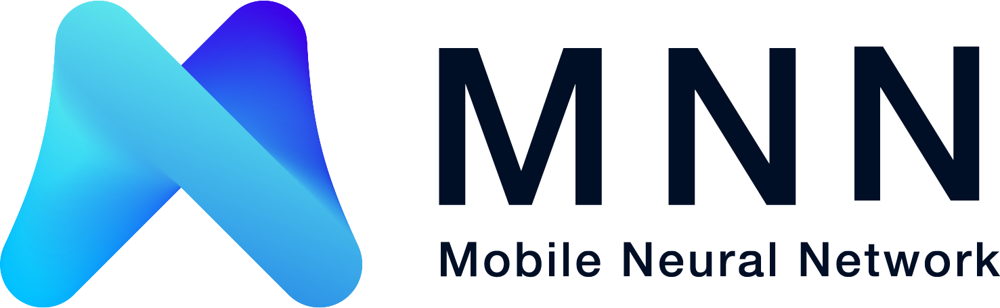
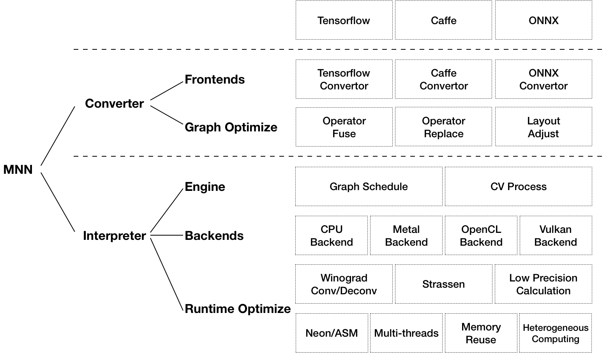

[中文版本](README_CN.md)

## Intro
MNN is a lightweight deep neural network inference engine. It loads models and do inference on devices. At present, MNN has been integrated in more than 20 apps of Alibaba-inc, such as Taobao, Tmall, Youku and etc., covering live broadcast, short video capture, search recommendation, product searching by image, interactive marketing, equity distribution, security risk control and other scenarios. In addition, MNN is also used on embedded devices, such as IoT.

## Features
### Lightweight
- Optimized for devices, no dependencies, can be easily deployed to mobile devices and a variety of embedded devices.
- iOS platform: static library size for armv7+arm64 platforms is about 5MB, size increase of linked executables is about 620KB, and metallib file is about 600KB.
- Android platform: core so size is about 400KB, OpenCL so is about 400KB, Vulkan so is about 400KB.

### Versatility
- Supports `Tensorflow`, `Caffe`, `ONNX`, and supports common neural networks such as `CNN`, `RNN`, `GAN`.
- Supports 86 `Tensorflow` ops, 34 `Caffe` ops; MNN ops: 71 for CPU, 55 for Metal, 29 for OpenCL, and 31 for Vulkan.
- Supports iOS 8.0+, Android 4.3+ and embedded devices with POSIX interface.
- Supports hybrid computing on multiple devices. Currently supports CPU and GPU. GPU op plugin can be loaded dynamically to replace default (CPU) op implementation.

### High performance
- Implements core computing with lots of optimized assembly code to make full use of the ARM CPU.
- For iOS, GPU acceleration (Metal) can be turned on, which is faster than Apple's native CoreML.
- For Android, `OpenCL`, `Vulkan`, and `OpenGL` are available and deep tuned for mainstream GPUs (`Adreno` and `Mali`).
- Convolution and transposition convolution algorithms are efficient and stable. The Winograd convolution algorithm is widely used to better symmetric convolutions such as 3x3 -> 7x7.
- Additional optimizations for the new architecture ARM v8.2 with half-precision calculation support.

### Easy to use
- Efficient image processing module, speeding up affine transform and color space transform without libyuv or opencv.
- Provides callbacks throughout the workflow to extract data or control the execution precisely.
- Provides options for selecting inference branch and paralleling branches on CPU and GPU.

## Architecture

MNN can be divided into two parts: Converter and Interpreter.

Converter consists of Frontends and Graph Optimize. The former is responsible for supporting different training frameworks. MNN currently supports Tensorflow, Tensorflow Lite, Caffe and ONNX (PyTorch/MXNet); the latter optimizes graphs by operator fusion, operator substitution, and layout adjustment.

Interpreter consists of Engine and Backends. The former is responsible for the loading of the model and the scheduling of the calculation graph; the latter includes the memory allocation and the Op implementation under each computing device. In Engine and Backends, MNN applies a variety of optimization schemes, including applying Winograd algorithm in convolution and deconvolution, applying Strassen algorithm in matrix multiplication, low-precision calculation, Neon optimization, hand-written assembly, multi-thread optimization, memory reuse, heterogeneous computing, etc.

## Quick start
- [Usage](https://www.yuque.com/mnn/en/usage)
- [Supported Operators](https://www.yuque.com/mnn/en/ops)
- [API](doc/API/API_index.html)
- [Demo](https://www.yuque.com/mnn/en/demo_zoo)

## Tools
- [Test tools](https://www.yuque.com/mnn/en/tool_test)
- [Benchmark](https://www.yuque.com/mnn/en/tool_benchmark)
- [Model compress](https://www.yuque.com/mnn/en/tool_quantize)

## Customizing
- [Customizing backend](https://www.yuque.com/mnn/en/customize_backend)
- [Customizing operator](https://www.yuque.com/mnn/en/customize_op)
- [Contributing](https://www.yuque.com/mnn/en/contribute)

## How to use python interface
- [Python](https://www.yuque.com/mnn/en/usage_in_python)

## Feedbacks
- [FAQ](https://www.yuque.com/mnn/en/faq)

Scan QR code to join DingDing discussion group.

## License
Apache 2.0

## Acknowledgement
MNN participants: Taobao Technology Department, Search Engineering Team, DAMO Team, Youku and other group employees.

MNN refers to the following projects:
- [Caffe](https://github.com/BVLC/caffe)
- [flatbuffer](https://github.com/google/flatbuffers)
- [gemmlowp](https://github.com/google/gemmlowp)
- [Google Vulkan demo](http://www.github.com/googlesamples/android-vulkan-tutorials)
- [Halide](https://github.com/halide/Halide)
- [Mace](https://github.com/XiaoMi/mace)
- [ONNX](https://github.com/onnx/onnx)
- [protobuffer](https://github.com/protocolbuffers/protobuf)
- [skia](https://github.com/google/skia)
- [Tensorflow](https://github.com/tensorflow/tensorflow)
- [ncnn](https://github.com/Tencent/ncnn)
- [paddle-mobile](https://github.com/PaddlePaddle/paddle-mobile)
- [stb](https://github.com/nothings/stb)
- [rapidjson](https://github.com/Tencent/rapidjson)
