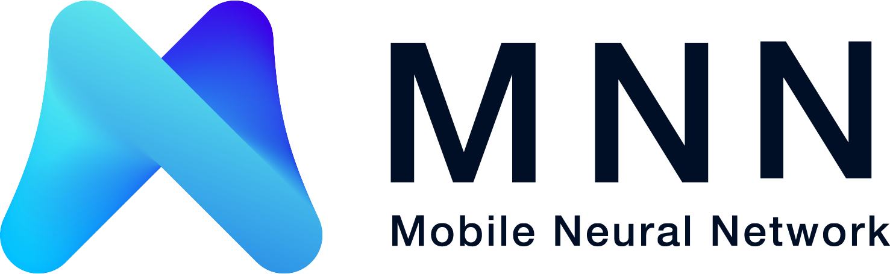
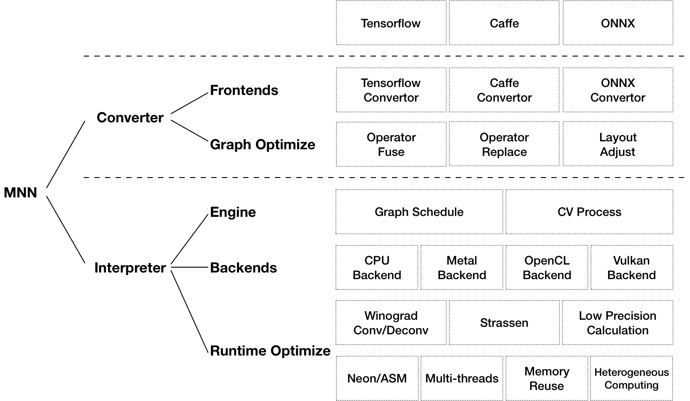

---

[MNN](https://github.com/alibaba/MNN) 是一個輕量級的深度神經網路引擎，支援深度學習的推理 (Inference) 與訓練。適用於伺服器、個人電腦、手機及各類嵌入式裝置。目前，MNN 已在阿里巴巴的手機淘寶、手機天貓、優酷等超過 30 個 App 中使用，涵蓋直播、短影音、搜尋推薦、商品圖像搜尋、互動行銷、權益發放、安全風控等場景。

[MNN-LLM](https://github.com/alibaba/MNN/tree/master/transformers/llm) 是基於 MNN 引擎開發的大型語言模型執行方案，旨在解決大語言模型在本機裝置（手機 / 個人電腦 / 嵌入式裝置）上的高效部署問題。支援常見的 Qwen、Baichuan、Zhipu、LLAMA 等大語言模型。使用教學：[MNN-LLM 使用教學](https://mnn-docs.readthedocs.io/en/latest/transformers/llm.html)

[MNN-Diffusion](https://github.com/alibaba/MNN/tree/master/transformers/diffusion) 是基於 MNN 引擎開發的 Stable Diffusion 文字生成圖像模型執行方案，解決了 Stable Diffusion 模型在本機裝置上的高效部署問題。使用教學：[MNN-Diffusion 使用教學](https://mnn-docs.readthedocs.io/en/latest/transformers/diffusion.html)

在阿里巴巴中，[MNN](https://mp.weixin.qq.com/s/5I1ISpx8lQqvCS8tGd6EJw) 被用作 [Walle](https://mp.weixin.qq.com/s/qpeCETty0BqqNJV9CMJafA) 系統中計算容器的基礎模組。Walle 是首個端到端、通用型、規模化產業應用的端雲協同機器學習系統，發表於作業系統頂級會議 OSDI 2022。Walle 的論文解釋了 MNN 的關鍵設計理念，並提供了 MNN 相對於其他深度學習框架（TensorFlow, TensorFlow Lite, PyTorch, PyTorch Mobile, TVM）的 Benchmark 測試結果。相關測試腳本與說明文件放置於「/benchmark」目錄下。若 MNN 或 Walle 的設計對您的研究或生產有所助益，歡迎引用我們的 OSDI 論文：

    @inproceedings {proc:osdi22:walle,
        author = {Chengfei Lv and Chaoyue Niu and Renjie Gu and Xiaotang Jiang and Zhaode Wang and Bin Liu and Ziqi Wu and Qiulin Yao and Congyu Huang and Panos Huang and Tao Huang and Hui Shu and Jinde Song and Bin Zou and Peng Lan and Guohuan Xu and Fei Wu and Shaojie Tang and Fan Wu and Guihai Chen},
        title = {Walle: An {End-to-End}, {General-Purpose}, and {Large-Scale} Production System for {Device-Cloud} Collaborative Machine Learning},
        booktitle = {16th USENIX Symposium on Operating Systems Design and Implementation (OSDI 22)},
        year = {2022},
        isbn = {978-1-939133-28-1},
        address = {Carlsbad, CA},
        pages = {249--265},
        url = {https://www.usenix.org/conference/osdi22/presentation/lv},
        publisher = {USENIX Association},
        month = jul,
    }

## 文件與工作檯
MNN 文件：
- [最新文件 (readthedocs)](https://mnn-docs.readthedocs.io/en/latest/index.html)

- 也可閱讀 docs/README，編譯本機文件

[MNN 官網](http://www.mnn.zone)上還可下載 MNN 團隊全新力作「MNN 工作檯」，涵蓋開箱即用的模型、視覺化訓練等工具，更可一鍵部署至多端裝置。

## 整體特點

### 輕量性

- 主體功能（模型推理 CPU+GPU）無任何依賴，程式碼精簡，可方便地部署到行動裝置和各種嵌入式裝置中。
   - iOS 平台：功能全開的 MNN 靜態庫 (armv7+arm64) 大小約 12MB，連結後生成的可執行檔大小增加約 2MB。裁減主體功能後的靜態庫大小為 6.1MB，連結後生成的可執行檔大小增加約 600 KB。
   - Android 平台：主體功能 armv7a - c++_shared 動態庫大小約 800KB。
- 支援採用 Mini 編譯選項進一步降低封裝大小，大約能在上述庫體積基礎上再降低 25% 左右。
- 支援模型 FP16 / Int8 壓縮與量化，可減少模型 50% - 75% 的體積。

### 通用性

- 支援 TensorFlow、Caffe、ONNX、Torchscripts 等主流模型檔案格式，支援 CNN / RNN / GAN / Transformer 等主流網路結構。
- 支援多輸入多輸出、任意維度的輸入輸出、動態輸入（輸入大小可變）以及帶控制流的模型。
- 運算元豐富，支援 178 個 TensorFlow Op、52 個 Caffe Op、163 個 Torchscripts Op、158 個 ONNX Op（ONNX 基本完整支援）。
- 支援伺服器 / 個人電腦 / 手機，以及具備 POSIX 介面的嵌入式裝置，支援使用裝置的 CPU / GPU 進行計算，支援部分裝置的 NPU 計算（iOS 11 + CoreML / Huawei + HIAI / Android + NNAPI）。
- 支援 Windows / iOS 8.0+ / Android 4.3+ / Linux 及具備 POSIX 介面的作業系統。

### 高效能

- 對 iOS / Android / PC / Server 的 CPU 架構進行了適配，編寫 SIMD 程式碼或手寫組合語言以實現核心運算，充分發揮 CPU 的算力，單執行緒下執行常見 CV 模型接近裝置算力峰值。
- 支援基於 Metal / OpenCL / Vulkan 使用行動裝置上的 GPU 進行推理。
- 支援基於 CUDA 使用 PC / Server 上的 NVIDIA GPU 實現更快速的推理。
- 廣泛運用 Winograd 卷積演算法提升卷積效能，首次在業界工程實踐中實現轉置卷積的 Winograd 演算法最佳化與矩陣乘法的 Strassen 演算法最佳化，並取得顯著加速效果。
- 支援低精度計算 (int8 / fp16 / bf16) 以提升推理效能。並對 ARMv8.2 與 AVX512 架構的相關指令進行了適配，這兩種架構下有更好的加速效果。

### 易用性

- 支援使用 MNN 的運算元進行常用的數值計算，覆蓋 numpy 常用功能。
- 提供 MNN CV 模組，支援圖像仿射變換與歸一化等 MNN_CV 庫，支援常用的圖像處理（armv7a 架構下小於 100 KB）。
- 支援各平台下的模型訓練，尤其是行動端上的模型訓練。
- 支援 Python 呼叫。

MNN 適配的硬體架構與精度詳見下表：

- S：支援，深度最佳化且已有應用場景，推薦使用
- A：支援，有初步最佳化或已有應用場景，可以使用
- B：支援，無最佳化或處於實驗狀態，不推薦使用
- C：不支援

| Architecture / Precision |  | Normal | FP16 | BF16 | Int8 / Int4 |
| --- | --- | --- | --- | --- | --- |
| CPU | Native | B | C | B | B |
|  | x86/x64-SSE4.1 | A | C | C | A |
|  | x86/x64-AVX2 | S | C | C | A |
|  | x86/x64-AVX512 | S | C | C | S |
|  | ARMv7a | S | S (ARMv8.2) | S | S |
|  | ARMv8 | S | S (ARMv8.2) | S (ARMv8.6) | S |
| GPU | OpenCL | A | S | C | S |
|  | Vulkan | A | A | C | A |
|  | Metal | A | S | C | S |
|  | CUDA | A | S | C | A |
| NPU | CoreML | A | C | C | C |
|  | HIAI | A | C | C | C |
|  | NNAPI | B | B | C | B |
|  | QNN | C | B | C | C |

## 工具

基於 MNN (張量計算引擎)，提供了一系列工具，以支援模型推理、訓練與通用計算：

- MNN-Converter：模型轉換工具，由 Frontends 與 Graph Optimize 構成。前者負責支援不同的訓練框架，MNN 目前支援 TensorFlow(Lite)、Caffe、ONNX (PyTorch/MXNet 模型可先轉為 ONNX 模型再轉至 MNN) 與 Torchscripts；後者透過運算元融合、運算元替代、佈局調整等方式最佳化圖，一般離線執行。
- MNN-Compress：模型壓縮工具，在一定的精度誤差許可下，對 MNN 模型進行壓縮，減少模型體積，提升執行效能。
- MNN-Express：支援帶控制流的模型執行，支援呼叫 MNN 的運算元進行自訂計算。
- MNN-CV：類似 OpenCV，但核心計算功能基於 MNN 實現的圖像處理演算法庫。
- MNN-Train：MNN 訓練模組，支援各平台訓練。

## 社群交流與回饋
釘釘 (DingTalk) 群組：

- 釘釘群 3 (可加入): 160170007549
- 釘釘群 3 (已無法加入)
- 釘釘群 2 (已滿): 23350225
- 釘釘群 1 (已滿): 23329087

## 歷史論文

MNN 初步版本的[論文](https://arxiv.org/pdf/2002.12418.pdf)也曾在 MLSys 2020 上發表。該論文主要關注 MNN 作為行動端機器學習推理引擎的手動運算元最佳化。若 MNN 曾對您的研究有所助益，歡迎引用 MNN 的 MLSys 論文：

	@inproceedings{alibaba2020mnn,
      author = {Jiang, Xiaotang and Wang, Huan and Chen, Yiliu and Wu, Ziqi and Wang, Lichuan and Zou, Bin and Yang, Yafeng and Cui, Zongyang and Cai, Yu and Yu, Tianhang and Lv, Chengfei and Wu, Zhihua},
      title = {MNN: A Universal and Efficient Inference Engine},
      booktitle = {MLSys},
      year = {2020}
    }

## License
Apache 2.0

## 致謝
MNN 參與人員：淘寶技術部、搜尋工程團隊、達摩院團隊、優酷等集團員工。

MNN 參考、借鏡了下列專案：

- [Caffe](https://github.com/BVLC/caffe)
- [flatbuffer](https://github.com/google/flatbuffers)
- [gemmlowp](https://github.com/google/gemmlowp)
- [Google Vulkan demo](http://www.github.com/googlesamples/android-vulkan-tutorials)
- [Halide](https://github.com/halide/Halide)
- [Mace](https://github.com/XiaoMi/mace)
- [ONNX](https://github.com/onnx/onnx)
- [protobuffer](https://github.com/protocolbuffers/protobuf)
- [skia](https://github.com/google/skia)
- [Tensorflow](https://github.com/tensorflow/tensorflow)
- [ncnn](https://github.com/Tencent/ncnn)
- [paddle-mobile](https://github.com/PaddlePaddle/paddle-mobile)
- [stb](https://github.com/nothings/stb)
- [rapidjson](https://github.com/Tencent/rapidjson)
- [pybind11](https://github.com/pybind/pybind11)
- [pytorch](https://github.com/pytorch/pytorch)
- [bolt](https://github.com/huawei-noah/bolt)
- [libyuv](https://chromium.googlesource.com/libyuv/libyuv)
- [libjpeg](https://github.com/libjpeg-turbo/libjpeg-turbo)
- [opencv](https://github.com/opencv/opencv)
- [onnxruntime](https://github.com/microsoft/onnxruntime)
