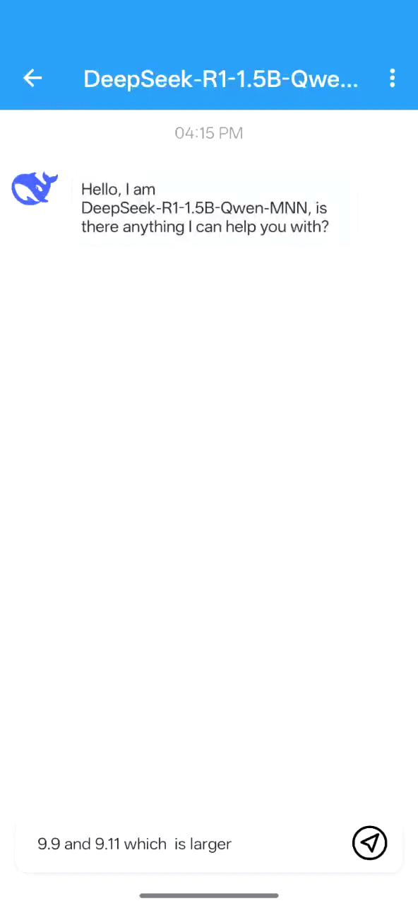

# MNN Chat Android App
[中文版本](./README_CN.md)

[Download](#releases)  [下载](./README_CN.md#releases)

[GooglePlay](https://play.google.com/store/apps/details?id=com.alibaba.mnnllm.android.release)

[iOS App](../../iOS/MNNLLMChat/README.md)

## Introduction
This is our full multimodal language model (LLM) Android app
<p align="center">
  
  
  
  
</p>


### Features

+ **Multimodal Support:** Enables functionality across diverse tasks, including text-to-text, image-to-text, audio-to-text, and text-to-image generation (via diffusion models).

+ **CPU Inference Optimization:** MNN-LLM demonstrates exceptional performance in CPU benchmarking in Android, achieving prefill speed improvements of 8.6x over llama.cpp and 20.5x over fastllm, with decoding speeds that are 2.3x and 8.9x faster, respectively. the following is a comparison between llama.cpp and MNN-LLM on Android inferencing qwen-7b.

+ **Broad Model Compatibility:** Supports multiple leading model providers, such as Qwen, Gemma, Llama (including TinyLlama and MobileLLM), Baichuan, Yi, DeepSeek, InternLM, Phi, ReaderLM, and Smolm.

+ **Privacy First:** Runs entirely on-device, ensuring complete data privacy with no information uploaded to external servers.


# How to Use
+ you can download the app from [Releases](#releases) or [build it yourself](#development);
+ After installing the application, you can browse all supported models, download them, and interact with them directly within the app.;
+ Additionally, you can access your chat history in the sidebar and revisit previous conversations seamlessly.

 !!!warning!!! This version has been tested exclusively on the OnePlus 13 and Xiaomi 14 Ultra, Due to the demanding performance requirements of large language models (LLMs), many budget or low-spec devices may experience issues such as slow inference speeds, application instability, or even failure to run entirely. and its stability on other devices cannot be guaranteed. If you encounter any issues, please feel free to open an issue for assistance.


# Development
+ Prepare
  + Android Studio
  + NDK(21 recommended)
  + `export ANDROID_NDK=${YOUR_NDK_ROOT}`
+ Clone the repository:
  ```shell
    git clone https://github.com/alibaba/MNN.git
  ```
+ Build library:
  ```shell
  cd project/android
  mkdir build_64
  cd build_64
  ../build_64.sh "-DMNN_LOW_MEMORY=true -DMNN_CPU_WEIGHT_DEQUANT_GEMM=true -DMNN_BUILD_LLM=true -DMNN_SUPPORT_TRANSFORMER_FUSE=true -DMNN_ARM82=true -DMNN_USE_LOGCAT=true -DMNN_OPENCL=true -DLLM_SUPPORT_VISION=true -DMNN_BUILD_OPENCV=true -DMNN_IMGCODECS=true -DLLM_SUPPORT_AUDIO=true -DMNN_BUILD_AUDIO=true -DMNN_BUILD_DIFFUSION=ON -DMNN_SEP_BUILD=OFF -DCMAKE_SHARED_LINKER_FLAGS='-Wl,-z,max-page-size=16384' -DCMAKE_INSTALL_PREFIX=."
  make install
  ```

+ build android app project and install
  ```shell
  cd ../../../apps/Android/MnnLlmChat
  ./gradlew installDebug
  ```

# Releases
## Version 0.6.8
+ Click here to [download](https://meta.alicdn.com/data/mnn/mnn_chat_0_6_8.apk)
+ add new models:  SmolLM3-3B、gemma-3-1b 
+ support penalty sampler in mixed sampler mode.
+ can switch models in chat screen.
+ can update models when the remote models changed.
+ fix download source for huggingface.
+ Support  Realtime voice call with ASR and TTS
## Version 0.5.1.2
+ Click here to [download](https://meta.alicdn.com/data/mnn/mnn_chat_0_5_1_2.apk)
+ fix huggingface download error
+ fix showing wrong download state when not download start.

## Version 0.5.1.1
+ Click here to [download](https://meta.alicdn.com/data/mnn/mnn_chat_0_5_1_1.apk)
+ Upgrade MNN engine to v3.2.0
+ fix some bugs
## Version 0.5.1
+ Click here to [download](https://meta.alicdn.com/data/mnn/mnn_chat_0_5_1.apk)
+ Support DeepSeek-R1-0528-Qwen3
+ fix some bugs:
  + first install use ModelScope if system language chinese
  + do not show dialog if not forceCheckUpdate
  + show model size of local model
## Version 0.5.0
+ Click here to [download](https://meta.alicdn.com/data/mnn/mnn_chat_0_5_0.apk)
+ Support Qwen3-30B-A3B
+ Support new vision models SmoVLM and FastVLM
+ Support Local models(by adb push)
+ add some advanced settings: precision, thread num
+ UI updates:
  + support filter models by Local, Modality, and Vendors
  + support hide thinking process

## Version 0.4.4.1
+ Click here to [download](https://meta.alicdn.com/data/mnn/mnn_chat_0_4_4_1.apk)
+ Fix Modlers download error
+ fix Select Text not work bug

## Version 0.4.4
+ Click here to [download](https://meta.alicdn.com/data/mnn/mnn_chat_0_4_4.apk)
+ Add support for Qwen Omni 3B and 7B, enable audio output switch
+ Show size of models in modellist

## Version 0.4.3
+ Click here to [download](https://meta.alicdn.com/data/mnn/mnn_chat_0_4_3.apk)
+ Support Xiaomi Mimo UI
+ Added support for Qwen Omni
+ hide attachments on send
+ Benchmarks: show total decode & prefill time
+ support copying user messages
+ Fixed download crashes on certain devices
+ Added support for reporting crash logs
+ Enabled multi-turn conversation support for multimodal models
+ Refactor Download Module,Chat Activity

## Version 0.4.0
+ Click here to [download](https://meta.alicdn.com/data/mnn/mnn_chat_d_0_4_0.apk)
+ Now compatible with the Qwen3 model, with a toggle for Deep Thinking mode
+ Added Dark Mode, fully aligned with Material 3 design guidelines
+ Optimized chat interface with support for multi-line input
+ New Settings page: customize sampler type, system prompt, max new tokens, and more

## Version 0.3.0
+ Click here to [download](https://meta.alicdn.com/data/mnn/mnn_chat_d_0_3_0.apk)
+ upgrade mnn engine to v3.1.0
+ add settings page
+ show download speed info
+ support filter only downloaded models.
+ support download models from modelers.cn

## Version 0.2.2
+ Click here to [download](https://meta.alicdn.com/data/mnn/mnn_chat_d_0_2_2.apk)
+ Support mmap for speed up laoding speed.
+ Add version update checker

## Version 0.2.1
+ Click here to [download](https://meta.alicdn.com/data/mnn/mnn_chat_d_0_2_1_1.apk)
+ Support for ModelScope downloads
+ Optimization of DeepSeek's multi-turn conversation capabilities and UI presentation
+ Added support for including debug information when submitting feedback or issues
<p align="center">
  
</p>

## Version 0.2
+ Click here to [download](https://meta.alicdn.com/data/mnn/mnn_llm_app_debug_0_2_0.apk)
+ Optimized for DeepSeek R1 1.5B
+ Added support for Markdown
+ Resolved several bugs and improved stability

## Version 0.1
+ Click here to [download](https://meta.alicdn.com/data/mnn/mnn_llm_app_debug_0_1.apk)
+ this is our first public released version; you can :
  + search all our supported models, download  and chat with it in the app;
  + diffusion model:
    + stable-diffusion-v1-5
  + audio model:
    + qwen2-audio-7b
  + visual models:
    + qwen-vl-chat
    + qwen2-vl-2b
    + qwen2-vl-7b


# About MNN-LLM
MNN-LLM is a versatile inference framework designed to optimize and accelerate the deployment of large language models on both mobile devices and local PCs, addressing challenges like high memory consumption and computational costs through innovations such as model quantization, hybrid storage, and hardware-specific optimizations. In CPU benchmarking, MNN-LLM excels, achieving prefill speed boosts of 8.6x over llama.cpp and 20.5x over fastllm, complemented by decoding speeds that are 2.3x and 8.9x faster, respectively. In
GPU-based assessments, MNN-LLM’s performance slightly declines
compared to MLC-LLM, particularly when using Qwen2-7B with shorter prompts, due to MLC-LLM’s advantageous symmetric quantization technique. MNN-LLM excels, achieving up to 25.3x faster prefill and 7.1x faster decoding than llama.cpp, and 2.8x and 1.7x improvements over MLC-LLM, respectively.
 For more detailed information, please refer to the paper:[MNN-LLM: A Generic Inference Engine for Fast Large LanguageModel Deployment on Mobile Devices](https://dl.acm.org/doi/pdf/10.1145/3700410.3702126)


# Acknowledgements
This project is built upon the following open-source projects:

+ [progress-dialog](https://github.com/techinessoverloaded/progress-dialog)
+ [okhttp](https://github.com/square/okhttp)
+ [retrofit](https://github.com/square/retrofit)
+ [Android-SpinKit](https://github.com/ybq/Android-SpinKit)
+ [expandable-fab](https://github.com/nambicompany/expandable-fab)
+ [Android-Wave-Recorder](https://github.com/squti/Android-Wave-Recorder)
