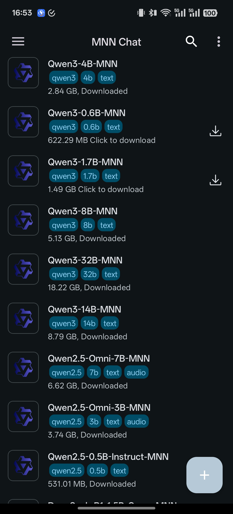
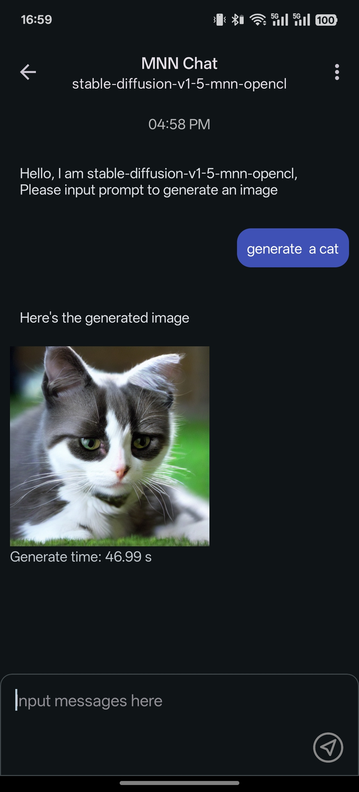
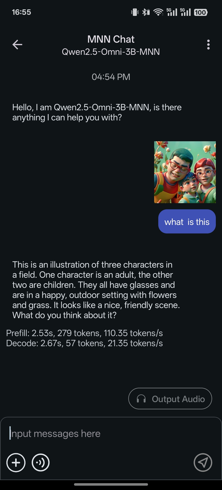

# MNN Chat Android 應用程式
[簡體中文版本](./README_CN.md)

[下載](#releases)

[iOS App](../../iOS/MNNLLMChat/README-ZH.md)

## 簡介
這是我們的全功能多模態大型語言模型 (LLM) Android 應用程式。

<p align="center">
  
  
  
  
</p>


### 功能亮點

+ **多模態支援：** 提供多種任務功能，包括文字生成文字、圖像生成文字、音訊轉文字，以及文字生成圖像（基於擴散模型）。

+ **CPU 推理最佳化：** 在 Android 平台上，MNN-LLM 展現了卓越的 CPU 效能；預填充 (prefill) 速度相較於 llama.cpp 提高了 8.6 倍，相較於 fastllm 提升了 20.5 倍；解碼速度分別快了 2.3 倍與 8.9 倍。下圖為 llama.cpp 與 MNN-LLM 的比較。

+ **廣泛的模型相容性：** 支援多種領先的模型提供商，包括 Qwen、Gemma、Llama（涵蓋 TinyLlama 與 MobileLLM）、Baichuan、Yi、DeepSeek、InternLM、Phi、ReaderLM 與 Smolm。

+ **本機端運作：** 完全在裝置本機執行，確保資料隱私，無需將資訊上傳至外部伺服器。


## 使用說明
您可以透過 [Releases](#releases) 下載應用程式，或自行[建置](#開發)。
+ 安裝應用程式後，您可以瀏覽所有支援的模型，下載所需模型，並直接在 App 內與模型互動。
+ 此外，您可以透過側邊欄存取對話歷史，輕鬆查看與管理先前的對話記錄。

!!!warning!!! 此版本目前僅在 OnePlus 13 和小米 14 Ultra 上進行過測試。由於大型語言模型 (LLM) 對裝置效能要求較高，許多低階配置裝置可能會遇到以下問題：推理速度緩慢、應用程式不穩定甚至無法執行。無法保證其他裝置的穩定性。如果您在使用過程中遇到問題，請隨時提交 Issue 以獲得協助。


## 開發
+ 準備環境：
  + Android Studio
  + NDK（與 `app/build.gradle` 保持一致，目前為 `27.2.12479018`）
  + `export ANDROID_NDK=${YOUR_NDK_ROOT}`
+ 複製程式碼庫：
  ```shell
    git clone https://github.com/alibaba/MNN.git
  ```
+ 建置函式庫：
  ```shell
  cd project/android
  mkdir build_64
  cd build_64
  ../build_64.sh "-DMNN_LOW_MEMORY=true -DMNN_CPU_WEIGHT_DEQUANT_GEMM=true -DMNN_BUILD_LLM=true -DMNN_SUPPORT_TRANSFORMER_FUSE=true -DMNN_ARM82=true -DMNN_USE_LOGCAT=true -DMNN_OPENCL=true -DLLM_SUPPORT_VISION=true -DMNN_BUILD_OPENCV=true -DMNN_IMGCODECS=true -DLLM_SUPPORT_AUDIO=true -DMNN_BUILD_AUDIO=true -DMNN_BUILD_DIFFUSION=ON -DMNN_SEP_BUILD=OFF -DCMAKE_INSTALL_PREFIX=."
  make install
  ```
+ 建置 Android 應用程式專案並安裝：
  ```shell
  cd ../../../apps/Android/MnnLlmChat
  ./installDebug.sh
  ```

## 版本發佈 (Releases)

*(由於篇幅限制，以下版本說明已精簡翻譯，保留連結與關鍵亮點)*

### Version 0.8.2.2
+ 點擊這裡 [下載](https://meta.alicdn.com/data/mnn/apks/mnn_chat_0_8_2_2.apk)
+ 更新亮點：更新 MNN runtime，匯入最新的 CPU LinearAttention 與 Arm82 fp16 最佳化路徑；提升思考模式在提示詞與陣列拼接場景下的相容性；為 OpenCL 與 Metal 執行路徑補充 TopKV2 後端支援。

### Version 0.8.2.1
+ 點擊這裡 [下載](https://meta.alicdn.com/data/mnn/apks/mnn_chat_0_8_2_1.apk)
+ 問題修復：修復 Android 在預編譯 runtime 下可能只輸出單個 Token 或第二輪無法繼續生成的問題。

### Version 0.8.2
+ 點擊這裡 [下載](https://meta.alicdn.com/data/mnn/apks/mnn_chat_0_8_2.apk)
+ 更新亮點：支援語音對話中即時使用視覺輸入；復原對話頁面返回後的自動捲動。

*(其餘舊版本亦可依照此模式進行翻譯)*

## 關於 MNN-LLM
MNN-LLM 是一個多功能的推理框架，旨在最佳化並加速大型語言模型在行動裝置與本機 PC 上的部署。透過模型量化、混合儲存與硬體特定最佳化等創新措施，解決高記憶體消耗與計算成本等挑戰。如需更詳細資訊，請參考論文：[MNN-LLM: A Generic Inference Engine for Fast Large Language Model Deployment on Mobile Devices](https://dl.acm.org/doi/pdf/10.1145/3700410.3702126)

## 致謝
該專案基於以下開源專案：
+ [progress-dialog](https://github.com/techinessoverloaded/progress-dialog)
+ [okhttp](https://github.com/square/okhttp)
+ [retrofit](https://github.com/square/retrofit)
+ [Android-SpinKit](https://github.com/ybq/Android-SpinKit)
+ [expandable-fab](https://github.com/nambicompany/expandable-fab)
+ [Android-Wave-Recorder](https://github.com/squti/Android-Wave-Recorder)
