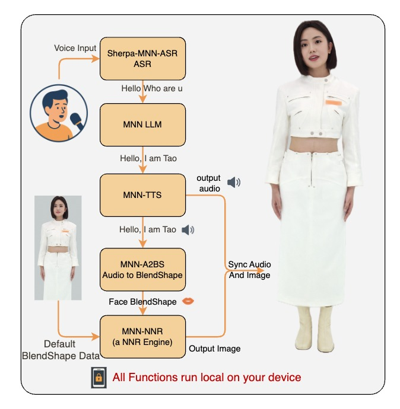

# MNN-TaoAvatar Android - Local 3D Avatar Intelligence

<p align="center">
  
</p>

+ [中文](./README_CN.md)
+ [Download](#releases) 

Welcome to **MNN-TaoAvatar App**, a full-featured mobile app about the [TaoAvatar paper (arXiv:2503.17032v1)](https://arxiv.org/html/2503.17032v1). This project brings multimodal AI avatars to life directly on Android devices, running **all models locally**, including:

- LLM (Large Language Model)
- ASR (Automatic Speech Recognition)
- TTS (Text-to-Speech)
- A2BS (Audio-to-BlendShape)
- NNR (Neural Rendering)

> The iOS App will be coming later, stay tuned for updates!

## Features

- **Conversational AI** powered by a local LLM
- **Speech-to-text** with embedded ASR models
- **Voice synthesis** with TTS on-device
- **Avatar behavior animation** via A2BS(Audio-to-BlendShape)
- **Real-time neural rendering** for expressive avatars
- **100% offline** and privacy-focused

## How it Works


## Requirements

Because **all AI models are executed locally on-device**, this project requires **high-performance hardware** to run smoothly.

### Minimum Device Requirements

- **Snapdragon 8 Gen 3** or **equivalent flagship SoC**  
  _Examples: Snapdragon 8 Gen 3,  Dimensity 9200 to have smooth experience._
- **8 GB RAM** or more
- **5 GB free disk space** for model files
- **ARM64 architecture**

> ⚠️ Devices below these specs may experience lag, audio stutter, or limited functionality.


## Setup and Run

### 1. Clone the Repository

```bash
git clone https://github.com/alibaba/MNN.git
cd apps/Android/MnnTaoAvatar
```

### 2. Build and Deploy

- Connect an Android device
- Hit **Run** in Android Studio or use:

```bash
./gradlew installDebug
```

## Releases
## Version 0.0.2
+ Click here to [download](https://meta.alicdn.com/data/mnn/avatar/mnn_taoavatar_0_0_2.apk)
+ support supertonic tts for TaoAvatar
## Version 0.0.1
+ Click here to [download](https://meta.alicdn.com/data/mnn/avatar/mnn_taoavatar_0_0_1.apk)
+ this is our first public released version; you can chat with 3d avatar in the app with asr and tts; if you have any questions, please feel free to open an issue for assistance.


## Links And References

- [TaoAvatar Paper](https://arxiv.org/html/2503.17032v1)
- [Models Collection](https://modelscope.cn/collections/TaoAvatar-68d8a46f2e554a)
- [LLM Model: Qwen2.5-1.5B MNN](https://github.com/alibaba/MNN/tree/master/3rd_party/NNR)
- [TTS Model: bert-vits2-MNN](https://modelscope.cn/models/MNN/bert-vits2-MNN)
- [A2BS Model: UniTalker-MNN](https://modelscope.cn/models/MNN/UniTalker-MNN)
- [NNR Model: TaoAvatar-NNR-MNN](https://modelscope.cn/models/MNN/TaoAvatar-NNR-MNN)
- [ASR Model: sherpa-mnn-streaming-zipformer-bilingual-zh-en-2023-02-20](https://modelscope.cn/models/MNN/sherpa-mnn-streaming-zipformer-bilingual-zh-en-2023-02-20)