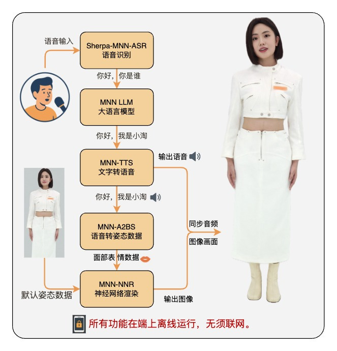

# MNN-TaoAvatar Android - 本機端智慧數位人

<p align="center">
  
</p>

+ [简体中文版本](./README_CN.md) | [繁體中文版本](./README_TW.md)
+ [下載](#releases) 

這是一款支援本機端運作、完全離線、且支援多模態互動的智慧數位人 App！

什麼是 MNN-TaoAvatar？它是阿里最新研究成果的實際應用（詳見 [TaoAvatar 論文](https://arxiv.org/html/2503.17032v1)），將大型語言模型 (LLM)、語音辨識 (ASR)、語音合成 (TTS)、語音轉動作合成 (A2BS) 以及神經繪製 (NNR) 技術全都整合到手機端，實現全本機運作，無需聯網！

> 📢 iOS 版本稍後推出，敬請期待！

## 特色功能一覽

* **本機端聊天機器人**：基於本機運作的 LLM，即時與數位人暢聊。
* **更智慧的語音辨識**：內建 ASR 模型，說話即時轉換為文字。
* **隨心所欲的語音合成**：TTS 模型，讓你的數位人發聲自然且真實。
* **聲音驅動表情與動作**：A2BS 技術，透過聲音自動生成數位人豐富的臉部表情與動作。
* **即時神經繪製**：讓數位人表情細膩逼真，互動感更強。
* **100% 離線運作**：完全在本機端執行，守護隱私更放心。

## 工作原理


## 硬體要求

由於需要將多個模型同時執行在手機上，因此需要**高效能晶片**與**充足的記憶體**：

* **旗艦級晶片效能**：高通 Snapdragon 8 Gen 3 或聯發科天璣 (Dimensity) 9200 以上等級。
* **記憶體至少 8GB**。
* **手機儲存空間需至少 5GB**，用於存放模型檔案。
* **ARM64 架構**。

> ⚠️ 效能不足的裝置可能會遇到卡頓、聲音斷斷續續或功能受限等情況。

## 安裝與體驗步驟

1. 複製專案程式碼

```bash
git clone https://github.com/alibaba/MNN.git
cd apps/Android/MnnTaoAvatar
```

2. 建置與部署

* 連接你的 Android 手機，在 Android Studio 中點選「Run」，或執行：

```bash
./gradlew installDebug
```


## 版本發佈 (Releases)

### Version 0.0.2
+ 點擊這裡[下載](https://meta.alicdn.com/data/mnn/avatar/mnn_taoavatar_0_0_2.apk)
+ 新增對 TaoAvatar 的 Supertonic TTS 支援。

### Version 0.0.1
+ 點擊這裡[下載](https://meta.alicdn.com/data/mnn/avatar/mnn_taoavatar_0_0_1.apk)
+ 這是我們首次公開發布的版本；您可以在應用程式中透過語音辨識 (ASR) 和語音合成 (TTS) 與 3D 虛擬形象進行對話；如果您有任何問題，請隨時提交 Issue 以獲得協助。

## 更多相關資源

* [TaoAvatar 論文](https://arxiv.org/html/2503.17032v1)
* [模型合集](https://modelscope.cn/collections/TaoAvatar-68d8a46f2e554a)
* [LLM 模型：Qwen2.5-1.5B MNN](https://github.com/alibaba/MNN/tree/master/3rd_party/NNR)
* [TTS 模型：bert-vits2-MNN](https://modelscope.cn/models/MNN/bert-vits2-MNN)
* [聲音動作模型：UniTalker-MNN](https://modelscope.cn/models/MNN/UniTalker-MNN)
* [神經繪製模型：TaoAvatar-NNR-MNN](https://modelscope.cn/models/MNN/TaoAvatar-NNR-MNN)
* [ASR 模型：Sherpa 雙語串流辨識模型](https://modelscope.cn/models/MNN/sherpa-mnn-streaming-zipformer-bilingual-zh-en-2023-02-20)
