# MNNLLM iOS Application

## 介绍

本项目是一个基于MNN引擎，支持本地大模型多模态对话的iOS应用。

纯本地运行，隐私性强。当模型下载到本地之后，所有的对话都将在本地进行，不会有任何网络上传处理。


## 功能：

1. 模型列表
    - 获取 MNN 支持的模型礼拜；
    - 模型管理，支持下载和删除模型；
    - 模型搜索，支持本地模型搜索；
2. 多模态聊天对话：支持完整的Markdown格式输出
    - 文本到文本
    - 语音到文本
    - 图片到文本，图片可以拍摄输入或从图库中选择
3. 对话历史
    - 包含对话历史列表，可以还原对话场景

### 视频介绍


[点击这里下载原分辨率介绍视频](https://github.com/Yogayu/MNN/blob/master/project/MNNLLMForiOS/assets/introduction.mov)

### 应用预览图

|  |  |  |
|--|--|--|
| **Text To Text**  | **Image To Text**  | **Audio To Text**  |
| 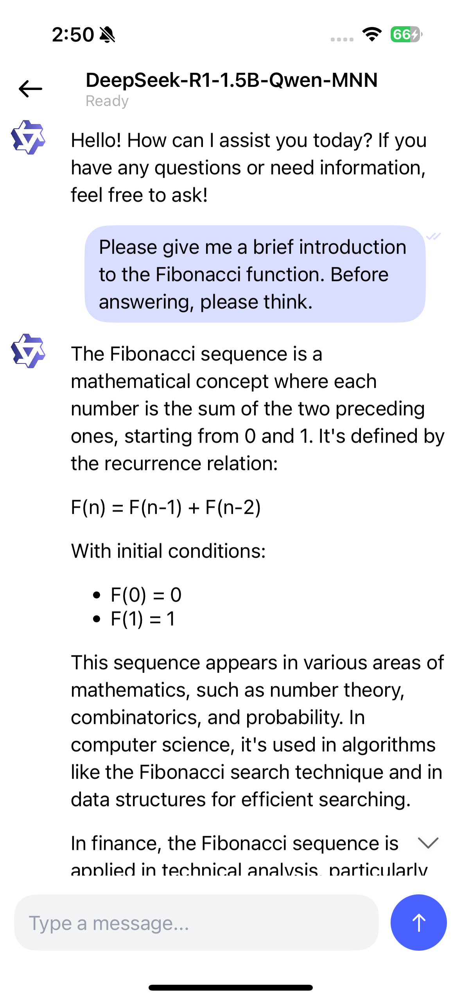 | 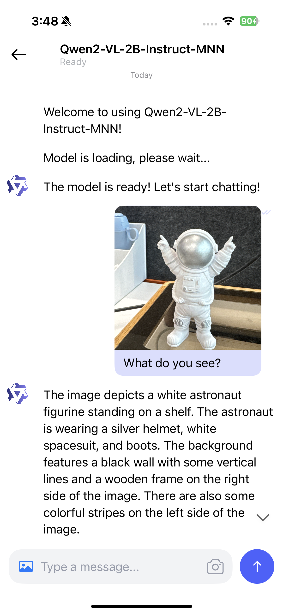 | 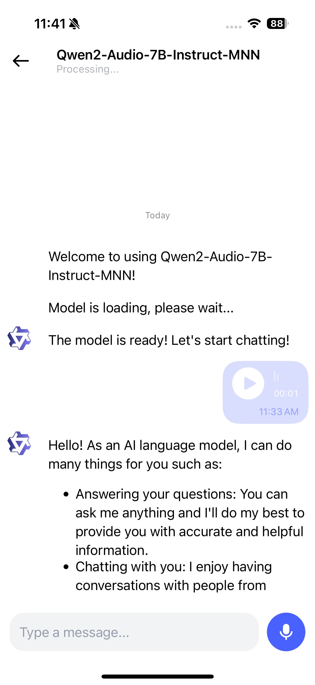 |
| **Model List**  | **History**  | **History**  |
| 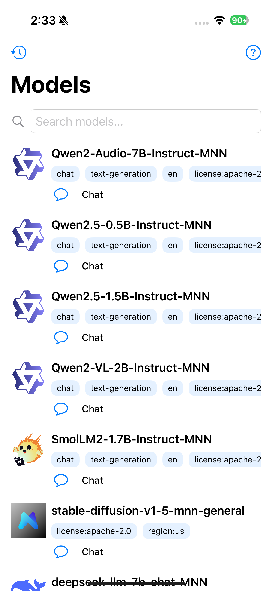 | 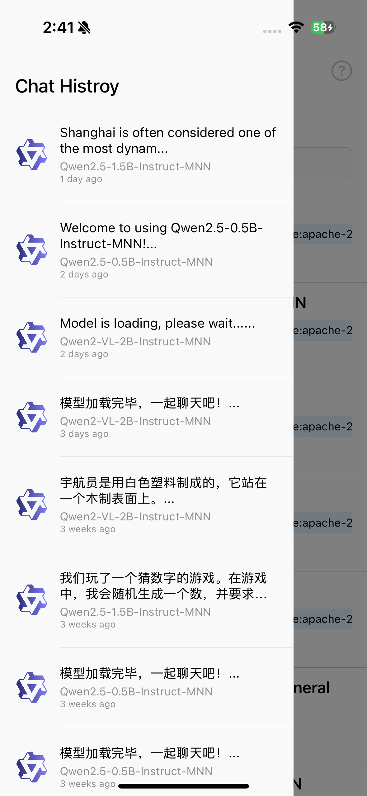 | 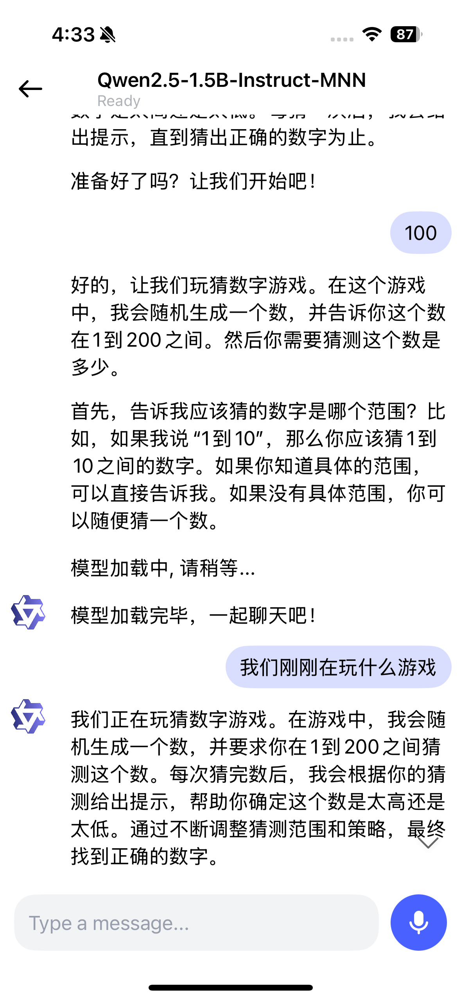 |


<p></p>

此外，本应用支持 DeepSeek  带think模式端侧使用：

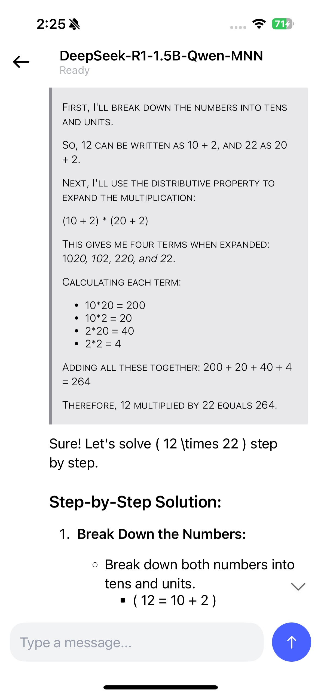


## 如何构建并使用

1. 下载仓库代码：

    ```shell
    git clone https://github.com/alibaba/MNN.git
    ```

2. 编译 MNN.framework:

    ```shell
    cd MNN/
    sh package_scripts/ios/buildiOS.sh "-DMNN_ARM82=true -DMNN_LOW_MEMORY=true -DMNN_SUPPORT_TRANSFORMER_FUSE=true -DMNN_BUILD_LLM=true -DMNN_CPU_WEIGHT_DEQUANT_GEMM=true
    -DMNN_METAL=ON
    -DMNN_BUILD_DIFFUSION=ON
    -DMNN_BUILD_OPENCV=ON
    -DMNN_IMGCODECS=ON
    -DMNN_OPENCL=OFF
    -DMNN_SEP_BUILD=OFF
    -DMNN_SUPPORT_TRANSFORMER_FUSE=ON"
    ```

3. 拷贝 framework 到 iOS 项目中

    ```shell
    mv MNN-iOS-CPU-GPU/Static/MNN.framework /apps/iOS/MNNLLMChat/MNN.framework
    ```

    确保 Link Binary With Libraried 中包含 MNN.framework，和其他三个 Framework。
    
    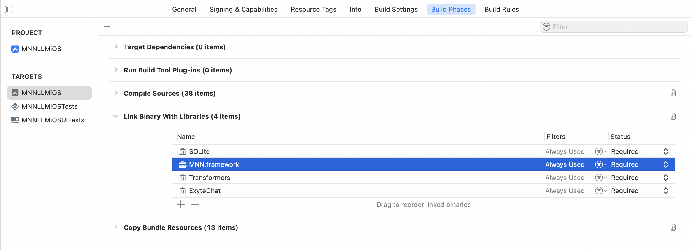

    如果没有包含，可以手动添加 MNN.framework:

    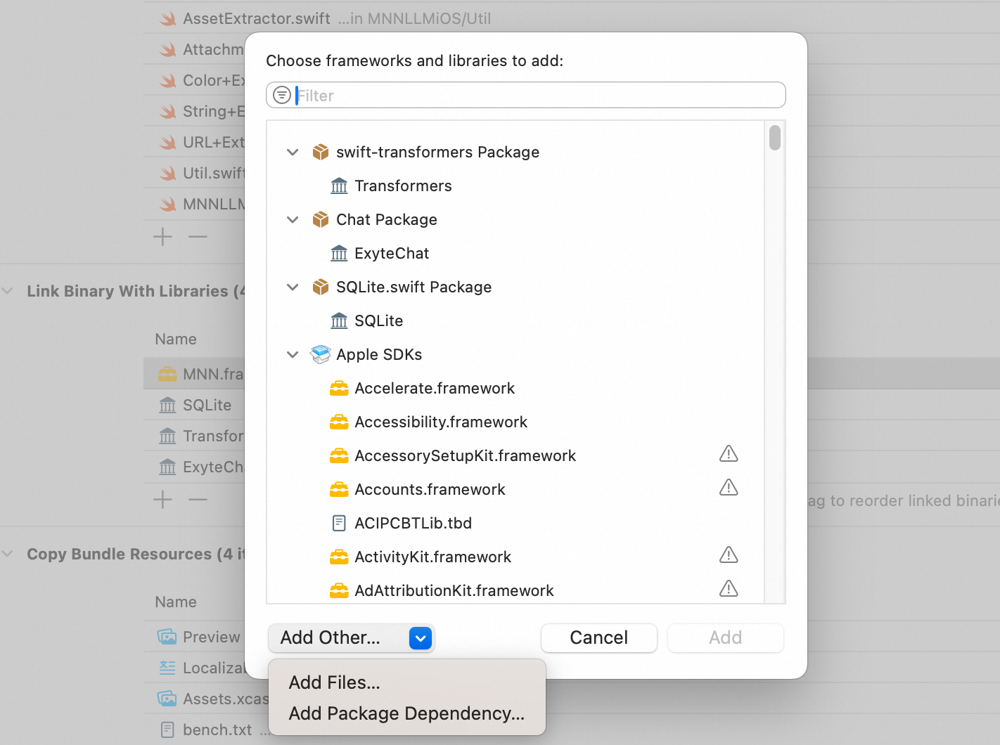
    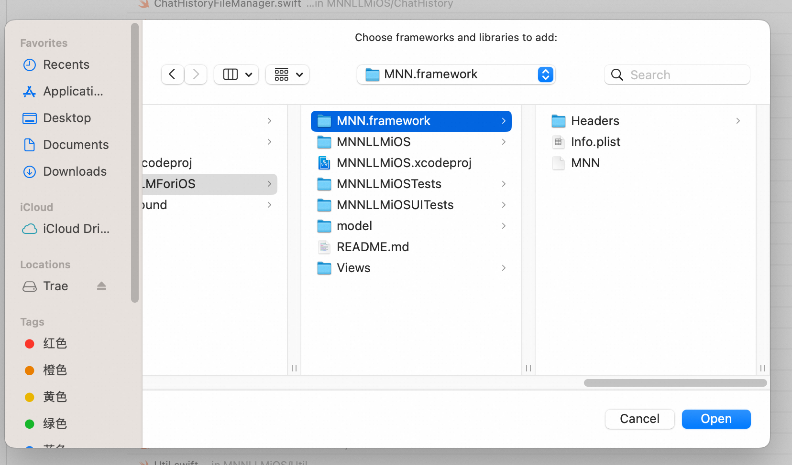
    

4. 修改 iOS 签名并编译项目
    
    ```shell
    cd /apps/iOS/MNNLLMChat
    open MNNLLMiOS.xcodeproj
    ```

    在 Xcode 项目属性中 Signing & Capabilities > Team 输入自己的账号和Bundle Identifier
    
    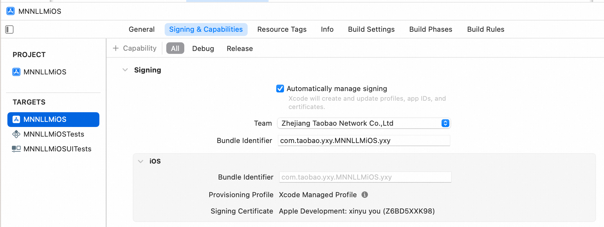


    等待 Swift Package 下载完成之后，进行编译使用。

## 注意

iPhone 因为内存有限，建议使用7B以及以下的模型，避免内存不足导致的崩溃。

## 引用

- [Exyte/Chat](https://github.com/exyte/Chat)
- [stephencelis/CSQLite](https://github.com/stephencelis/SQLite.swift)
- [swift-transformers](https://github.com/huggingface/swift-transformers/)