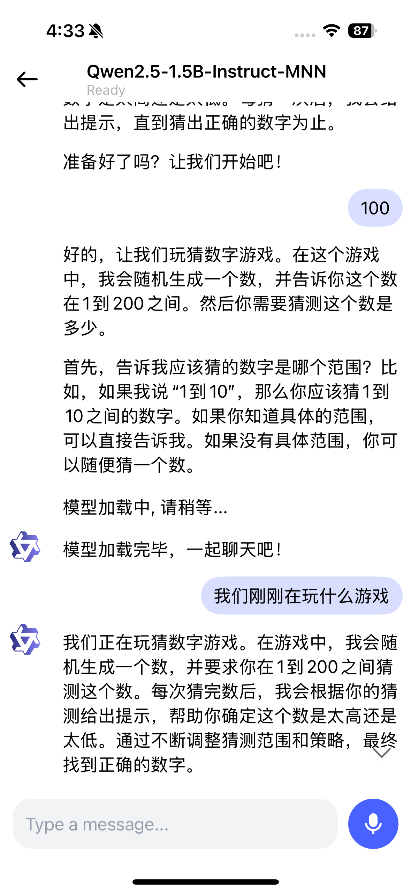

# MNNLLM iOS Application

[查看中文文档](./README-ZH.md)

## Introduction

This project is an iOS application based on the MNN engine, supporting local large-model multimodal conversations.

It operates fully offline with high privacy. Once the models are downloaded to the device, all conversations occur locally without any network uploads or processing.

## Features

1. **Model List**
   - Browse models supported by MNN.
   - Manage models: download and delete models.
   - Search for models locally.
   
2. **Multimodal Chat**
   - Text-to-text conversation.
   - Audio-to-text conversation.
   - Image-to-text conversation: capture images via camera or select from the gallery.

3. **Chat History**
   - View conversation history, with the ability to restore previous chat sessions.


### Video Introduction


### Application Preview:

|  |  |  |
|--|--|--|
| **Text To Text**  | **Image To Text**  | **Audio To Text**  |
|  |  |  |
| **Model List**  | **History**  | **History**  |
|  |  |  |

<p></p>

Additionally, the app supports edge-side usage of DeepSeek with Think mode:


## How to Build and Use

1. Clone the repository:

    ```shell
    git clone https://github.com/alibaba/MNN.git
    ```

2. Build the MNN.framework:

    ```shell
    sh package_scripts/ios/buildiOS.sh "
    -DMNN_ARM82=ON
    -DMNN_LOW_MEMORY=ON
    -DMNN_SUPPORT_TRANSFORMER_FUSE=ON
    -DMNN_BUILD_LLM=ON
    -DMNN_CPU_WEIGHT_DEQUANT_GEMM=ON
    -DMNN_METAL=ON
    -DMNN_BUILD_DIFFUSION=ON
    -DMNN_OPENCL=OFF
    -DMNN_SEP_BUILD=OFF
    -DLLM_SUPPORT_AUDIO=ON
    -DMNN_BUILD_AUDIO=ON
    -DLLM_SUPPORT_VISION=ON 
    -DMNN_BUILD_OPENCV=ON 
    -DMNN_IMGCODECS=ON
    "
    ```

3. Copy the framework to the iOS project:

    ```shell
    mv MNN-iOS-CPU-GPU/Static/MNN.framework /apps/iOS/MNNLLMChat/MNN.framework
    ```

    Ensure the `Link Binary With Libraries` section includes the `MNN.framework`:
    
    

    If it's missing, add it manually:

    
    
    

4. Update iOS signing and build the project:

    ```shell
    cd /apps/iOS/MNNLLMChat
    open MNNLLMiOS.xcodeproj
    ```

    In Xcode, go to `Signing & Capabilities > Team` and input your Apple ID and Bundle Identifier:

    

    Wait for the Swift Package to finish downloading before building.

## Notes

Due to memory limitations on iPhones, it is recommended to use models with 7B parameters or fewer to avoid memory-related crashes.

## References

- [Exyte/Chat](https://github.com/exyte/Chat)
- [stephencelis/CSQLite](https://github.com/stephencelis/SQLite.swift)
- [swift-transformers](https://github.com/huggingface/swift-transformers/)