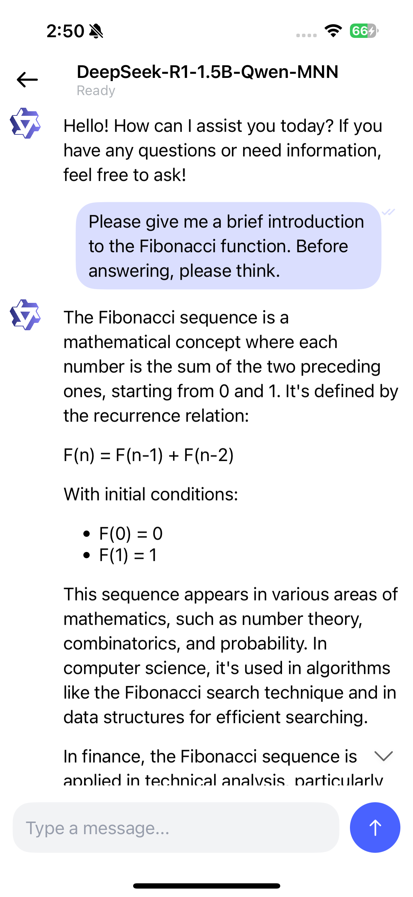
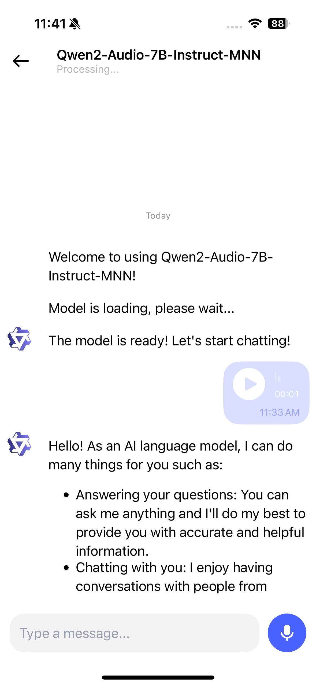
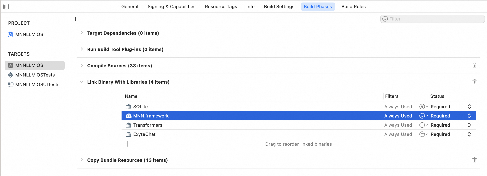
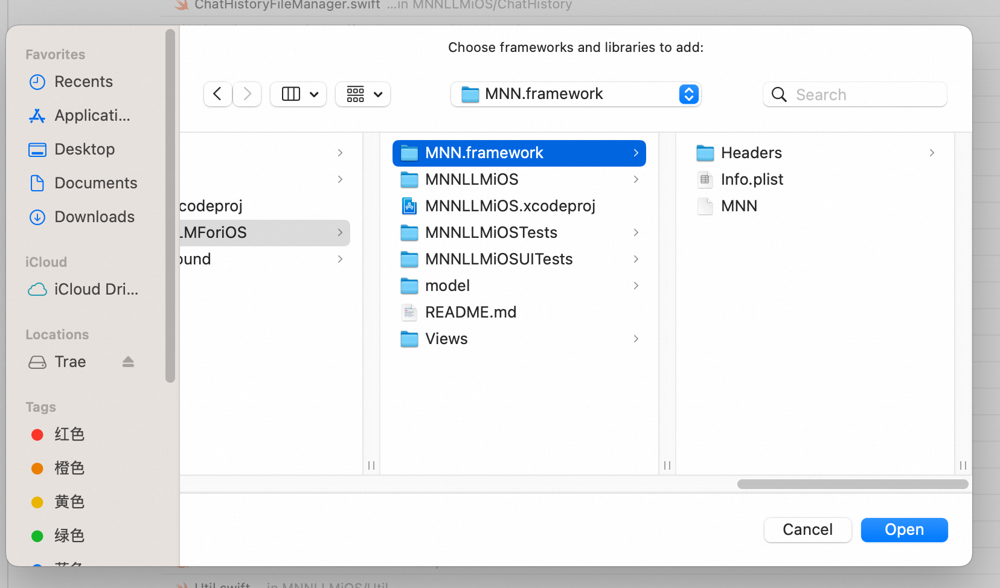
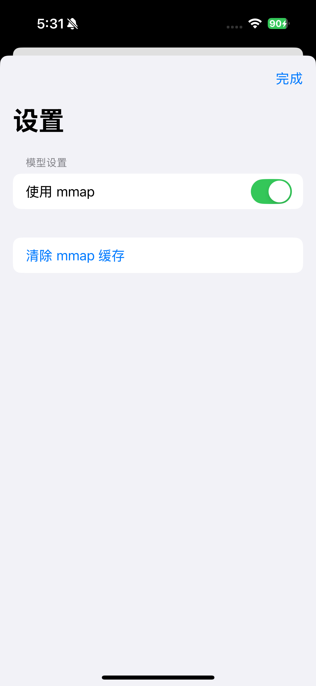

# MNNLLM iOS Application

[查看中文文档](./README-ZH.md)

## Introduction

This project is an iOS application based on the MNN engine, supporting local large-model multimodal conversations.

It operates fully offline with high privacy. Once the models are downloaded to the device, all conversations occur locally without any network uploads or processing.


## Features

1. **Local Models**
    - Display locally downloaded models
    - Support custom pinning
2. **Model Market**
    - Get list of models supported by MNN
    - Model management: download and delete models
        - Support switching between Hugging Face, ModelScope, and Modeler download sources
    - Model search: support keyword search and tag search
3. **Benchmark Testing**
    - Support automated benchmark testing, outputting Prefill speed, Decode Speed, and Memory Usage information
4. **Multimodal Chat**: Supports full Markdown format output
    - Text-to-text
    - Audio-to-text
    - Image-to-text: images can be captured or selected from gallery
5. **Model Configuration**
    - Support configuring mmap
    - Support configuring sampling strategy
    - Support configuring diffusion settings
6. **Chat History**
    - Support model conversation history list, restore historical conversation scenarios


### Video Introduction


[Click here to download the original resolution introduction video](https://github.com/Yogayu/MNN/blob/master/project/MNNLLMForiOS/assets/introduction.mov)


### Application Preview:

|  |  |  | |
|--|--|--|--|
| **Text To Text**  | **Image To Text**  | **Audio To Text**  | **Model Filter** |
|  |  |  |  |
| **Local Model** | **Model Market** | **Benchmark** | **History** |
|  |  |  |  |

<p></p>

Additionally, the app supports edge-side usage of DeepSeek with Think mode:


## How to Build and Use

1. Clone the repository:

    ```shell
    git clone https://github.com/alibaba/MNN.git
    ```

2. Build the MNN.framework:

    ```shell
    sh package_scripts/ios/buildiOS.sh "
    -DMNN_ARM82=ON
    -DMNN_LOW_MEMORY=ON
    -DMNN_SUPPORT_TRANSFORMER_FUSE=ON
    -DMNN_BUILD_LLM=ON
    -DMNN_CPU_WEIGHT_DEQUANT_GEMM=ON
    -DMNN_METAL=ON
    -DMNN_BUILD_DIFFUSION=ON
    -DMNN_OPENCL=OFF
    -DMNN_SEP_BUILD=OFF
    -DLLM_SUPPORT_AUDIO=ON
    -DMNN_BUILD_AUDIO=ON
    -DLLM_SUPPORT_VISION=ON
    -DMNN_BUILD_OPENCV=ON
    -DMNN_IMGCODECS=ON
    "
    ```

3. Copy the framework to the iOS project:

    ```shell
    mv MNN-iOS-CPU-GPU/Static/MNN.framework apps/iOS/MNNLLMChat
    ```

    Ensure the `Link Binary With Libraries` section includes the `MNN.framework`:

    

    If it's missing, add it manually:

    
    


4. Update iOS signing and build the project:

    ```shell
    cd apps/iOS/MNNLLMChat
    open MNNLLMiOS.xcodeproj
    ```

    In Xcode, go to `Signing & Capabilities > Team` and input your Apple ID and Bundle Identifier:

    

    Wait for the Swift Package to finish downloading before building.

## Notes

Due to memory limitations on iPhones, it is recommended to use models with 7B parameters or fewer to avoid memory-related crashes.

Here is the professional technical translation of the provided text:

---

## Local Debugging

If we want to directly download the models to the computer for debugging without downloading them through the app, we can follow these steps:

1. First, download the MNN-related models from [Hugging Face](https://huggingface.co/taobao-mnn) or [Modelscope](https://modelscope.cn/organization/MNN):


    


2. After downloading, drag all the files from the model folder into the project's LocalModel folder:

    

3. Ensure that the above files are included in the Copy Bundle Resources section:

    

4. Comment out the model download code:

    ```Swift
    /*
    try await modelClient.downloadModel(model: model) { progress in
        Task { @MainActor in
            DispatchQueue.main.async {
                self.downloadProgress[model.modelId] = progress
            }
        }
    }
    */
    ```


5. Modify the Model Loading Method

    Modify the `LLMInferenceEngineWrapper` class:

    ```Swift
    // BOOL success = [self loadModelFromPath:modelPath];
    // MARK: Test Local Model
    BOOL success = [self loadModel];
    ```


6. Run the project, navigate to the chat page, and perform model interactions and debugging.

## Release Notes

### Version 0.4

- Added three major project modules: Local Models, Model Market, and Benchmark Testing
- Added benchmark testing to test different model performance
- Added settings page, accessible from the history sidebar
- Added Ali CDN for getting model lists
- Added model market filtering functionality

### Version 0.3.1  

- Add support for model parameter configuration  

|  |  |  |  

### Version 0.3  

New Features:  

- Add support for downloading from the **Modeler** source  
- Add support for **Stable Diffusion** text-to-image generation  

|  |  |  

### Version 0.2  

New Features:  

- Add support for **mmap configuration** and **manual cache clearing**  
- Add support for downloading models from the **ModelScope** source  

|  |  |  

## References

- [Exyte/Chat](https://github.com/exyte/Chat)
- [stephencelis/CSQLite](https://github.com/stephencelis/SQLite.swift)
- [swift-transformers](https://github.com/huggingface/swift-transformers/)