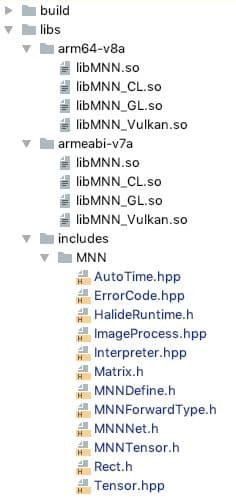

[English Version](Tutorial_EN.md)

[TOC]

# Demo源码

Android & iOS：[Demo工程目录](../demo)

# 工具编译

编译生成各平台下的MNN库（如编译安卓下的so库），请参考[编译文档](Install_CN.md)。


# 模型下载&转换

工程中没有内置模型文件，MNN提供了脚本工具自动下载Tensorflow、Caffe等模型文件并完成转换，下载转换完后的模型在[resource](../resource)目录下，Android/iOS工程会引用该目录作为资源目录。

步骤：

1. 安装模型转换工具，请参考[转换工具文档](../tools/converter/README.md)
2. 执行[get_model.sh](../tools/script/get_model.sh)脚本
3. 执行成功后，在[resource](../resource)目录下可以看到转换完的模型文件


# 工程搭建

以下介绍在Android/iOS IDE环境中使用MNN的准备工作。

## iOS

##### 1. Podfile中添加MNN

```ruby
pod 'MNN', :path => "path/to/MNN"
```

##### 2. pod update

##### 3. 在目标文件中引用

```objective-c
#import <MNN/Interpreter.hpp>
#import <MNN/Tensor.hpp>
#import <MNN/ImageProcess.hpp>
```

## Android

本节介绍在Android中使用MNN的准备环境和前提工作，涉及到JNI的一些知识但不作为重点，如不了解其使用请移步[官方文档](https://developer.android.com/studio/projects/add-native-code)。

### 准备工具

在Android Studio（2.2+）下，推荐使用外部构建工具cmake（当然也可以使用原生的构建工具ndk-build），搭配Gradle插件来构建或使用so库。

注意：强烈推荐安装 `ccache` 加速MNN的编译速度，macOS `brew install ccache` ubuntu `apt-get install ccache` 。

首先需要下载NDK和cmake构建工具：

打开Android Studio -> Perferences -> Appearance&Behavior -> System Setting -> Android SDK，或者直接在左侧搜索Android SDK，选择SDK Tools，下载NDK、cmake工具包。


### 添加MNN so库

将编译好的MNN相关so库和头文件加到工程中，Demo中已经包含编译好的armeabi-v7a、arm64-v8a两种架构下的CPU、GPU、OpenCL、Vulkan的so库，我们将它们添加到libs目录下：



然后创建CMakeLists.txt构建脚本，关联预构建的MNN so库（见上文工具编译）：

##### CMakeLists.txt

```cmake
cmake_minimum_required(VERSION 3.4.1)

set(lib_DIR ${CMAKE_SOURCE_DIR}/libs)
include_directories(${lib_DIR}/includes)

set (CMAKE_C_FLAGS "${CMAKE_C_FLAGS} -fopenmp")
set (CMAKE_CXX_FLAGS "${CMAKE_CXX_FLAGS} -fopenmp")

set (CMAKE_C_FLAGS "${CMAKE_C_FLAGS} -std=gnu99 -fvisibility=hidden -fomit-frame-pointer -fstrict-aliasing -ffunction-sections -fdata-sections -ffast-math -flax-vector-conversions")
set (CMAKE_CXX_FLAGS "${CMAKE_CXX_FLAGS} -std=c++11 -fvisibility=hidden -fvisibility-inlines-hidden -fomit-frame-pointer -fstrict-aliasing -ffunction-sections -fdata-sections -ffast-math -fno-rtti -fno-exceptions -flax-vector-conversions")
set (CMAKE_LINKER_FLAGS "${CMAKE_LINKER_FLAGS} -Wl,--gc-sections")

add_library( MNN SHARED IMPORTED )
set_target_properties(
                MNN
                PROPERTIES IMPORTED_LOCATION
                ${lib_DIR}/${ANDROID_ABI}/libMNN.so
                )
...
```

然后配置模块级的gradle，指定CMakeLists路径和jniLibs的路径

##### build.gradle

```java
android {
    ...
    externalNativeBuild {
        cmake {
            path "CMakeLists.txt"
        }
    }

    sourceSets {
        main {
            jniLibs.srcDirs = ['libs']
        }
    }
    ...
}
```

### 加载MNN so库

并非所有的so都要加载，根据需要选择要加载哪些so。示例中加载了CPU、GPU、OpenCL、Vulkan四个so库。

```java
static {
    System.loadLibrary("MNN");
    try {
        System.loadLibrary("MNN_CL");
        System.loadLibrary("MNN_GL");
        System.loadLibrary("MNN_Vulkan");
    } catch (Throwable ce) {
        Log.w(Common.TAG, "load MNN GPU so exception=%s", ce);
    }
    ...
}
```

### 封装native接口

接下来就可以封装native方法来调用MNN C++接口了，因为直接调用层在java，涉及到参数传递和转换的一些处理，没有直接使用C++接口那么方便。在上层也并不需要而且很难实现和C++接口一一对应的调用粒度，所以我们一般都是构建一个自己的原生库，在其中按照MNN的调用过程封装了一系列方便上层调用的接口。

[Demo](../demo)中展示了一个封装的最佳实践：mnnnetnative.cpp封装了MNN C++接口，CMake会打包成libMNNcore.so；为了方便Java层的调用，我们封装了三个类：

- MNNNetNative：仅提供native方法声明，和MNNnetnative.cpp的接口一一对应
- MNNNetInstance：提供网络创建、输入、推理、输出、销毁过程用到的接口
- MNNImageProcess：提供图像处理相关的接口

你可以直接将他们复制到你的工程中使用，避免封装的麻烦（推荐）。当然，如果您对MNN C++接口和jni都很熟悉，也可以按照自己的方式来封装。


# 开发指南

### 基本过程

无论在什么环境下上层如何封装，底层都是调用MNN C++接口，只要保证调用的基本步骤正确即可。MNN的基本调用过程如下图：


### 代码示例

#### iOS

我们以Demo中的MobileNet示例调动过程：

```objective-c
// 创建网络
NSString *model = [[NSBundle mainBundle] pathForResource:@"mobilenet" ofType:@"mnn"];
auto interpreter = std::shared_ptr<MNN::Interpreter>(MNN::Interpreter::createFromFile(model.UTF8String));

// 创建session
MNN::ScheduleConfig config;
config.type = MNN_FORWARD_CPU;
config.numThread = 4;
MNN::Session *session = interpreter->createSession(config);

/*
 *  设置输入
 *  1. 归一化处理 2.格式转换 3.图像变换(裁剪、旋转、缩放) 4.数据输入tensor
 */
int w = image.size.width;
int h = image.size.height;
unsigned char *rgba = (unsigned char *)calloc(w * h * 4, sizeof(unsigned char)); {
    CGColorSpaceRef colorSpace = CGImageGetColorSpace(image.CGImage);
    CGContextRef contextRef = CGBitmapContextCreate(rgba, w, h, 8, w * 4, colorSpace,
                                                    kCGImageAlphaNoneSkipLast | kCGBitmapByteOrderDefault);
    CGContextDrawImage(contextRef, CGRectMake(0, 0, w, h), image.CGImage);
    CGContextRelease(contextRef);
}

const float means[3] = {103.94f, 116.78f, 123.68f};
const float normals[3] = {0.017f, 0.017f, 0.017f};
MNN::CV::ImageProcess::Config process;
::memcpy(process.mean, means, sizeof(means));
::memcpy(process.normal, normals, sizeof(normals));
process.sourceFormat = MNN::CV::RGBA;
process.destFormat = MNN::CV::BGR;

std::shared_ptr<MNN::CV::ImageProcess> pretreat(MNN::CV::ImageProcess::create(process));
MNN::CV::Matrix matrix;
matrix.postScale((w - 1) / 223.0, (h - 1) / 223.0);
pretreat->setMatrix(matrix);

auto input = interpreter->getSessionInput(session, nullptr);
pretreat->convert(rgba, w, h, 0, input);
free(rgba);

// 推理
interpreter->runSession(session);

// 获取输出
MNN::Tensor *output = interpreter->getSessionOutput(session, nullptr);
auto copy = std::shared_ptr<MNN::Tensor>(MNN::Tensor::createHostTensorFromDevice(output));
float *data = copy->host<float>();
```

#### Android

以下我们使用Demo中MNNNetInstance封装的接口来示例调用的过程：

```java
// create net instance
MNNNetInstance instance = MNNNetInstance.createFromFile(MainActivity.this, modelFilePath);

// create session
MNNNetInstance.Config config= new MNNNetInstance.Config();
config.numThread = 4;
config.forwardType = MNNForwardType.FORWARD_CPU.type;
//config.saveTensors = new String[]{"layer name"};
MNNNetInstance.Session session = instance.createSession(config);

// get input tensor
MNNNetInstance.Session.Tensor inputTensor = session.getInput(null);

/*
 *  convert data to input tensor
 *  1. 归一化处理 2.格式转换 3.图像变换(裁剪、旋转、缩放) 4.数据输入tensor
 */
MNNImageProcess.Config config = new MNNImageProcess.Config();
// normalization params
config.mean = ...
config.normal = ...
// input data format convert
config.source = MNNImageProcess.Format.YUV_NV21;
config.dest = MNNImageProcess.Format.BGR;
// transform
Matrix matrix = new Matrix();
matrix.postTranslate((bmpWidth - TestWidth) / 2, (bmpHeight- TestHeight) / 2);// translate
matrix.postScale(2 ,2);// scale
matrix.postRotate(90);// rotate
matrix.invert(matrix);

// bitmap input
MNNImageProcess.convertBitmap(orgBmp, inputTensor, config, matrix);
// buffer input
//MNNImageProcess.convertBitmap(buffer, inputTensor, config, matrix);

// inference
session.run();
//session.runWithCallback(new String[]{"layer name"})

// get output tensor
MNNNetInstance.Session.Tensor output = session.getOutput(null);
// get results
float[] result = output.getFloatData();// float results
//int[] result = output.getIntData();// int results
//byte[] result = output.getUINT8Data();// uint8 results
...

// instance release
instance.release();
```

### API for iOS

以下按照调用顺序介绍使用的接口

#### 1. 创建Interpreter

```objective-c
static Interpreter* createFromFile(const char* file);
```

##### 参数说明

- file: 模型存放的本地路径

##### 返回值：

Interpreter对象


#### 2. 创建Session

```objective-c
MNN::ScheduleConfig config;
config.type = MNN_FORWARD_CPU;
config.numThread = 4;
MNN::Session *session = interpreter->createSession(config);
```

##### 参数说明

- config: ScheduleConfig对象，其中可指定执行类型forwardType、线程数numThread、需要保存的中间层saveTensors；其中执行类型iOS平台支持MNN_FORWARD_CPU和MNN_FORWARD_METAL。

##### 返回值

Session对象

#### 3. 获取输入/输出的Tensor

```objective-c
Tensor* getSessionInput(const Session* session, const char* name);
Tensor* getSessionOutput(const Session* session, const char* name);
```

##### 参数说明

- session: 网络执行的session
- name: 指定获取输入/输出层的名字，如果默认传null

##### 返回值

Tensor对象

#### 4. Resize Input Tenors, Session

这一步不是必须的，如需要，则先resize所有输入tensor，然后再resize session。

##### Reize Tensor

```objective-c
void resizeTensor(Tensor* tensor, const std::vector<int>& dims);
```

###### 参数说明

- dims: 维度信息

##### Resize Session

```objective-c
void resizeSession(Session* session);
```

所有的input tensor完成resize之后，调用session的resize。

#### 5. Tensor输入数据

这一步指的是将输入数据进行必要的预处理后，将数据塞入inputTensor。

###### 使用ImageProcess进行预处理并设置输入

```objective-c
auto input = interpreter->getSessionInput(session, nullptr);
pretreat->convert(rgba, w, h, 0, input);// ImageProcess的convert步骤会把处理好的数据直接塞入inputTensor中
```

###### 手动设置输入

```objective-c
auto inputTensor = net->getSessionInput(session, name.UTF8String);
MNN::Tensor inputTensorUser(inputTensor, inputTensor->getDimensionType());
if (nullptr == inputTensorUser.host<float>()) {
    auto tmpTensor = MNN::Tensor::create<uint8_t>(dims, &data);
    tmpTensor->copyToHostTensor(inputTensor);
} else {
    auto inputData = inputTensorUser.host<float>();
    auto size = inputTensorUser.size();
    ::memcpy(inputData, data, size);
    inputTensor->copyFromHostTensor(&inputTensorUser);
}
```

#### 6. 推理

```objective-c
interpreter->runSession(session);
```

##### 参数说明

- session: 网络运行session

##### 返回值：

推理完成状态，MNN::ErrorCode

#### 7. 结果提取

可根据实际需要获取指定数据类型数据float、int、UINT8等，以float为例：

```objective-c
MNN::Tensor *output = interpreter->getSessionOutput(session, nullptr);
auto copy = std::shared_ptr<MNN::Tensor>(MNN::Tensor::createHostTensorFromDevice(output));
float *data = copy->host<float>();
```


### API for Android

以下按照调用顺序介绍使用的接口（以Demo中MNNNetInstance、MNNImageProcess封装为例）

#### 1. 创建MNNNetInstance

```java
public static MNNNetInstance createFromFile(Context context, String fileName)
```

##### 参数说明

- context：上下文
- fileName：模型存放的本地路径

##### 返回值：

MNNNetInstance对象


#### 2. 创建session

```java
public Session createSession(Config config);
```

##### 参数说明

- config：MNNImageProcess.Config对象，其中可指定forwardType、numThread、saveTensors

##### 返回值：

session对象

> 注意：saveTensors为需要保存中间输出结果而指定的层的名称，可以指定多个。中间层的Tensor可以在推理后直接通过getOutput("layer name")取出。


#### 3. 获取输入的tensor

```java
public Tensor getInput(String name)
```

##### 参数说明

- name：指定获取输入层的名字，如果默认传null

##### 返回值：

输入的Tensor对象

#### 4. Resize input tensors、session

这一步不是必须的，如需要，则先resize所有输入tensor，然后再resize session。

##### Resize Tensor

```java
public void reshape(int[] dims);
```

##### 参数说明

- dims：维度信息。

##### Resize Session

```java
public void reshape()
```

所有的input tensor完成resize之后，调用session的resize。

#### 5. tensor输入数据

这一步是把模型的输入，如图像的rgb或视频yuv数据，转换成模型需要的输入格式，并提供缩放、旋转、裁剪等通用操作，然后写入到输入的tensor中。


##### 1）byte数组作为输入

**MNNImageProcess.java**

```java
public static boolean convertBuffer(byte[] buffer, int width, int height, MNNNetInstance.Session.Tensor tensor, Config config, Matrix matrix)
```

##### 参数说明

- buffer：byte数组
- width：buffer宽
- height：buffer高
- tensor：输入的tensor
- config：配置信息。配置中可指定数据源格式、目标格式（如BGR）、归一化参数等。详见MNNImageProcess.Config
- matrix：用于图像平移、缩放、旋转的矩阵。可参考Android的Matrix的用法

##### 返回值：

成功/失败，bool值

##### 2）图像Bitmap作为输入

**MNNImageProcess.java**

```java
public static boolean convertBitmap(Bitmap sourceBitmap, Tensor tensor, MNNImageProcess.Config config, Matrix matrix);
```

##### 参数说明

- sourceBitmap：图像bitmap对象
- tensor：输入的tensor
- config：配置信息。配置中可指定目标格式（如BGR，源不需要指定）、归一化参数等。详见MNNImageProcess.Config
- matrix：用于图像平移、缩放、旋转的矩阵。可参考Android的Matrix的用法

##### 返回值：

成功/失败，bool值

#### 6. 推理

##### 1）推理

```java
public void run()
```

##### 2）推理+保存中间输出

```java
public Tensor[] runWithCallback(String[] names)
```

##### 参数说明

- names：中间层的名称

##### 返回值：

返回对应中间层输出的Tensor数组

#### 7. 获取输出的tensor

```java
public Tensor getOutput(String name);
```

##### 参数说明

- name：指定获取输出层的名字，如果默认传null

##### 返回值：

输出的Tensor对象

#### 8. 结果提取

##### 从tensor中获取float类型结果，结果会全部取完

```java
public float[] getFloatData()
```

##### 从tensor中获取int类型结果，结果会全部取完

```java
public int[] getIntData()
```

##### 从tensor中获取UINT8类型结果，结果会全部取完

```java
public byte[] getUINT8Data()
```

#### 9. MNNNetInstance销毁

```java
public void release();
```

网络不使用了需要及时销毁，以释放native内存。


### MNN图像处理

当我们用视频或图片作为输入源的时经常需要做一些裁剪、旋转、缩放操作，或者需要转换成模型要的输入格式，如果在上层处理效率太低，MNN提供了图像处理模块来处理这些常用操作，使用方便且速度较快，其主要提供的能力有：

- 数据格式转换（RGBA/RGB/BGR/GRAY/BGRA/YUV420/NV21）
- 归一化操作
- 图像的裁剪、旋转、缩放处理

tensor输入数据时调用convertBuffer或convertBitmap接口，使用了MNNImageProcess.Config config和Matrix matrix这两个参数：
其中，MNNImageProcess.Config用来配置源数据格式和目标格式（如果是图片输入不需要指定源格式），并且可配置归一化参数；
Matrix就是用来对图像做仿射变换用的，需要注意的是，这里的matrix参数是指从目标图像到源图像的变换矩阵。如果不好理解，可以按源图像变换到目标图像后再取逆。

> 注意：Matrix参数是指从目标图像到源图像的变换矩阵

我们举个例子：Android Camera输出视频NV21数据作为输入，模型的输入格式需要BGR。同时，由于安卓摄像头的正向问题，需要把视频顺时针旋转90度；模型要求输入为224*224大小，并且数值在0-1之间。

#### 参考示例

##### Android

```java
MNNImageProcess.Config config = new MNNImageProcess.Config();
// normalization
config.mean=new float[]{0.0f,0.0f,0.0f};
config.normal=new float[]{1.0f,1.0f,1.0f};
// nv21 to bgr
config.source=MNNImageProcess.Format.YUV_NV21;// input source format
config.dest=MNNImageProcess.Format.BGR;       // input data format

// matrix transform: dst to src
Matrix matrix=new Matrix();
matrix.postRotate(90);
matrix.preTranslate(-imageWidth/2,-imageHeight/2);
matrix.postTranslate(imageWidth/2,imageHeight/2);
matrix.postScale(224/imageWidth,224/imageHeight);
matrix.invert(matrix);// 因为是目标变换到源的矩阵，需要取逆

MNNImageProcess.convertBuffer(data, imageWidth, imageHeight, inputTensor,config,matrix);
```

##### iOS

```objective-c
CVPixelBufferRef pixelBuffer = CMSampleBufferGetImageBuffer(sampleBuffer);
int w = (int)CVPixelBufferGetWidth(pixelBuffer);
int h = (int)CVPixelBufferGetHeight(pixelBuffer);

CVPixelBufferLockBaseAddress(pixelBuffer, kCVPixelBufferLock_ReadOnly);
unsigned char *bgra = (unsigned char *)CVPixelBufferGetBaseAddress(pixelBuffer);

const float means[3] = {103.94f, 116.78f, 123.68f};
const float normals[3] = {0.017f, 0.017f, 0.017f};
MNN::CV::ImageProcess::Config process;
::memcpy(process.mean, means, sizeof(means));
::memcpy(process.normal, normals, sizeof(normals));
process.sourceFormat = MNN::CV::BGRA;
process.destFormat = MNN::CV::BGR;

std::shared_ptr<MNN::CV::ImageProcess> pretreat(MNN::CV::ImageProcess::create(process));
MNN::CV::Matrix matrix;
matrix.postScale((w - 1) / 223.0, (h - 1) / 223.0);
pretreat->setMatrix(matrix);

auto input = interpreter->getSessionInput(session, nullptr);
pretreat->convert(bgra, w, h, 0, input);

CVPixelBufferUnlockBaseAddress(pixelBuffer, kCVPixelBufferLock_ReadOnly);
```
