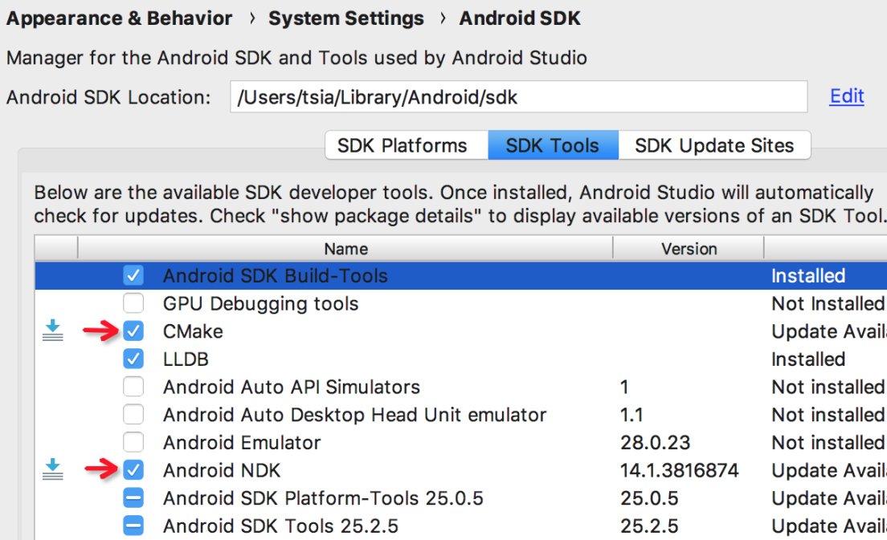
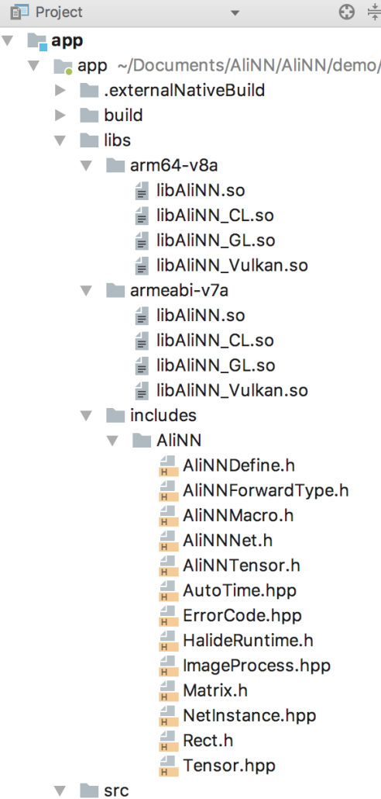
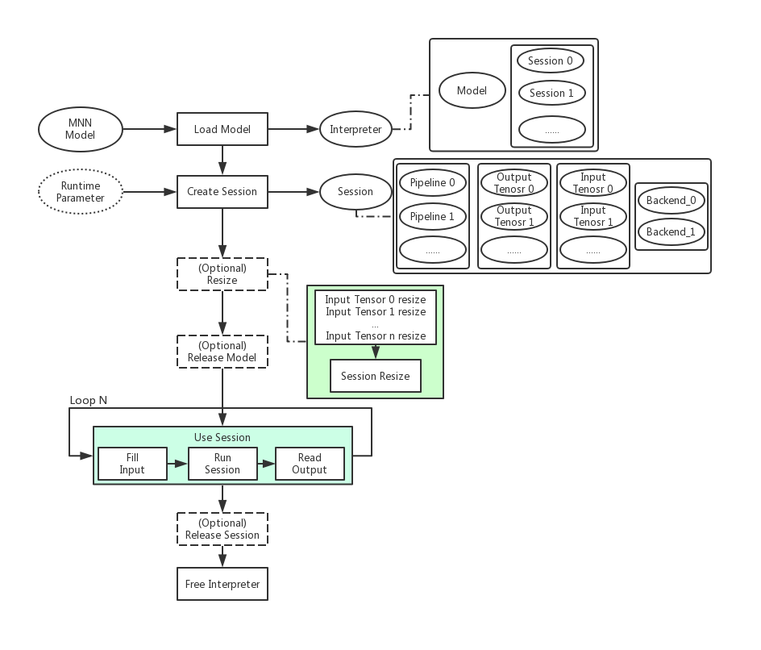

[中文版本](Tutorial_CN.md)

[TOC]

# Demo

Android & iOS: [Demo Directory](../demo)


# Compilation

Refer to the [compilation documentation](INSTALL_EN.md) to build libraries.


# Models downLoad & convert

There are no built-in model files in the project, But MNN has provided a shell script to download, convert Tensorflow, Caffe model files. Converted models are saved in [resource directory](../resource) witch is referenced as a resource directory in iOS & Android project.

Steps:
1. To install the converter, please refer to the [Converter Doc](../tools/converter/README.md).
2. Execute the scrip[get_model.sh](../tools/script/get_model.sh).
3. You will see the converted model files in the [resource directory](../resource) after succeed.


# Project structures

Here's how to integrate MNN in an Android/iOS IDE.

## iOS

##### 1. Add MNN to Podfile

```ruby
pod 'MNN', :path => "path/to/MNN"
```

##### 2. pod update

##### 3. Reference in the target file

```objective-c
#import <MNN/Interpreter.hpp>
#import <MNN/Tensor.hpp>
#import <MNN/ImageProcess.hpp>
```

## Android

This section describes how to integrate MNN in Android. knowledge of JNI is involved but not illustrated here, if you do not understand its usage, please refer to [Official Documentation](https://developer.android.com/studio/projects/add-native-code)。

### Toolchain preparation 

Under Android Studio (2.2+), cmake is recommended（you can also choose the native ndk-build tool directly）and the Gradle plug-in is used to build or use the so library。

Note: It is highly recommended to install `ccache` to speed up the compilation of MNN, macOS `brew install ccache` ubuntu `apt-get install ccache`.

You need to download the NDK and cmake firstly: 

Open Android Studio -> Perferences -> Appearance&Behavior -> System Setting -> Android SDK, Or search the Android SDK directly on the left, select SDK Tools, and download the NDK and cmake toolkits.



### Add MNN so libraries

Add the compiled MNN so libraries and header files to the project, the demo has included the compiled so libraries of CPU, GPU, OpenCL and Vulkan under armeabi-v7a and arm64-v8a. We added them to the libs directory:



Then create a CMakeLists.txt that associates the pre-built MNN so libraries (see compilation documentation above) :

##### CMakeLists.txt

```cmake
cmake_minimum_required(VERSION 3.4.1)

set(lib_DIR ${CMAKE_SOURCE_DIR}/libs)
include_directories(${lib_DIR}/includes)

set (CMAKE_C_FLAGS "${CMAKE_C_FLAGS} -fopenmp")
set (CMAKE_CXX_FLAGS "${CMAKE_CXX_FLAGS} -fopenmp")

set (CMAKE_C_FLAGS "${CMAKE_C_FLAGS} -std=gnu99 -fvisibility=hidden -fomit-frame-pointer -fstrict-aliasing -ffunction-sections -fdata-sections -ffast-math -flax-vector-conversions")
set (CMAKE_CXX_FLAGS "${CMAKE_CXX_FLAGS} -std=c++11 -fvisibility=hidden -fvisibility-inlines-hidden -fomit-frame-pointer -fstrict-aliasing -ffunction-sections -fdata-sections -ffast-math -fno-rtti -fno-exceptions -flax-vector-conversions")
set (CMAKE_LINKER_FLAGS "${CMAKE_LINKER_FLAGS} -Wl,--gc-sections")

add_library( MNN SHARED IMPORTED )
set_target_properties(
                MNN
                PROPERTIES IMPORTED_LOCATION
                ${lib_DIR}/${ANDROID_ABI}/libMNN.so
                )
...
```

Then configure the gradle, specifying the CMakeLists.txt path and the jniLibs path

##### build.gradle

```java
android {
    ...
    externalNativeBuild {
        cmake {
            path "CMakeLists.txt"
        }
    }

    sourceSets {
        main {
            jniLibs.srcDirs = ['libs']
        }
    }
    ...
}
```

### Load MNN so libraries

Not all so libraries are need to be loaded, choose what you need. In the example, CPU, GPU, OpenCL and Vulkan are loaded.

```java
static {
    System.loadLibrary("MNN");
    try {
        System.loadLibrary("MNN_CL");
        System.loadLibrary("MNN_GL");
        System.loadLibrary("MNN_Vulkan");
    } catch (Throwable ce) {
        Log.w(Common.TAG, "load MNN GPU so exception=%s", ce);
    }
    ...
}
```

### Encapsulate native interface

Next, you can wrap the native method to call the MNN C++ interface, since the direct call layer in Java involves parameter passing and transformation, it is not as convenient as using the C++ interface directly. It is not necessary and difficult to implement the call granularity corresponding to C++ interfaces in the upper layer, so we usually build a native library on our own, in which we encapsulate a series of interfaces convenient for upper layer calls according to the call procedure of MNN.

[Demo](../demo) shows an encapsulated best practice. mnnnetnative.cpp encapsulates the C++ interface of MNN, which will be packaged as libMNNcore.so with cmake. To facilitate the invocation of the Java layer, we encapsulate three classes:

- MNNNetNative: Only native method declaration is provided, which corresponds to the interface of MNNnetnative.cpp
- MNNNetInstance: Provides interfaces for network creation, input, inference, output, and destruction
- MNNImageProcess: Provides interfaces related to image processing

You can copy them directly into your project to avoid the hassle of encapsulation (recommended). Of course, if you are familiar with the MNN C++ interface and jni, you can also wrap it in your own way.


# Development guideline

### The basic process

No matter how the upper layer is encapsulated in any environment, the bottom layer is to call the MNN C++ interface. Just make sure the basic steps of the call are correct. The basic call process of MNN is as follows:



### Code sample

#### iOS

We provide the MobileNet example:

```objective-c
// Create a interpreter
NSString *model = [[NSBundle mainBundle] pathForResource:@"mobilenet" ofType:@"mnn"];
auto interpreter = std::shared_ptr<MNN::Interpreter>(MNN::Interpreter::createFromFile(model.UTF8String));

// Create a session
MNN::ScheduleConfig config;
config.type = MNN_FORWARD_CPU;
config.numThread = 4;
MNN::Session *session = interpreter->createSession(config);

/*
 *  Set input
 *  1. Normalization processing 2.Format transformation; 3. Image transformation (pruning, rotating, scaling); 4. Data input tensor
 */
int w = image.size.width;
int h = image.size.height;
unsigned char *rgba = (unsigned char *)calloc(w * h * 4, sizeof(unsigned char)); {
    CGColorSpaceRef colorSpace = CGImageGetColorSpace(image.CGImage);
    CGContextRef contextRef = CGBitmapContextCreate(rgba, w, h, 8, w * 4, colorSpace,
                                                    kCGImageAlphaNoneSkipLast | kCGBitmapByteOrderDefault);
    CGContextDrawImage(contextRef, CGRectMake(0, 0, w, h), image.CGImage);
    CGContextRelease(contextRef);
}

const float means[3] = {103.94f, 116.78f, 123.68f};
const float normals[3] = {0.017f, 0.017f, 0.017f};
MNN::CV::ImageProcess::Config process;
::memcpy(process.mean, means, sizeof(means));
::memcpy(process.normal, normals, sizeof(normals));
process.sourceFormat = MNN::CV::RGBA;
process.destFormat = MNN::CV::BGR;

std::shared_ptr<MNN::CV::ImageProcess> pretreat(MNN::CV::ImageProcess::create(process));
MNN::CV::Matrix matrix;
matrix.postScale((w - 1) / 223.0, (h - 1) / 223.0);
pretreat->setMatrix(matrix);

auto input = interpreter->getSessionInput(session, nullptr);
pretreat->convert(rgba, w, h, 0, input);
free(rgba);

// Inference
interpreter->runSession(session);

// Obtain the output
MNN::Tensor *output = interpreter->getSessionOutput(session, nullptr);
auto copy = std::shared_ptr<MNN::Tensor>(MNN::Tensor::createHostTensorFromDevice(output));
float *data = copy->host<float>();
```

#### Android

The following procedures are called using the interface encapsulated by MNNNetInstance in the demo:

```java
// create net instance
MNNNetInstance instance = MNNNetInstance.createFromFile(MainActivity.this, modelFilePath);

// create session
MNNNetInstance.Config config= new MNNNetInstance.Config();
config.numThread = 4;
config.forwardType = MNNForwardType.FORWARD_CPU.type;
//config.saveTensors = new String[]{"layer name"};
MNNNetInstance.Session session = instance.createSession(config);

// get input tensor
MNNNetInstance.Session.Tensor inputTensor = session.getInput(null);

/*
 *  Set input
 *  1. Normalization processing 2.Format transformation; 3. Image transformation (pruning, rotating, scaling); 4. Data input tensor
 */
MNNImageProcess.Config config = new MNNImageProcess.Config();
// normalization params
config.mean = ...
config.normal = ...
// input data format convert
config.source = MNNImageProcess.Format.YUV_NV21;
config.dest = MNNImageProcess.Format.BGR;
// transform
Matrix matrix = new Matrix();
matrix.postTranslate((bmpWidth - TestWidth) / 2, (bmpHeight- TestHeight) / 2);// translate
matrix.postScale(2 ,2);// scale
matrix.postRotate(90);// rotate
matrix.invert(matrix);

// bitmap input
MNNImageProcess.convertBitmap(orgBmp, inputTensor, config, matrix);
// buffer input
//MNNImageProcess.convertBitmap(buffer, inputTensor, config, matrix);

// inference
session.run();
//session.runWithCallback(new String[]{"layer name"})

// get output tensor
MNNNetInstance.Session.Tensor output = session.getOutput(null);
// get results
float[] result = output.getFloatData();// float results
//int[] result = output.getIntData();// int results
//byte[] result = output.getUINT8Data();// uint8 results
...

// instance release
instance.release();
```

### API for iOS

The interfaces are introduced according to the calling sequence below.

#### 1. Create interpreter

```objective-c
static Interpreter* createFromFile(const char* file);
```

##### Parameters

- file: local path to the model file

##### Return value:

Interpreter object


#### 2. Create a session

```objective-c
MNN::ScheduleConfig config;
config.type = MNN_FORWARD_CPU;
config.numThread = 4;
MNN::Session *session = interpreter->createSession(config);
```

##### Parameters

- Config: ScheduleConfig object, in which, the scheduling type of forwardType will be specified, the number of threads numThread and the intermediary saveTensors to be saved; iOS supports MNN_FORWARD_CPU and MNN_FORWARD_METAL execution type.

##### Return value:

Session object


#### 3. Get input/output tensor

```objective-c
Tensor* getSessionInput(const Session* session, const char* name);
Tensor* getSessionOutput(const Session* session, const char* name);
```

##### Parameters

- session: The session that the network executes in
- name: Specifies the name of the fetching input/output tensor, default as null

##### Return value:

Tensor object


#### 4. Resize input tenors and session

This is not a required step, but if you need to resize, you need to resize all input tensors, and then resize session.

##### Reize tensor

```objective-c
void resizeTensor(Tensor* tensor, const std::vector<int>& dims);
```

###### Parameters

- dims: Dimension information

##### Resize session

After all the input tensor resize is completed, then resize the session.

```objective-c
void resizeSession(Session* session);
```

#### 5. Input data

Prepare input data and set them into the inputTensor after necessary pre-processing.

###### Use ImageProcess to pre-process and set the input

```objective-c
auto input = interpreter->getSessionInput(session, nullptr);
pretreat->convert(rgba, w, h, 0, input);// The convert step of the ImageProcess will put the processed data directly into the inputTensor
```

###### Manual setting input

```objective-c
auto inputTensor = net->getSessionInput(session, name.UTF8String);
MNN::Tensor inputTensorUser(inputTensor, inputTensor->getDimensionType());
if (nullptr == inputTensorUser.host<float>()) {
    auto tmpTensor = MNN::Tensor::create<uint8_t>(dims, &data);
    tmpTensor->copyToHostTensor(inputTensor);
} else {
    auto inputData = inputTensorUser.host<float>();
    auto size = inputTensorUser.size();
    ::memcpy(inputData, data, size);
    inputTensor->copyFromHostTensor(&inputTensorUser);
}
```

#### 6. Inference

```objective-c
interpreter->runSession(session);
```

##### Parameters

- session: Network session

##### Return value:

Inference completion state : MNN::ErrorCode

#### 7. Get result

Supports float, int, uint8_t, etc. Make a choice according to actual needs. Take float as an example:

```objective-c
MNN::Tensor *output = interpreter->getSessionOutput(session, nullptr);
auto copy = std::shared_ptr<MNN::Tensor>(MNN::Tensor::createHostTensorFromDevice(output));
float *data = copy->host<float>();
```

### API for Android

The following interfaces are introduced in order of invocation (take the encapsulation of MNNNetInstance and MNNImageProcess in the Demo as examples).

#### 1. Create MNNNetInstance

```java
public static MNNNetInstance createFromFile(Context context, String fileName)
```

##### Parameters

- context: context
- fileName: The local path where the model resides

##### Return value: 

MNNNetInstance object


#### 2. Create session

```java
public Session createSession(Config config);
```

##### Parameters

- config: Config object, in which forwardType, numThread, saveTensors can be specified

##### 返回值: 

session object

> Note: saveTensors for the need to save intermediate output the name of the layer specified, you can specify multiple. The Tensor of the middle layer will then be extracted directly from the getOutput("layer name") after they extrapolate.


#### 3. Get input tensor

```java
public Tensor getInput(String name)
```

##### Parameters

- name: Specifies the name of the fetching input tensor, defaults as null

##### Return value: 

Input Tensor Object

#### 4. Resize input tensors、session

This is not a required step, but if you need to resize, you need to resize all input tensors, and then resize session.

##### Resize Tensor

```java
public void reshape(int[] dims);
```

##### Parameters

- dims: Dimensional information.

##### Resize session

```java
public void reshape()
```

After all the input tensor resize is completed, then resize the session.

#### 5. Input data

And the first step is to convert the input of the model, for example, RGB channels of image or yuv channels of video, into the input format that the model will be based on. And then perform general operations like scaling, rotation, clipping, etc. Write into the tensor of the input at last.

##### 1）byte array as input

**MNNImageProcess.java**

```java
public static boolean convertBuffer(byte[] buffer, int width, int height, MNNNetInstance.Session.Tensor tensor, Config config, Matrix matrix)
```

##### Parameters

- buffer: byte array
- width: buffer width
- height: buffer height
- tensor: input tensor
- config: configuration information. The configuration can specify the data source format, target format (such as BGR), normalized parameters, and so on. See MNNImageProcess.config
- matrix: Matrix for image translation, scaling, and rotation. Refer to the use of Android Matrix

##### Return value: 

Success/failure, bool value

##### 2）Image bitmap as input

**MNNImageProcess.java**

```java
public static boolean convertBitmap(Bitmap sourceBitmap, Tensor tensor, MNNImageProcess.Config config, Matrix matrix);
```

##### Parameters

- sourceBitmap: Image bitmap object
- tensor: input tensor
- config: configuration information. The configuration can specify the target format (such as BGR, the source does not need to be specified), normalized parameters, etc. See MNNImageProcess.config
- matrix: Matrix for image translation, scaling, and rotation. Refer to the use of Android Matrix

##### Return value: 

Success/failure, bool value

#### 6. Inference 

##### 1）Inference

```java
public void run()
```

##### 2）Inference with intermediate output saving

```java
public Tensor[] runWithCallback(String[] names)
```

##### Parameters

- names: name of the middle tensors

##### Return value: 

Return the corresponding middle tensor array


#### 7. Get output tensor

```java
public Tensor getOutput(String name);
```

##### Parameters

- name: Specifies the name of the fetching output tensor, defaults as null

##### Return value: 

The output tensor object

#### 8. Get Result

##### Read all tensor data in float type

```java
public float[] getFloatData()
```

##### Read all tensor data in int type

```java
public int[] getIntData()
```

##### Read all tensor data in uint8 type

```java
public byte[] getUINT8Data()
```

#### 9. MNNNetInstance destroy

```java
public void release();
```

Destroy net instance in time to release native memory.


### MNN image processing

When we use video or photos as input source, we usually need to clip, rotate, scale, or re-format input data. MNN provides the image processing module to handle these common operations. And it's convenient and fast. It provides:

- Data format conversion (RGBA/RGB/BGR/GRAY/BGRA/YUV420/NV21)
- normalization
- Image clipping, rotation, scaling processing

When inputing data, either convertBuffer or convertBitmap is called. During which, MNNImageProcess.Config config and Matrix matrix are used.
MNNImageProcess.Config is used to configure the source data format (if the input is image, then the source data format is not needed), target format and the normalization parameters;
Matrix is used to perform affine transformation on the image. It should be noted that the matrix parameter here refers to the transformation matrix from the target image to the source image. If you don't understand, you can transform from the source image to the target image and then take the inverse matrix.

> Note: the Matrix parameter refers to the transformation Matrix from the target image to the source image

For example, we use the NV21 video outputs data from Android camera as input, and BGR is the input format of the model. Meanwhile, to adjust photo orientation of Android camera or video, rotation clockwise in 90 degrees is needed. The model requires an input sizes as 224*224 and takes values between 0 and 1.

#### Example

##### Android

```java
MNNImageProcess.Config config = new MNNImageProcess.Config();
// normalization
config.mean=new float[]{0.0f,0.0f,0.0f};
config.normal=new float[]{1.0f,1.0f,1.0f};
// nv21 to bgr
config.source=MNNImageProcess.Format.YUV_NV21;// input source format
config.dest=MNNImageProcess.Format.BGR;       // input data format

// matrix transform: dst to src
Matrix matrix=new Matrix();
matrix.postRotate(90);
matrix.preTranslate(-imageWidth/2,-imageHeight/2);
matrix.postTranslate(imageWidth/2,imageHeight/2);
matrix.postScale(224/imageWidth,224/imageHeight);
matrix.invert(matrix);// Because it's the matrix from the target to the source, you have to take the inverse

MNNImageProcess.convertBuffer(data, imageWidth, imageHeight, inputTensor,config,matrix);
```

##### iOS

```objective-c
CVPixelBufferRef pixelBuffer = CMSampleBufferGetImageBuffer(sampleBuffer);
int w = (int)CVPixelBufferGetWidth(pixelBuffer);
int h = (int)CVPixelBufferGetHeight(pixelBuffer);

CVPixelBufferLockBaseAddress(pixelBuffer, kCVPixelBufferLock_ReadOnly);
unsigned char *bgra = (unsigned char *)CVPixelBufferGetBaseAddress(pixelBuffer);

const float means[3] = {103.94f, 116.78f, 123.68f};
const float normals[3] = {0.017f, 0.017f, 0.017f};
MNN::CV::ImageProcess::Config process;
::memcpy(process.mean, means, sizeof(means));
::memcpy(process.normal, normals, sizeof(normals));
process.sourceFormat = MNN::CV::BGRA;
process.destFormat = MNN::CV::BGR;

std::shared_ptr<MNN::CV::ImageProcess> pretreat(MNN::CV::ImageProcess::create(process));
MNN::CV::Matrix matrix;
matrix.postScale((w - 1) / 223.0, (h - 1) / 223.0);
pretreat->setMatrix(matrix);

auto input = interpreter->getSessionInput(session, nullptr);
pretreat->convert(bgra, w, h, 0, input);

CVPixelBufferUnlockBaseAddress(pixelBuffer, kCVPixelBufferLock_ReadOnly);
```
