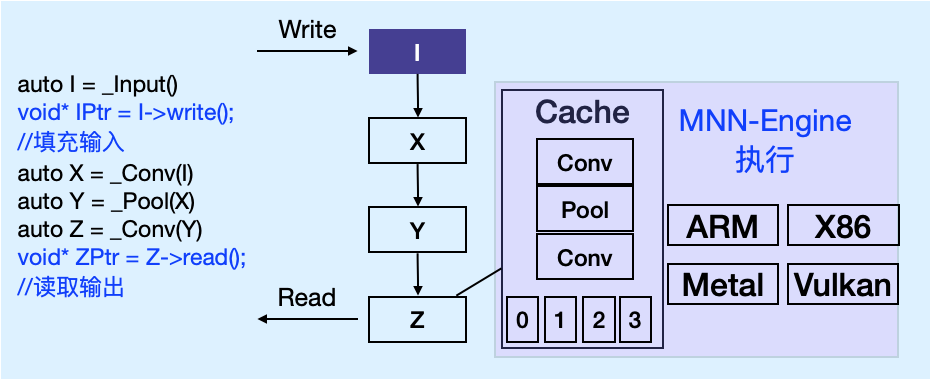

# Expr API使用
## 概念说明

### 表达式
表达式是一个延迟计算引擎，它提供如下功能：
1. 数值计算
2. 模型搭建

基于数值计算的能力，Expr API 可用于模型推理，但效率相比session/module 较低，不建议采用这种方式做模型推理。

表达式计算原理如下：


表达式可以设置为Defer(延迟计算)模式或Eager(立即计算)模式：Defer模式下，调用表达式相关API不直接计算，而是搭建模型，在需要获取输出值时才执行；Eager模式下，直接进行计算，对应地无法搭建模型。

C++环境默认为Defer模式，Python环境默认为Eager模式，可通过当前的执行器(Executor)切换计算模式。


### 数据类型

用户操作的数据类型为 VARP，可按Tensor去读取它的值，按保存时的方式不同，分成三类
- `Input`: 由 `_Input`创建，或者加载模型而得，在保存时仅存储维度信息（shape），可以写入值
- `Const/Trainable`: 由`_Const`或`_TrainableParam`创建，或者加载模型而得，在保存时存储数值，不能写入，只能读取
- `Function`: 非输入或者常量，一切由计算而得的变量，不能写入，在保存时存储与之相关的计算图 `Function` 变量可通过`fix`调用转换为相应类型，转换时将值计算出来，并去除前置节点依赖。

### 执行器
表达式在搭建模型或进行计算时，使用与[Module API](module.md)同样一个执行器（Executor） ，可配置表达式的执行模式、计算所用资源等。

## 表达式接口能力
### 模型存取与修改
- 模型读取
  ```cpp
  static std::vector<VARP> load(const char* fileName);
  static std::map<std::string, VARP> loadMap(const char* fileName);
  static std::vector<VARP> load(const uint8_t* buffer, size_t length);
  static std::map<std::string, VARP> loadMap(const uint8_t* buffer, size_t length);
  ```
- 模型保存
  ```cpp
  static void save(const std::vector<VARP>& vars, const char* fileName);
  ```
- 节点替换
  ```cpp
  static void replace(VARP dst, VARP src);
  ```
### 变量操作
- 创建变量
  ```cpp
  static VARP create(EXPRP expr, int index = 0);
  // include/MNN/expr/NeuralNetWorkOp.hpp 中的函数
  VARP _Input(INTS shape = {}, Dimensionformat data_format = NC4HW4, halide_type_t dtype = halide_type_of<float>()) ;
  ...
  VARP _Col2Im(VARP x, VARP outputShape, INTS kernelSize, INTS dilate, INTS pads, INTS stride);
  // include/MNN/expr/MathOp.hpp 中的函数
  VARP _Add(VARP x, VARP y);
  ...
  VARP _Histogram(VARP x, int bin, int min, int max, int channel = -1);
  ```
- 获取变量信息
  ```cpp
  struct Info {
      Dimensionformat order = NHWC;
      INTS dim;
      halide_type_t type;
      int size;
      void syncSize();
  };
  const Variable::Info* Variable::getInfo();
  ```
- 读取变量数据
  ```cpp
  template <typename T>
  const T* readMap();
  ```
- 向变量写数据
  ```cpp
  template <typename T>
  T* writeMap();
  ```
- 转换变量类型
  ```cpp
  bool fix(InputType type) const;
  ```

## 使用表Expr进行模型推理
可以通过模型加载函数将模型转换为表达式计算图，对输入的`VARP`写入数据后，对输出`VARP`执行读取操作，即可完成模型推理过程。
代码示例如下：
```cpp
#include <MNN/expr/ExprCreator.hpp>
using namespace MNN::Express;
// 加载 model.mnn ，保存 prob 的计算部分
void splitDemp() {
    auto varMap = Variable::loadMap("model.mnn");
    std::vector<VARP> vars = std::vector<VARP> {varMap["prob"]};
    Variable::save(vars, "part.mnn");
}

// 保存变量数据
void saveOutput(float* data0, size_t n0, float* data1, size_t n1) {
    VARP input0 = _Const(data0, NHWC, {n0});
    VARP input1 = _Const(data1, NHWC, {n1});
    Variable::save({input0, input1}, "result.mnn");
}

// 加载输入输出分别为 input 和 output 的 model.mnn ，输入数据到 input ，计算 output
void loadAndCompute() {
    auto varMap = Variable::loadMap("model.mnn");
    float* inputPtr = varMap["input"]->writeMap<float>();
    size_t inputSize = varMap["input"]->getInfo()->size;
    for (int i=0; i<inputSize; ++i) {
        inputPtr[i] = (float)i/(float)1000;
    }
    auto outputPtr = varMap["output"]->readMap<float>();
    auto outputSize = varMap["output"]->getInfo()->size;
    for (int i=0; i<outputSize; ++i) {
        printf("%f, ", outputPtr[i]);
    }
}
```

## 使用Expr进行数值计算
可以通过`NeuralNetWorkOp.hpp`和`MathOp.hpp`中创建变量的函数组合构造计算图，完成数值计算任务。
代码示例如下：
```cpp
#include <MNN/expr/ExprCreator.hpp>

using namespace MNN::Express;

void demo() {
    auto varp = _Input({1, 3, 224, 224}, NHWC);
    {
        // Init value init
        auto ptr = varp->writeMap<float>();
        auto size = varp->getInfo()->size;
        for (int i=0; i<size; ++i) {
            ptr[i] = (float)i / 100.0f;
        }
    }
    auto input = varp * _Scalar<float>(1.0f/255.0f);
    output = input * input + input;
    
    // fix input 之后，1.0f / 255.0f 的预处理不会保存到计算图里面
    input.fix(VARP::INPUT);
    // graph.mnn 描述 x * x + x 这个计算图
    Variable::save({output}, "graph.mnn");
    
    // fix output 之后，保存输出的数值而非计算图
    output.fix(VARP::CONSTANT);
    Variable::save({varp}, "output.mnn");
}
```

## 使用cv功能进行图像处理
在`MNN/tools/cv`中提供了`OpenCV-like`的函数集合，这些函数操作的基本数据类型为`VARP`，使用方式与`VARP`数值计算相似，因此可以结合`cv`中的函数实现图像处理功能。
代码示例如下：
```cpp
#include <MNN/expr/ExprCreator.hpp>
#include "tools/cv/include/cv/cv.hpp"

using namespace MNN;

void demo() {
    auto img = CV::imread("cat.jpg");
    auto rgb = CV::cvtColor(img, COLOR_BGR2RGB);
    auto input = CV::resize(rgb, {224, 224});
    input = Express::_Cast(input, halide_type_of<float>);
    input = input * _Scalar<float>(1.0f/255.0f);
    for (int i = 0; i < 10; i++) {
        printf("%f, ", input->readMap<float>()[i]);
    }
}
```

## 计算模式
表达式可以设置为Defer(延迟计算)模式或Eager(立即计算)模式：Defer模式下，调用表达式相关API不直接计算，而是搭建模型，在需要获取输出值时才执行；Eager模式下，直接进行计算，无法搭建模型。

C++环境默认为Defer模式，Python环境默认为Eager模式，可通过当前的执行器(Executor)切换计算模式。

参考如下代码切换Eager(立即计算)模式和Defer(延迟计算)模式：

C++ 代码:
```cpp
void demo() {
    // Set Defer mode
    ExecutorScope::Current()->lazyEval = true;
    {
        // Defer Compute Begin
        VARP x = _Input();
        x->writeMap<float>[0] = 1.0f;
        VARP y = x + x;
        y = y * x;
        // Compute Only readMap
        const float* yPtr = y->readMap<float>();
        // Will save graph
        Variable::save([y], "graph.mnn");
        // Defer Compute End
    }

    // Set Eager mode
    ExecutorScope::Current()->lazyEval = false;
    {
        // Eager Compute Begin
        VARP x = _Input();
        x->writeMap<float>[0] = 1.0f;
        // Compute Directly
        VARP y = x + x;
        y = y * x;
        // Just Read value
        const float* yPtr = y->readMap<float>();
        // Will save constant value, can't save graph
        Variable::save([y], "graph.mnn");
        // Eager Compute End
    }
}
```

Python 代码:
```python
import MNN
F = MNN.expr

# Set Defer mode
F.lazy_eval(True)

# Set Eager mode
F.lazy_eval(False)
```

## 示例代码
完整的示例代码可以参考`demo/exec/`文件夹中的以下源码文件：
- `expressDemo.cpp` 使用`Expr`执行模型推理
- `expressMakeModel.cpp` 使用`Expr`构建模型
- `segment.cpp` 使用`Session`进行图像分割，使用`Expr`进行后处理
- `pictureRecognition_module.cpp` 使用`Module`执行图像分类，使用`Expr`进行后处理
- `pictureRecognition_batch.cpp` 使用`Module`执行图像分类，使用`Expr`进行后处理
