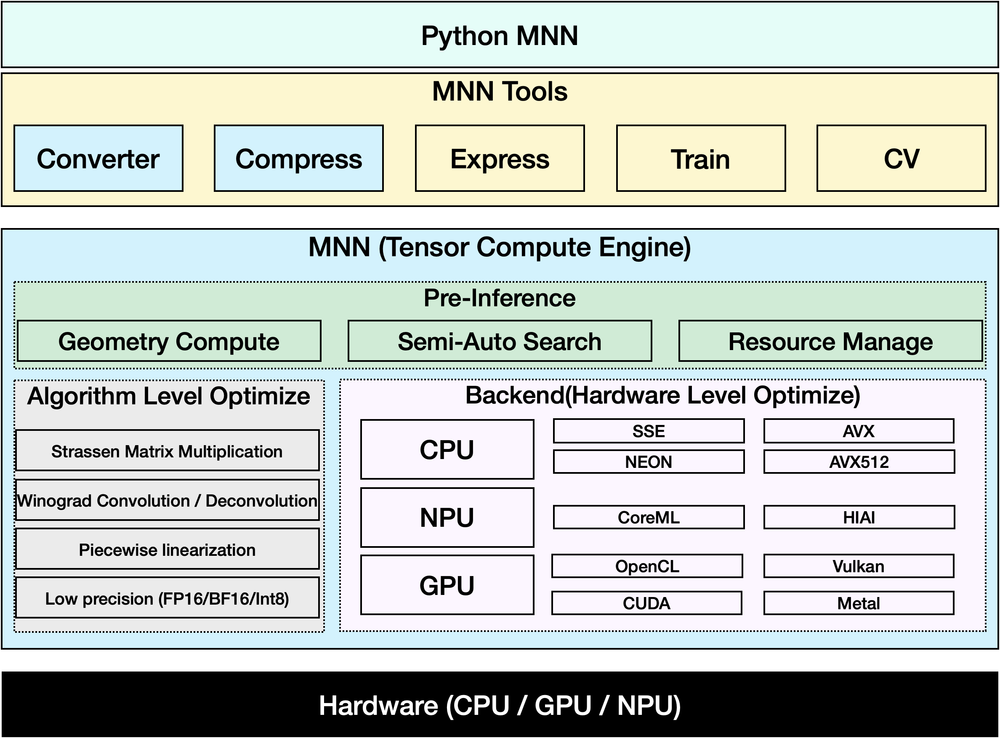

# MNN介绍

[MNN Homepage](http://www.mnn.zone)

[MNN](https://github.com/alibaba/MNN)是一个轻量级的深度神经网络引擎，支持深度学习的推理与训练。适用于服务器/个人电脑/手机/嵌入式各类设备。目前，MNN已经在阿里巴巴的手机淘宝、手机天猫、优酷等30多个App中使用，覆盖直播、短视频、搜索推荐、商品图像搜索、互动营销、权益发放、安全风控等场景。

在阿里巴巴中，[MNN](https://mp.weixin.qq.com/s/5I1ISpx8lQqvCS8tGd6EJw)被用作为[Walle](https://mp.weixin.qq.com/s/qpeCETty0BqqNJV9CMJafA)系统中计算容器的基础模块。Walle是首个端到端、通用型、规模化产业应用的端云协同机器学习系统，发表于操作系统顶会OSDI 2022。Walle的论文中解释了MNN的关键设计理念，并提供了MNN相对于其他深度学习框架（TensorFlow, TensorFlow Lite, PyTorch, PyTorch Mobile, TVM）的benchmark测试结果。相关测试脚本和说明文档被放在“/benchmark”目录下。如果MNN或Walle的设计对你的研究或生产有所助益，欢迎引用我们的OSDI论文：

    @inproceedings {proc:osdi22:walle,
        author = {Chengfei Lv and Chaoyue Niu and Renjie Gu and Xiaotang Jiang and Zhaode Wang and Bin Liu and Ziqi Wu and Qiulin Yao and Congyu Huang and Panos Huang and Tao Huang and Hui Shu and Jinde Song and Bin Zou and Peng Lan and Guohuan Xu and Fei Wu and Shaojie Tang and Fan Wu and Guihai Chen},
        title = {Walle: An {End-to-End}, {General-Purpose}, and {Large-Scale} Production System for {Device-Cloud} Collaborative Machine Learning},
        booktitle = {16th USENIX Symposium on Operating Systems Design and Implementation (OSDI 22)},
        year = {2022},
        isbn = {978-1-939133-28-1},
        address = {Carlsbad, CA},
        pages = {249--265},
        url = {https://www.usenix.org/conference/osdi22/presentation/lv},
        publisher = {USENIX Association},
        month = jul,
    }

## 工作台
[MNN官网](http://www.mnn.zone)上还可以下载MNN团队全新力作MNN工作台，涵盖开箱即用模型、可视化训练等工具，更可以一键部署到多端设备。

## 整体特点

### 轻量性 

- 主体功能（模型推理CPU+GPU）无任何依赖，代码精简，可以方便地部署到移动设备和各种嵌入式设备中。 
   - iOS平台：功能全开的MNN静态库 armv7+arm64大小12MB左右，链接生成可执行文件增加大小2M左右。可裁剪主体功能后静态库大小6.1M ，链接生成可执行文件增加大小 600 KB。
   - Android平台：主体功能 armv7a - c++_shared 动态库大小800KB左右。
- 支持采用 Mini 编辑选项进一步降低包大小，大约能在上述库体积基础上进一步降低 25% 左右。
- 支持模型FP16/Int8压缩与量化，可减少模型50% - 75% 的体积

### 通用性 

- 支持 Tensorflow、Caffe、ONNX、Torchscripts 等主流模型文件格式，支持CNN / RNN / GAN / Transformer 等主流网络结构。
- 支持多输入多输出，支持任意维度的输入输出，支持动态输入（输入大小可变），支持带控制流的模型
- 算子丰富，支持 178 个Tensorflow Op、52个 Caffe Op、163个 Torchscipts Op、158 个 ONNX Op（ONNX 基本完整支持）
- 支持 服务器 / 个人电脑 / 手机 及具有POSIX接口的嵌入式设备，支持使用设备的 CPU / GPU 计算，支持部分设备的 NPU 计算（IOS 11 + CoreML / Huawei + HIAI / Android + NNAPI）
- 支持 Windows / iOS 8.0+ / Android 4.3+ / Linux  及具有POSIX接口的操作系统

### 高性能

- 对iOS / Android / PC / Server 的CPU架构进行了适配，编写SIMD代码或手写汇编以实现核心运算，充分发挥 CPU的算力，单线程下运行常见CV模型接近设备算力峰值
- 支持基于 Metal / OpenCL / Vulkan 使用移动端设备上的GPU进行推理
- 支持基于 CUDA 使用 PC / Server 上的 NVIDIA GPU 实现更快速的推理
- 广泛运用了 Winograd 卷积算法提升卷积性能，首次在业界工程实践中实现转置卷积的Winograd算法优化与矩阵乘的Strassen算法优化，并取得加速效果
- 支持低精度计算（ int8 / fp16 / bf16）以提升推理性能。并对 ARMv8.2 和 AVX512架构的相关指令进行了适配，这两种架构下有更好的加速效果

### 易用性

- 支持使用 MNN 的算子进行常用的数值计算，覆盖 numpy 常用功能
- 提供 MNN CV 模块，支持图像仿射变换与归一化等 MNN_CV 库，支持常用的图像处理（armv7a 架构下小于 100 k ）
- 支持各平台下的模型训练，尤其是移动端上的模型训练
- 支持 python 调用

MNN适配的硬件架构与精度详见下表：

- S ：支持，深度优化并已有应用场景，推荐使用
- A ：支持，有初步优化或已有应用场景，可以使用
- B ：支持，无优化或在实验状态，不推荐使用
- C ：不支持

| Architecture / Precision |  | Normal | FP16 | BF16 | Int8 |
| --- | --- | --- | --- | --- | --- |
| CPU | Native | B | C | B | B |
|  | x86/x64-SSE4.1 | A | B | B | A |
|  | x86/x64-AVX2 | S | B | B | A |
|  | x86/x64-AVX512 | S | B | B | S |
|  | ARMv7a | S | S (ARMv8.2) | S | S |
|  | ARMv8 | S | S (ARMv8.2) | S(ARMv8.6) | S |
| GPU | OpenCL | A | S | C | C |
|  | Vulkan | A | A | C | C |
|  | Metal | A | S | C | C |
|  | CUDA | A | S | C | C |
| NPU | CoreML | B | C | C | C |
|  | HIAI | B | C | C | B |
|  | NNAPI | B | C | C | C |

## 工具

基于MNN (张量计算引擎)，提供了一系列工具，以支持模型推理、训练和通用计算：

- MNN-Converter：模型转换工具，由Frontends和Graph Optimize构成。前者负责支持不同的训练框架，MNN当前支持Tensorflow(Lite)、Caffe、ONNX(PyTorch/MXNet的模型可先转为ONNX模型再转到MNN)和Torchscripts；后者通过算子融合、算子替代、布局调整等方式优化图，一般离线运行。
- MNN-Compress: 模型压缩工具，在一定的精度误差许可下，对MNN模型进行压缩，减少模型体积，提升运行性能。
- MNN-Express ：支持带控制流的模型运行，支持调用 MNN 的算子进行自定义的计算。
- MNN-CV ：类似 OpenCV ，但核心计算功能基于 MNN 实现的图像处理算法库
- MNN-Train ：MNN 训练模块，支持各平台训练

## 社区交流与反馈
钉钉群组：

- 钉钉群1:23329087 
- 钉钉群2:23350225
- 钉钉群3:[点击申请加入](https://h5.dingtalk.com/circle/healthCheckin.html?dtaction=os&corpId=ding8989a1d6ae6ef130b177420cc0e366ea&f0c81=1b93a&cbdbhh=qwertyuiop)

## 历史论文

MNN初步版本的[论文](https://arxiv.org/pdf/2002.12418.pdf)也曾在MLSys 2020上面发表。该论文主要关注MNN作为移动端机器学习推理引擎的手动算子优化。如果MNN之前对你的研究有所助益，欢迎引用MNN的MLSys论文：

	@inproceedings{alibaba2020mnn,
      author = {Jiang, Xiaotang and Wang, Huan and Chen, Yiliu and Wu, Ziqi and Wang, Lichuan and Zou, Bin and Yang, Yafeng and Cui, Zongyang and Cai, Yu and Yu, Tianhang and Lv, Chengfei and Wu, Zhihua},
      title = {MNN: A Universal and Efficient Inference Engine},
      booktitle = {MLSys},
      year = {2020}
    }

## License
Apache 2.0

## 致谢
MNN参与人员：淘宝技术部、搜索工程团队、达摩院团队、优酷等集团员工。

MNN参考、借鉴了下列项目：

- [Caffe](https://github.com/BVLC/caffe)
- [flatbuffer](https://github.com/google/flatbuffers)
- [gemmlowp](https://github.com/google/gemmlowp)
- [Google Vulkan demo](http://www.github.com/googlesamples/android-vulkan-tutorials)
- [Halide](https://github.com/halide/Halide)
- [Mace](https://github.com/XiaoMi/mace)
- [ONNX](https://github.com/onnx/onnx)
- [protobuffer](https://github.com/protocolbuffers/protobuf)
- [skia](https://github.com/google/skia)
- [Tensorflow](https://github.com/tensorflow/tensorflow)
- [ncnn](https://github.com/Tencent/ncnn)
- [paddle-mobile](https://github.com/PaddlePaddle/paddle-mobile)
- [stb](https://github.com/nothings/stb)
- [rapidjson](https://github.com/Tencent/rapidjson)
- [pybind11](https://github.com/pybind/pybind11)
- [pytorch](https://github.com/pytorch/pytorch)
- [bolt](https://github.com/huawei-noah/bolt)
- [libyuv](https://chromium.googlesource.com/libyuv/libyuv)
- [libjpeg](https://github.com/libjpeg-turbo/libjpeg-turbo)
- [opencv](https://github.com/opencv/opencv)

