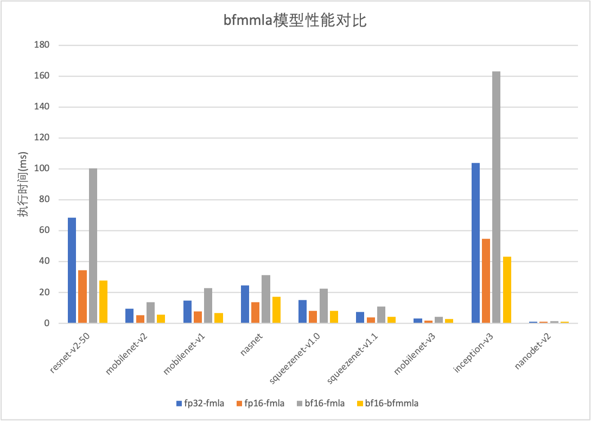
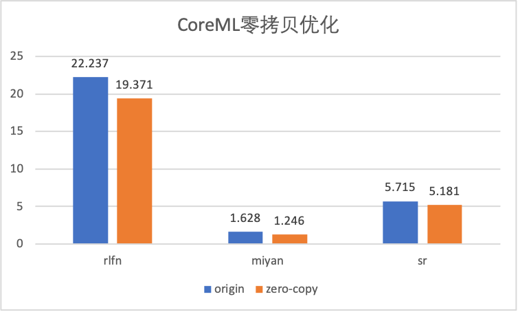

# 发布版本
## 2.2.0 (`Latest`)
### 框架通用性
- MNN新增对`ARMv8.6-A`指令支持，支持了`smmla`和`bfmmla`指令
- MNN新增汇编预处理脚本，能够将汇编指令转换为`.inst`指令，降低新指令对编译器的依赖
- 新增A16和M2 CPU family支持
- 新增Interp3D支持
- MNN新增`NNAPI`后端，能够利用Android设备上的NPU/APU/DSP进行计算；支持`float32`与`float16`数据类型的模型推理。目前支持的算子如下：
  - [x] Conv2d, DepthwiseConv2d
  - [x] MaxPool2d, AvgPool2d
  - [x] Binary/Elementwise: Add, Sub, Mul, Div
  - [x] Unary: Abs, Exp, Sqrt, Rsqrt, Log, Sin, Tanh, Floor, Neg, Hardswish
  - [x] Activation: Softmax, Relu, Relu6, Prelu, Sigmoid, Elu
  - [x] Reduction: Sum, Mean, Max, Min, Prod, All, Any
  - [x] Argmax, Argmin
  - [x] Resize: Nearstneighbor, Bilinear
  - [x] Reshape, Transpose, Tile, Pad, Slice, DepthToSpace, Concat, Gether
  - [x] Scale/BatchNorm
### 性能优化
- 新增ARMv8.6指令支持后，GemmInt8, GemmBF16性能提升
  - `smmla`实现的`GemmInt8`实测性能在矩阵规模为`[1024, 1024, 1024]`时，性能相比`sdot`提升为88.47%（s图中`33x33`项），接近理论性能(100%)；模型性能提升20%左右。
  
  
  - `bfmmla`实现的`GemmBF16`实测性能在规模为`[1024, 1024, 1024]`时，性能相比fp16`fmla`提升为91.53%（图中`1024,1024,1024`项），接近理论性能；模型性能相比原来的bf16提升一倍以上。
  
  
- 在执行Mobilenetv1时，NNAPI使用accelerator设备进行推理，在中端和高端设备上相比CPU单线程均有性能优势；在高端设备上相比CPU 4线程仍有性能优势；在其他类模型对比时，除卷积外其他算子较少的模型NNAPI均有优势，包含其他算子的模型会出现性能不如MNN-CPU的情况；在使用`float16`推理时，NNAPI平均性能相比MNN-CPU慢。
  
  
- CUDA性能优化，Depthwise卷积、Raster快速计算、Im2Col等优化，MobileNet/Squeezenet等模型性能提升
  
- 新增BinaryRelu-Fuse和对应的各后端实现，resnet模型性能提升
  
### 其他
- 进行了部分代码重构（包括但不限于）
  - 对于包含多个SubModule的复杂模型, 复用子模型间共性tensor，重新构建计算图和指令队列，显著降低大内存操作的耗时
- 修复了如下 Bug（包括但不限于）
  - Onnx Resize 在指定 scale 且输入输出无法整除时，计算错误
  - 修复在不支持SSE 4.1的设备上打开SSE执行Crash的问题
  - 修复多输入Conv转换错误
  - 修复ARM82后端GridSampler在Linux上的编译错误
  - 修复Conv1dSqueezeMove在Squeeze双输入时计算出错的问题
  - 修复输入为NC4HW4时，stride计算错误的问题
  - 修复HIAI后端编译错误，Binary BUG
## 2.1.0
### 框架通用性
- MNN-CV增加`solvepnp / svd`等函数实现
- MNN-Train补充`Unary/Binary/Reduction`的求导实现
- MNN-Express支持`Eager模式`，该模式下不保存计算图，直接计算结果，可通过Executor的`lazyEval`配置
  - 在C++中默认使用`Lazy模式`
  - 在Python中默认使用`Eager模式`
- 新增基于`Markdown+Sphinx`的文档
### 性能优化
- 服务端推理 CUDA 性能提升
  - 基于 cutlass 重新实现了矩阵乘，对卷积应用 Winograd算法优化
  
- MNN-CoreML后端支持输出zero-copy
  
### 模型压缩
支持 Winograd Int8对`kernel_size > 1`的量化卷积进行优化 ，离线量化工具（C++: quantized.out，python: mnnquant）json配置文件中增加`"winogradOpt": true`，并将特征量化方法设置为`"feature_quantize_method":"EMA"`即可使用

### 其他
- 进行了部分代码重构（包括但不限于）
  - MNN Metal 改为在线生成 Shader 编译，避免集成 MNN.metallib 的兼容性问题
  - 移除 CPU / Geometry / Arm82 部分冗余代码
  - 默认移除原先 TFlite - Uint8 的算子支持，但可以通过 MNN_SUPPORT_DEPRECATED_OP 宏打开
  - 移除 linux 系统下编译 Torchscript 所需要的 libTorch 库，改为编译时从网络下载
  - ScatterND 改为基于 Loop 算子实现
- 修复了如下 Bug（包括但不限于）
  - CPU - AVX512 int8 在转换 NC4HW4 格式时内存访问越界
  - GeometryBinary 处理 NC4HW4 输入，两边Channel上对齐大小相同，但Channel不同时计算出错
  - Arm82 Interp 算子多 Batch 情况下计算出错问题
  - Windows 上 json2MNN 工具写入结果有误
  - Onnx GatherElement 算子在输入大小不确定时转换失败
  - 修复Python中Module，RuntimeManager内存泄露问题
  - 修复控制流模型转换时输出算子Name不匹配的问题
  - 修正 ROIPooling / ROIAlign 低精度计算 crash 的问题
## 2.0.0
### 框架通用性
- 模型推理通用性增加：Torchsciprts OP 添加，Onnx OP 补齐
   - Onnx 算子数由 117 增加到 158 
   - Torchscripts 算子数由 34 增加到 163
- MNNConvert功能扩充
   - 支持模型转换正确性验证
   - 支持MNN模型与Json文件互转，方便查看与编辑模型结构
- MNN增加统一版本号机制
   - 编译期版本宏定义
   - 运行时版本号函数
   - 模型中增加版本信息
- 增加 MNN-CV / MNN-Numpy 功能
   - C++中提供了与OpenCV中图像编解码，图像处理用法相似的API；
   - Python中提供了与cv2/numpy基础功能用法相似的函数；
   - 支持的cv函数57个，numpy函数170个，[函数列表](https://www.yuque.com/docs/share/5a42d046-22d9-49d1-8064-8d92a6292b26)；
### 性能优化
- 服务/PC端推理CPU/GPU性能大幅提升
   - CPU部分AVX512优化，多线程优化提速；
   - GPU部分CUDA移除cudnn，基于TensorCore重写；

### 模型压缩
- 新增mnncompress模型压缩工具
   - 支持基于TensorFlow 1.X和Pytorch的模型压缩，具体使用方法见[文档](https://www.yuque.com/mnn/cn/cxgvyh)
   - 添加压缩模型的模型转换，及相关算法的MNN底层推理支持
### 其他
- 测试/Demo/Benchmark完善
   - 修正 Android Demo 的 编译Bug；
   - 增加一个使用 mnn framework 的 ios demo工程；
   - Pymnn新增离线量化Demo与测试；
   - Pymnn新增训练相关测试；
   - Pymnn中新增MNN.numpy与numpy对比的benchmark;
   - 新增MNN.cv与OpenCV对比的benchmark;
- Bugfix（包括但不限于）
   - Pymnn修复训练相关API使用Bug;
   - 修复arm64汇编中的sp计算Bug;
   - GatherND 精度数目问题修复;
   - ZeroShape 支持完善；
   - NDK24 下 armv7a-arm82 编译错误修正；
   - benchmark metal crash修复；
   - benchmark metal crash;
   - Module 的 RuntimeManager 设置 precision = low 无效的问题修复；
   - CoreML Pooling CAFFE-PAD，Deconv修复；
   - CoreML多次执行内存占用过高问题修复；

## 1.2.0
### 框架通用性
- 新增Torchscript模型格式支持
    - 我们注意到，大量的机器学习工程师在从TensorFlow往PyTorch迁移。推理引擎对于PyTorch模型的原生支持尤为重要。虽然MNN已经支持了ONNX格式的模型，但是考虑到PyTorch自身长期的发展趋势，基于Torchscript格式的模型比ONNX更具通用性。现在，MNNConvert支持在Mac、Windows、Linux平台下将所有的[TorchVision](https://pytorch.org/vision/stable/index.html)视觉模型 转换到MNN格式。
- 新增ARM BF16后端
  - BF16 可以给中低端手机和高端机的小核带来性能收益，并且降低内存占用。经MNN团队内部测试，BF16相对于FP32在不同机型的中低端核心(A53 A55 A53kyro A55kyro)上，不同模型有 5%-30%的优化，性能如下：
  - BF16使用方法：
    - 编译MNN时，指定`-DMNN_SUPPORT_BF16=ON`
    - BackendConfig中指定`PrecisionMode=Precision_Low_BF16`
- 新增CoreML后端
  - 基于几何计算，MNN添加了CoreML的支持。在iPhone X之后，借助于Apple Neural Engine，相比于CPU，CoreML(ANE)在视觉模型中约有5-6倍的性能提升。
- 几何计算的演进
  - 在1.1.0版本的几何计算的基础上，本次发布中『几何计算』增加了对于循环算子（如Gather、BatchMatMul、LSTM）的GPU后端支持。
### 性能优化
- ARM 后端
   - 支持ARMv8.2指令的设备占有率随着时间的推移逐渐上升，是MNN优化的重点之一。相比于MNN 1.1.x版本，MNN 1.2.0的ARMv8.2性能在各类视觉模型中有5% ~ 20%的提升，且与业界主流引擎对比处于领先地位。
- X86 后端
  - MNN集中优化了X86-AVX2上的性能。目前在主流的视觉、时序模型中，MNN-AVX2后端相比于OpenVINO由20%到440%的性能优势，与ONNXRuntime相比，则有18%到60%的性能优势 (仅MobileNet V2略逊于OpenVINO/ONNXRuntime)。取得如此性能成绩，且通用性持平或更胜一筹的前提下，相比于 Onnx / OpenVino 几十至几百M 的大小，MNN 库的体积却很小，仅 3M 不到。 此外，MNN 支持了 AVX512 / AVX512VNNI，相对于 AVX2 ，在浮点矩阵乘法有 60% 加速，Int8矩阵乘则有 200% 的加速。
- OpenCL后端
  - 随着移动App中的部署的各类深度学习模型数量增多，MNN团队发现，CPU占用率居高不下，会影响App稳定性和用户体验。基于此判断，我们重点优化OpenCL后端的性能（与主流引擎相比已处于领先地位），并且与内部业务方共同设计面向GPU模型，达到性能、精度双高的模型。性能数据如下图：
### 模型压缩
- ARM 浮点稀疏算子实现
   - 随着CPU性能优化的边际收益的降低，为了获得更高的性能，需要从模型结构本身着手，设计、裁剪出合适目标硬件和推理引擎的模型结构，以获得最佳的精度和性能。基于此，MNN添加了随机稀疏和半结构化稀疏算子的ARM浮点实现 （原理见 ” Fast Conv Nets ” ），如下图所示：
   - 经过MNN内部在各类机型和模型实测，随机稀疏率, 1x4半结构稀疏率 (沿输出通道OC分块，blockOC=4) 分别为0.6、 0.3时，推理性能将大于稠密实现性能。随机稀疏率0.9时，MobileNet、NasNet、SqueezeNet各类模型中，在高、中、低端手机上的加速比为1.7倍 ~ 4.5倍；1x4半结构稀疏率0.9时，加速比为1.8倍 ~ 6.1倍。
 - 离线量化精度提升
   - 离线量化工具中添加了激活非对称的支持，并且通过量化时更新BN参数，离线量化精度获得普遍提升。结合使用非对称量化+BN参数更新，MobileNet V2量化模型精度从71.05%提高到71.73%，进一步逼近浮点模型（71.90%）。
### 其他
- 功能
  - 新建 MNN 表达式接口相关 demo，见pymnn/examples/MNNExpr/mobilenet_demo.py和demo/exec/{pictureRecognition_module.cpp, transformerDemo.cpp}
  - 对离线量化工具进行了重构，减少 int8 / float 互转损耗，以 shufflenet 为例可减少 20% 耗时
  - 完善模型校验工具 （tools/script/fastTest 系列）
  - 增加 Onnx 所有与 MNN 相匹配的单目 / 双目算符支持
- 图优化
  - 新增 Gelu / Hardswish 算子融合
  - 增加 Layernorm 算子融合的范围
  - 新增 MatMul + Bias 融合，增加其转换为卷积的范围
  - 新增 Tensorflow / Tflite 的 Dilate Convolution 算子融合（SpaceToBatch + Conv + BatchToSpace）
- Bugfix（包括但不限于）
  - 修正 StridedSlice 在 newAxis 和 begin << inputShape 情况下的实现错误
  - 修正 Eltwise MAX 的求导错误
  - 移除 MNNConvert 对 regex 的依赖（此问题导致在 gcc 4.8 环境下无法运行 Converter）
  - 修正 CPU Raster 算子对 dimension = 1 的 NC4HW4 数据格式处理错误的问题
  - 移除 MNN Python wheel 中意义不大的 mnnops （里面显示的 Op 列表不准确）

## 1.1.0
### 框架通用性
- 几何计算
    - 几何计算是本次发布中大规模的框架重构。它将大部分算子的计算过程中与硬件后端无关部分（形状计算和几何计算）剥离出来，极大地降低了异构后端算子实现的成本。基于几何计算，MNN重写了目前所有的硬件后端。由于引入几何计算之后GPU后端算子的覆盖率的增加，在阿里巴巴内部的业务模型中，MNN GPU后端性能普遍获得约20%提升。
- 新增后端
  - 基于几何计算机制，MNN新增了TensorRT和CUDA后端。目前已经支持常用CV模型与RNN模型。
- ASR模型支持
  - 除了业务应用广泛的CV模型，MNN在这次发布中添加了对基于Transformer结构的ASR模型的支持。这类模型结构要求推理引擎支持Control Flow、Dynamic Shape和Zero Shape等特性。MNN在框架层面对这些特性进行了支持和完善：
    - 重构Control Flow支持方案，提供用户透明的functional control flow实现，并支持TF1.x的控制流模型转换。
    - 添加Dynamic Shape的支持，MNN将整图按照动态形状算子划分为多个分段子图。在代码层面，一个子图对应一个Module，Module支持嵌套，即整图被表达为一个由Module组成的调用树，树的叶子节点可以使用Session来执行，Session每次执行前Resize，重新进行形状推理和预分配内存。
    - Zero Shape指的是模型中某些Tensor的shape存在0值，比如 (1, 0, 256），这种情况大多是为了给while-loop中某些循环变量提供初始值而引入的。MNN在对形状推理和执行逻辑上对Zero Shape进行了支持。
### 性能优化
- ARM 后端
   - 在今年5月，MNN在ARM CPU上的性能已立于[业界前列](https://zhuanlan.zhihu.com/p/151666822)。在此之后，MNN持续投入ARM CPU性能优化，在各模型和芯片上又获得了10%~20%的性能提升。性能提升之路永无止境。 
- X86 后端
  - 5月以来，MNN团队持续投入x86后端的优化，目前浮点单线程性能与行业标杆OpenVINO基本持平，部分情况 (Squeezenet v1.0) 超越。[x86.png](../_static/images/intro/releases/1_1_0_x86.png)
- OpenCL后端
  - 开启AutoTuning等一系列优化后，MNN在1.0.0的基础上，普遍有20%~100%的性能提升。具体性能数据如下： 
### 模型压缩
新添模型压缩的仅权值量化（MNNConvert --weightQuantBits）。此功能仅对conv/matmul/LSTM的float32权值进行量化，仅优化模型大小，加载模型后会解码为float32，量化位宽可选2~8，运行速度和float32模型一致。经内部测试8bit时精度基本无损，模型大小减小4倍。
### 其他
- 易用性
  - 由于OpenCL新增的AutoTuning机制、TensorRT后端初次推理的耗时较高，MNN在Interpreter上增加setCacheFile API，用于缓存GPU后端的编译优化之后的模型。
- Bugfix（包括但不限于）
  - SpaceToBatchND , BatchToSpaceND 支持 block size / padding 作为输入（支持在输入shape 未知情况下的 Tensorflow 空洞卷积）
  - 修正 depthToSpace 和 spaceToDepth ，支持 pixelshuffle
  - 修正 1x1 卷积对于 batch 较大，width / height 较小时，性能不好的问题
  - 修正 Onnx 的 ConvTranspose output padding 支持问题
  - 修正 Onnx 的 Resize 在某些输入个数下不支持的问题

## 1.0.0
### 框架通用性
- 表达式接口提供训练与量化功能
  - 新增C++的表达式接口（在`express`目录下）
  - 使用表达式接口动态构图
  - 使用表达式接口训练，训练耗时如下：
  - 使用表达式执行训练量化（QAT）
### 性能优化
- ARM 后端
  - ARMv82使用`asimdhp`和`asimddp`扩展提速接近100% 
  - ARM64重新实现矩阵乘kernel，性能提升

| 芯片/手机 | 优化前(ms) | 优化后(ms) |
| ---- | ------ | ------ |
| 高通425/红米4A | 261.12 | 237.89 |
| 高通652/360N5 | 122.94 | 115.80 |

- X86 后端
  - 使用FMA指令进行优化，单线程性能提升40~60%

| 模型(Mac单线程) | 优化前(ms) | 优化后(ms) |
| ---- | ------ | ------ |
| resnet18 | 81 | 48 |
| mobilenetv1 | 37 | 26 |

### 模型压缩
使用MNN QAT与Tensorflow的对比如下表所示： 

| 模型 | DataType | Accuracy | Model Size |
| :---: | :---: | :---: | :---: |
| Original Model | float32 | 72.324% | 13M |
| MNN QAT Model | symm int8 | 72.456% | 3.5M |
| Tensorflow QAT Model | symm int8 | 71.1% | 3.5M |

### 其他
- 功能
  - 新增`Python Expr API`