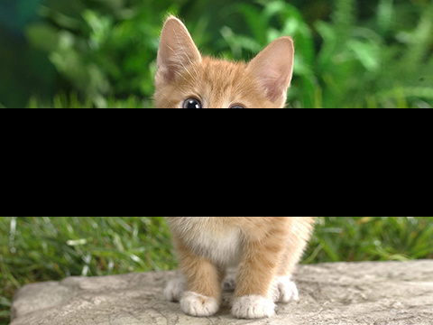

## cv

```python
module cv
```
cv模块提供了基础的图像处理函数，并在接口上兼容了opencv-python的API。


**使用注意：**
- 图像描述使用`Var`变量，其属性为：
  - `data_format`为`NHWC`
  - `shape`是`[h, w, c]`
  - `dtype`是`uint8`
- CV模块中的枚举类型直接用int实现，所以请使用`cv.COLOR_BGR2BGRA`，不要用`cv.ColorConversionCodes.COLOR_BGR2BGRA`*
- 将`[h, w, c]`的图形转换为模型输入的`[n, c, h, w]`不要使用`transpose`；请使用`expr.convert`，示例如下：
  ```python
  import MNN.cv as cv
  import MNN.numpy as np
  import MNN.expr as expr
  # data_format: NHWC, shape: [360, 480, 3], dtype: uint8
  img = imread('cat.jpg')
  # data_format: NHWC, shape: [360, 480, 3], dtype: float32
  imgf = img.astype(np.float32)
  # data_format: NHWC, shape: [1, 360, 480, 3], dtype: float32
  imgf_batch = np.expand_dims(imgf, 0)
  # data_format: NCHW, shape: [1, 360, 480, 3], dtype: float32
  input_var = expr.convert(imgf_batch, expr.NCHW)
  ```

---
### `cv Types`
- [Var](Var.md)

---
### `cv.COLOR_*`
描述图像颜色空间转换函数`cvtColor`的转换方式
- 类型：`int`
- 枚举值：
  - `COLOR_BGR2BGRA`
  - `COLOR_RGB2RGBA`
  - `COLOR_BGRA2BGR`
  - `COLOR_RGBA2RGB`
  - `COLOR_BGR2RGBA`
  - `COLOR_RGB2BGRA`
  - `COLOR_RGBA2BGR`
  - `COLOR_BGRA2RGB`
  - `COLOR_BGR2RGB`
  - `COLOR_RGB2BGR`
  - `COLOR_BGRA2RGBA`
  - `COLOR_RGBA2BGRA`
  - `COLOR_BGR2GRAY`
  - `COLOR_RGB2GRAY`
  - `COLOR_GRAY2BGR`
  - `COLOR_GRAY2RGB`
  - `COLOR_GRAY2BGRA`
  - `COLOR_GRAY2RGBA`
  - `COLOR_BGRA2GRAY`
  - `COLOR_RGBA2GRAY`
  - `COLOR_BGR2BGR565`
  - `COLOR_RGB2BGR565`
  - `COLOR_BGR5652BGR`
  - `COLOR_BGR5652RGB`
  - `COLOR_BGRA2BGR565`
  - `COLOR_RGBA2BGR565`
  - `COLOR_BGR5652BGRA`
  - `COLOR_BGR5652RGBA`
  - `COLOR_GRAY2BGR565`
  - `COLOR_BGR5652GRAY`
  - `COLOR_BGR2BGR555`
  - `COLOR_RGB2BGR555`
  - `COLOR_BGR5552BGR`
  - `COLOR_BGR5552RGB`
  - `COLOR_BGRA2BGR555`
  - `COLOR_RGBA2BGR555`
  - `COLOR_BGR5552BGRA`
  - `COLOR_BGR5552RGBA`
  - `COLOR_GRAY2BGR555`
  - `COLOR_BGR5552GRAY`
  - `COLOR_BGR2XYZ`
  - `COLOR_RGB2XYZ`
  - `COLOR_XYZ2BGR`
  - `COLOR_XYZ2RGB`
  - `COLOR_BGR2YCrCb`
  - `COLOR_RGB2YCrCb`
  - `COLOR_YCrCb2BGR`
  - `COLOR_YCrCb2RGB`
  - `COLOR_BGR2HSV`
  - `COLOR_RGB2HSV`
  - `COLOR_BGR2Lab`
  - `COLOR_RGB2Lab`
  - `COLOR_BGR2Luv`
  - `COLOR_RGB2Luv`
  - `COLOR_BGR2HLS`
  - `COLOR_RGB2HLS`
  - `COLOR_HSV2BGR`
  - `COLOR_HSV2RGB`
  - `COLOR_Lab2BGR`
  - `COLOR_Lab2RGB`
  - `COLOR_Luv2BGR`
  - `COLOR_Luv2RGB`
  - `COLOR_HLS2BGR`
  - `COLOR_HLS2RGB`
  - `COLOR_BGR2HSV_FULL`
  - `COLOR_RGB2HSV_FULL`
  - `COLOR_BGR2HLS_FULL`
  - `COLOR_RGB2HLS_FULL`
  - `COLOR_HSV2BGR_FULL`
  - `COLOR_HSV2RGB_FULL`
  - `COLOR_HLS2BGR_FULL`
  - `COLOR_HLS2RGB_FULL`
  - `COLOR_LBGR2Lab`
  - `COLOR_LRGB2Lab`
  - `COLOR_LBGR2Luv`
  - `COLOR_LRGB2Luv`
  - `COLOR_Lab2LBGR`
  - `COLOR_Lab2LRGB`
  - `COLOR_Luv2LBGR`
  - `COLOR_Luv2LRGB`
  - `COLOR_BGR2YUV`
  - `COLOR_RGB2YUV`
  - `COLOR_YUV2BGR`
  - `COLOR_YUV2RGB`
  - `COLOR_YUV2RGB_NV12`
  - `COLOR_YUV2BGR_NV12`
  - `COLOR_YUV2RGB_NV21`
  - `COLOR_YUV2BGR_NV21`
  - `COLOR_YUV420sp2RGB`
  - `COLOR_YUV420sp2BGR`
  - `COLOR_YUV2RGBA_NV12`
  - `COLOR_YUV2BGRA_NV12`
  - `COLOR_YUV2RGBA_NV21`
  - `COLOR_YUV2BGRA_NV21`
  - `COLOR_YUV420sp2RGBA`
  - `COLOR_YUV420sp2BGRA`
  - `COLOR_YUV2RGB_YV12`
  - `COLOR_YUV2BGR_YV12`
  - `COLOR_YUV2RGB_IYUV`
  - `COLOR_YUV2BGR_IYUV`
  - `COLOR_YUV2RGB_I420`
  - `COLOR_YUV2BGR_I420`
  - `COLOR_YUV420p2RGB`
  - `COLOR_YUV420p2BGR`
  - `COLOR_YUV2RGBA_YV12`
  - `COLOR_YUV2BGRA_YV12`
  - `COLOR_YUV2RGBA_IYUV`
  - `COLOR_YUV2BGRA_IYUV`
  - `COLOR_YUV2RGBA_I420`
  - `COLOR_YUV2BGRA_I420`
  - `COLOR_YUV420p2RGBA`
  - `COLOR_YUV420p2BGRA`
  - `COLOR_YUV2GRAY_420`
  - `COLOR_YUV2GRAY_NV21`
  - `COLOR_YUV2GRAY_NV12`
  - `COLOR_YUV2GRAY_YV12`
  - `COLOR_YUV2GRAY_IYUV`
  - `COLOR_YUV2GRAY_I420`
  - `COLOR_YUV420sp2GRAY`
  - `COLOR_YUV420p2GRAY`
  - `COLOR_YUV2RGB_UYVY`
  - `COLOR_YUV2BGR_UYVY`
  - `COLOR_YUV2RGB_Y422`
  - `COLOR_YUV2BGR_Y422`
  - `COLOR_YUV2RGB_UYNV`
  - `COLOR_YUV2BGR_UYNV`
  - `COLOR_YUV2RGBA_UYVY`
  - `COLOR_YUV2BGRA_UYVY`
  - `COLOR_YUV2RGBA_Y422`
  - `COLOR_YUV2BGRA_Y422`
  - `COLOR_YUV2RGBA_UYNV`
  - `COLOR_YUV2BGRA_UYNV`
  - `COLOR_YUV2RGB_YUY2`
  - `COLOR_YUV2BGR_YUY2`
  - `COLOR_YUV2RGB_YVYU`
  - `COLOR_YUV2BGR_YVYU`
  - `COLOR_YUV2RGB_YUYV`
  - `COLOR_YUV2BGR_YUYV`
  - `COLOR_YUV2RGB_YUNV`
  - `COLOR_YUV2BGR_YUNV`
  - `COLOR_YUV2RGBA_YUY2`
  - `COLOR_YUV2BGRA_YUY2`
  - `COLOR_YUV2RGBA_YVYU`
  - `COLOR_YUV2BGRA_YVYU`
  - `COLOR_YUV2RGBA_YUYV`
  - `COLOR_YUV2BGRA_YUYV`
  - `COLOR_YUV2RGBA_YUNV`
  - `COLOR_YUV2BGRA_YUNV`
  - `COLOR_YUV2GRAY_UYVY`
  - `COLOR_YUV2GRAY_YUY2`
  - `COLOR_YUV2GRAY_Y422`
  - `COLOR_YUV2GRAY_UYNV`
  - `COLOR_YUV2GRAY_YVYU`
  - `COLOR_YUV2GRAY_YUYV`
  - `COLOR_YUV2GRAY_YUNV`
  - `COLOR_RGBA2mRGBA`
  - `COLOR_mRGBA2RGBA`
  - `COLOR_RGB2YUV_I420`
  - `COLOR_BGR2YUV_I420`
  - `COLOR_RGB2YUV_IYUV`
  - `COLOR_BGR2YUV_IYUV`
  - `COLOR_RGBA2YUV_I420`
  - `COLOR_BGRA2YUV_I420`
  - `COLOR_RGBA2YUV_IYUV`
  - `COLOR_BGRA2YUV_IYUV`
  - `COLOR_RGB2YUV_YV12`
  - `COLOR_BGR2YUV_YV12`
  - `COLOR_RGBA2YUV_YV12`
  - `COLOR_BGRA2YUV_YV12`

---
### `cv.INTER_*`
描述图像形变函数`resize`,`warpAffine`,`warpPerspective`的插值方式
- 类型：`int`
- 枚举值：
  - `INTER_NEAREST`
  - `INTER_LINEAR`
  - `INTER_CUBIC`
  - `INTER_AREA`
  - `INTER_LANCZOS4`
  - `INTER_LINEAR_EXACT`
  - `INTER_NEAREST_EXACT`
  - `WARP_FILL_OUTLIERS`
  - `WARP_INVERSE_MAP`

---
### `cv.BORDER_*`
描述图像形变函数`warpAffine`,`warpPerspective`的边界填充方式
- 类型：`int`
- 枚举值：
  - `BORDER_CONSTANT`
  - `BORDER_REFLECT_101`
  - `BORDER_REFLECT`
  - `BORDER_REFLECT101`
  - `BORDER_DEFAULT`

---
### `cv.THRESH_*`
描述阈值函数`threshold`的阈值方式
- 类型：`int`
- 枚举值：
  - `THRESH_BINARY`
  - `THRESH_BINARY_INV`
  - `THRESH_TRUNC`
  - `THRESH_TOZERO`
  - `THRESH_TOZERO_INV`
  - `THRESH_MASK`
  - `THRESH_OTSU`
  - `THRESH_TRIANGLE`

---
### `cv.RETR_*`
描述轮廓检测函数`findContours`的轮廓检索方式
- 类型：`int`
- 枚举值：
  - `RETR_EXTERNAL`
  - `RETR_LIST`
  - `RETR_CCOMP`
  - `RETR_TREE`
  - `RETR_FLOODFILL`

---
### `cv.CHAIN_*`
描述轮廓检测函数`findContours`的轮廓逼近算法
- 类型：`int`
- 枚举值：
  - `CHAIN_APPROX_NONE`
  - `CHAIN_APPROX_SIMPLE`
  - `CHAIN_APPROX_TC89_L1`
  - `CHAIN_APPROX_TC89_KCOS`

---
### `cv.LINE_*`
用在画图相关函数，如：`line`, `fillPoly`等，描述画线的类型
- 类型：`int`
  - `FILLED`
  - `LINE_4`
  - `LINE_8`
  - `LINE_AA`

---
### `cv.IMREAD_*`
用在图片读取函数`imread`的参数`flag`中，分别表示读取：uint8灰度图，uint8的bgr图，float32的bgr图
- 类型：`int`
  - `IMREAD_GRAYSCALE`
  - `IMREAD_COLOR`
  - `IMREAD_ANYDEPTH`

---
### `cv.ROTATE_*`
描述图像旋转函数`rotate`的旋转方式
- 类型：`int`
  - `ROTATE_90_CLOCKWISE`
  - `ROTATE_180`
  - `ROTATE_90_COUNTERCLOCKWISE`

---
### `cv.SOLVEPNP_*`
描述3d重建函数`solvePnP`的求解方法
- 类型：`int`
  - `SOLVEPNP_ITERATIVE`
  - `SOLVEPNP_SQPNP`

---
### `cv.DECOMP_*`
描述线性方程组求解函数`solve`的求解方法
- 类型：`int`
  - `DECOMP_LU`
  - `DECOMP_SVD`
  - `DECOMP_EIG`
  - `DECOMP_CHOLESKY`
  - `DECOMP_QR`
  - `DECOMP_NORMAL`

---
### `cv.NORM_*`
描述线归一化函数`normalize`的归一化方法
- 类型：`int`
  - `NORM_INF`
  - `NORM_L1`
  - `NORM_L2`
  - `NORM_MINMAX`

---
### `cv.ADAPTIVE_THRESH_*`
描述自适应阈值函数`adaptiveThreshold`的自适应方法
- 类型：`int`
  - `ADAPTIVE_THRESH_MEAN_C`
  - `ADAPTIVE_THRESH_GAUSSIAN_C`

---
### `copyTo(src, |mask, dst)`
将src复制并返回，如果mask不为空，则只拷贝mask为1的像素；如果dst不为空，则在mask为0时拷贝dst中对应的像素，参考：[copyTo](https://docs.opencv.org/4.5.2/d2/de8/group__core__array.html#ga931a49489330f998452fc53e96e1719a)

*注意：目前src仅支持int32类型数据，用户使用前后需要自行转换类型*

参数：
- `src:Var` 源图像
- `mask:Var` 掩码图像，可选
- `dst:Var` mask为0时选择的图像，可选

返回：复制的图像

返回类型：`Var`

示例：
```python
>>> img = cv.imread('cat.jpg')
>>> h, w, _ = img.shape
>>> zero = np.zeros((h//3, w), dtype=np.int32)
>>> one = np.ones((h//3, w), dtype=np.int32)
>>> mask = np.concatenate((one, zero, one), axis=0)
>>> img = img.astype(np.int32)
>>> copyTo = cv.copyTo(img, mask).astype(np.uint8)
>>> cv.imwrite('copyTo.jpg', copyTo)
True
```


---
### `bitwise_and(src1, src2, |dst, mask)`
对src1和src2执行按位与操作，并对结果按照执行copyTo返回，参考：[bitwise_and](https://docs.opencv.org/4.5.2/d2/de8/group__core__array.html#ga60b4d04b251ba5eb1392c34425497e14)

参数：
- `src1:Var` 源图像
- `src2:Var` 源图像
- `mask:Var` 掩码图像，可选
- `dst:Var` mask为0时选择的图像，可选

返回：按位与的图像

返回类型：`Var`

示例：

```python
>>> img = cv.imread('cat.jpg')
>>> cv.bitwise_and(img, img)
array([[[ 49,  57,  26],
        ...
        [158, 175, 184]]], dtype=uint8)
```

---
### `bitwise_or(src1, src2, |dst, mask)`
对src1和src2执行按位或操作，并对结果按照执行copyTo返回，参考：[bitwise_or](https://docs.opencv.org/4.5.2/d2/de8/group__core__array.html#gab85523db362a4e26ff0c703793a719b4)

参数：
- `src1:Var` 源图像
- `src2:Var` 源图像
- `mask:Var` 掩码图像，可选
- `dst:Var` mask为0时选择的图像，可选

返回：按位或的图像

返回类型：`Var`

示例：

```python
>>> img = cv.imread('cat.jpg')
>>> cv.bitwise_or(img, img)
array([[[ 49,  57,  26],
        ...
        [158, 175, 184]]], dtype=uint8)
```

---
### `bitwise_xor(src1, src2, |dst, mask)`
对src1和src2执行按位异或操作，并对结果按照执行copyTo返回，参考：[bitwise_xor](https://docs.opencv.org/4.5.2/d2/de8/group__core__array.html#ga84b2d8188ce506593dcc3f8cd00e8e2c)

参数：
- `src1:Var` 源图像
- `src2:Var` 源图像
- `mask:Var` 掩码图像，可选
- `dst:Var` mask为0时选择的图像，可选

返回：按位异或的图像

返回类型：`Var`

示例：

```python
>>> img = cv.imread('cat.jpg')
>>> cv.bitwise_xor(img, img)
array([[[0, 0, 0],
        ...
        [0, 0, 0]]], dtype=uint8)
```

---
### `hconcat(src)`
在水平方向上将src中的图像连接起来，并返回，相当于做axis=1的concat，参考：[hconcat](https://docs.opencv.org/4.5.2/d2/de8/group__core__array.html#gaf9771c991763233866bf76b5b5d1776f)

参数：
- `src:Var` 源图像

返回：水平连接的图像

返回类型：`Var`

示例：

```python
>>> img = cv.imread('cat.jpg')
>>> cv.hconcat(img)
>>> cv.hconcat(img)
array([[ 49,  57,  26, ...,  25,  62,  46],
       ...,
       [ 45,  94,  56, ..., 158, 175, 184]], dtype=uint8)
```

---
### `vconcat(src)`
在垂直方向上将src中的图像连接起来，并返回，相当于做axis=0的concat，参考：[vconcat](https://docs.opencv.org/4.5.2/d2/de8/group__core__array.html#ga744f53b69f6e4f12156cdde4e76aed27)

参数：
- `src:Var` 源图像

返回：垂直连接的图像

返回类型：`Var`

示例：

```python
>>> img = cv.imread('cat.jpg')
>>> cv.vconcat(img)
array([[ 49,  57,  26],
       ...,
       [158, 175, 184]], dtype=uint8)
```

---
### `mean(src, mask)`
逐channel计算src的元素均值，如果mask不为空，则只返回mask为1的结果，参考：[mean](https://docs.opencv.org/4.5.2/d2/de8/group__core__array.html#ga191389f8a0e58180bb13a727782cd461)

参数：
- `src:Var` 源图像

返回：每个channel的均值

返回类型：`Var`

示例：

```python
>>> img = cv.imread('cat.jpg')
>>> cv.mean(img)
array([ 85.656685, 135.9716, 125.76543,   0.], dtype=float32)
```

---
### `flip(src, flipCode)`
对src进行水平，垂直，或水平+垂直翻转，并返回，参考：[flip](https://docs.opencv.org/4.5.2/d2/de8/group__core__array.html#gaca7be533e3dac7feb70fc60635adf441)

|    flipCode  |    说明      |
|:------------:|:-----------:|
| filpCode = 0 | 垂直翻转 |
| flipCode > 0 | 水平翻转 |
| flipCode < 0 | 水平+垂直翻转 |

参数：
- `src:Var` 源图像

返回：翻转的图像

返回类型：`Var`

示例：

```python
>>> img = cv.imread('cat.jpg')
>>> flip = cv.flip(img, -1)
>>> cv.imwrite('flip.jpg', flip)
True
```


---
### `rotate(src, rotateMode)`
以90度的倍数旋转src，并返回，参考：[rotate](https://docs.opencv.org/4.5.2/d2/de8/group__core__array.html#ga4ad01c0978b0ce64baa246811deeac24)

|  rotateCode  |    说明      |
|:------------:|:-----------:|
| ROTATE_90_CLOCKWISE |  顺时针旋转90度 |
| ROTATE_180 | 顺时针旋转180度 |
| ROTATE_90_COUNTERCLOCKWISE | 顺时针旋转270度 |

参数：
- `src:Var` 源图像

返回：翻转的图像

返回类型：`Var`

示例：

```python
>>> img = cv.imread('cat.jpg')
>>> rotate = cv.rotate(img, cv.ROTATE_90_CLOCKWISE)
>>> cv.imwrite('rotate.jpg', rotate)
True
```


---
### `solve(src1, src2, |method)`
求解线性方程组，目前仅实现了LU方法；参考：[solve](https://docs.opencv.org/3.4/d2/de8/group__core__array.html#ga12b43690dbd31fed96f213eefead2373)

参数：
- `src1:Var` 线性方程组左侧矩阵
- `src2:Var` 线性方程组右侧矩阵
- `method:int` 求解方法，可选；默认为`cv.DECOMP_LU` (目前仅实现了LU方法)

返回：能否求解，求解获得的矩阵

返回类型：`Tuple(bool, Var)`

示例：

```python
>>> a = np.array([2., 3., 4., 0., 1., 5., 0., 0., 3.]).reshape(3, 3)
>>> b = np.array([1., 2., 3.]).reshape(3, 1)
>>> cv.solve(a, b)
(True, array([[ 3.],
              [-3.],
              [ 1.]], dtype=float32))
```

---
### `normalize(src, dst, alpha, beta, norm_type, |dtype, mask)`
对输入进行归一化；参考：[normalize](https://docs.opencv.org/3.4/d2/de8/group__core__array.html#ga87eef7ee3970f86906d69a92cbf064bd)

参数：
- `src:Var` 输入矩阵
- `dst:Var` Python中不需要使用该参数，直接赋为`None`即可
- `alpha:float` 归一化的下限
- `beta:float` 归一化的上限
- `norm_type:int` 归一化类型，如：`cv.NORM_MINMAX`
- `dtype:dtype` 输入类型，不需要赋值
- `mask` 兼容性参数，目前还不支持mask

返回：归一化结果

返回类型：`Var`

示例：

```python
>>> x = np.arange(12).reshape(2, 2, 3).astype(np.uint8)
>>> cv.normalize(x, None, -50, 270, cv.NORM_MINMAX)
array([[[  0,   0,   8],
        [ 37,  66,  95]],

       [[125, 154, 183],
        [212, 241, 255]]], dtype=uint8)
```

---
### `merge(mv)`
将多张图片沿channel合并；参考：[merge](https://docs.opencv.org/3.4/d2/de8/group__core__array.html#ga7d7b4d6c6ee504b30a20b1680029c7b4)

参数：
- `mv:[Var]` 输入矩阵数组

返回：合并结果矩阵

返回类型：`Var`

示例：

```python
>>> x = np.arange(9).reshape(3, 3)
>>> cv.merge([x, x])
array([[[0, 0],
        [1, 1],
        [2, 2]],

       [[3, 3],
        [4, 4],
        [5, 5]],

       [[6, 6],
        [7, 7],
        [8, 8]]], dtype=int32)
```

---
### `split(m)`
将图片沿channel方向拆分；参考：[split](https://docs.opencv.org/3.4/d2/de8/group__core__array.html#ga0547c7fed86152d7e9d0096029c8518a)

参数：
- `m:Var` 待拆分图片

返回：拆分出的图片

返回类型：`[Var]`

示例：

```python
>>> x = np.arange(12).reshape(2, 2, 3)
>>> cv.split(x)
[array([[0, 3],[6, 9]], dtype=int32),
 array([[1, 4],[7, 10]], dtype=int32),
 array([[2, 5],[8, 11]], dtype=int32)]
```

---
### `addWeighted(src1, alpha, src2, beta, gamma)`
对输入的两个矩阵执行权重相加：`dst = src1 * alpha + src2 * beta + gamma`；参考：[addWeighted](https://docs.opencv.org/3.4/d2/de8/group__core__array.html#gafafb2513349db3bcff51f54ee5592a19)

参数：
- `src1:Var` 第一个输入矩阵
- `alpha:float` 第一个输入矩阵的权重
- `src2:Var` 第二个输入矩阵
- `beta:float` 第二个输入矩阵的权重
- `gamma:float` 额外增加的常量

返回：加权得到的和

返回类型：`Var`

示例：

```python
>>> x = np.arange(3.)
>>> cv.addWeighted(x, 0.2, x, 0.5, 1)
array([1. , 1.7, 2.4], dtype=float32)
```

---
### `haveImageReader(filename)`
用于判断是否支持特定图像格式的解码，目前支持的图像格式：jpg, jpeg, png, bmp，参考：[haveImageReader](https://docs.opencv.org/4.5.2/d4/da8/group__imgcodecs.html#ga0c3f60f18ed3a139e5a9926f9315e3bc) 

*移动端默认不包含该函数*

参数：
- `filename:str` 图像文件路径

返回：是否有读取图像的接口

返回类型：`bool`

示例：

```python
>>> cv.haveImageReader('cat.jpg')
True
```

---
### `haveImageWriter(filename)`
用于判断是否支持特定图像格式的编码，目前支持的图像格式：jpg, jpeg, png, bmp，参考：[haveImageWriter](https://docs.opencv.org/4.5.2/d4/da8/group__imgcodecs.html#ga0ca4e24f5435a81dfeec720a6e32d852)

*移动端默认不包含该函数*

参数：
- `filename:str` 图像文件路径

返回：是否有写图像的接口

返回类型：`bool`

示例：

```python
>>> cv.haveImageWriter('cat.jpg')
True
```

---
### `imdecode(buf, |flag)`
将内存数据解码为图像，并返回，参考：[imdecode](https://docs.opencv.org/4.5.2/d4/da8/group__imgcodecs.html#ga26a67788faa58ade337f8d28ba0eb19e)

*移动端默认不包含该函数*

参数：
- `buf:ndarray|sequence` 图像数据序列，可以是ndarray, list, tuple, bytes等
- `flag:int` 解码方式，可选，默认为cv2.IMREAD_COLOR

返回：解码后的图像

返回类型：`Var`

示例：

```python
>>> cv.imdecode(bytearray(open('cat.jpg', 'rb').read()), cv.IMREAD_COLOR)
array([[[ 49,  57,  26],
        [ 50,  58,  27],
        [ 47,  55,  25],
        ...,
        [188, 205, 214],
        [158, 175, 184],
        [158, 175, 184]]], dtype=uint8)
```

---
### `imencode(ext, img, |params)`
将图像编码为图像数据，并返回，参考：[imencode](https://docs.opencv.org/4.5.2/d4/da8/group__imgcodecs.html#ga461f9ac09887e47797a54567df3b8b63)

*移动端默认不包含该函数*

参数：
- `ext:str` 图像文件扩展名，如jpg, png等
- `img:Var` 图像
- `params:[int]` 编码参数，可选，默认为[cv2.IMWRITE_JPEG_QUALITY, 95]

返回：编码后的图像数据序列，first是`bool`代表是否编码成功，second是`list`of`uint8`代表编码后的图像数据序列

返回类型：`pair`

示例：

```python
>>> success, buf = cv.imencode('jpg', cv.imread('cat.jpg'))
>>> success
True
>>> buf[:10]
[255, 216, 255, 224, 0, 16, 74, 70, 73, 70]
```

---
### `imread(filename, |flag)`
读取图像，并返回，参考：[imread](https://docs.opencv.org/4.5.2/d4/da8/group__imgcodecs.html#ga288b8b3da0892bd651fce07b3bbd3a56)

*移动端默认不包含该函数*

参数：
- `filename:str` 图像文件路径
- `flag:int` 读取方式，可选，默认为cv2.IMREAD_COLOR

返回：读取的图像

返回类型：`Var`

示例：

```python
>>> cv.imread('cat.jpg')
array([[[ 49,  57,  26],
        [ 50,  58,  27],
        [ 47,  55,  25],
        ...,
        [188, 205, 214],
        [158, 175, 184],
        [158, 175, 184]]], dtype=uint8)
```


---
### `imwrite(filename, img, |params)`
将图像写入文件，参考：[imwrite](https://docs.opencv.org/4.5.2/d4/da8/group__imgcodecs.html#gabbc7ef1aa2edfaa87772f1202d67e0ce)

*移动端默认不包含该函数*

参数：
- `filename:str` 图像文件写的路径
- `img:Var` 图像对象
- `params:[int]` 编码参数，可选，默认为[cv2.IMWRITE_JPEG_QUALITY, 95]

返回：是否写入成功

返回类型：`bool`

示例：

```python
>>> img = cv.imread('cat.jpg')
>>> cv.imwrite('write.jpg', img)
True
```

---
### `Rodrigues(src)`
将旋转矩阵转换为旋转向量，在`solvePnP`的返回值前会被使用，参考：[Rodrigues](https://docs.opencv.org/4.5.2/d9/d0c/group__calib3d.html#ga61585db663d9da06b68e70cfbf6a1eac)

*该函数只支持旋转矩阵到旋转向量，反之不支持*

参数：
- `src:Var` 旋转矩阵

返回：旋转向量

返回类型：`Var`

示例：
  
```python
>>> cv.Rodrigues(np.array([[1., 0., 0.], [0., 1., 0.], [0., 0., 1.]]))
array([[0.],
       [0.],
       [0.]], dtype=float32)
```

---
### `solvePnP(objectPoints, imagePoints, cameraMatrix, distCoeffs, |flags)`
根据输入的 3d坐标集合和2d坐标集合，相机内参和平移矩阵，计算3d坐标到2d坐标的映射关系，并返回旋转矩阵和平移矩阵，参考：[solvePnP](https://docs.opencv.org/4.5.2/d9/d0c/group__calib3d.html#ga549c2075fac14829ff4a58bc931c033d)

*目前仅支持SOLVEPNP_SQPNP*

参数：
- `objectPoints:Var` 3d坐标集合, shape为(n,3)，n为点的个数
- `imagePoints:Var` 2d坐标集合, shape为(n,2)，n为点的个数
- `cameraMatrix:Var` 相机内参矩阵, shape为(3,3)
- `distCoeffs:Var` 相机畸变系数, shape为(1,5)或(5,), 不使用可以传入[]
- `flags:int` 标志位，可选，做兼容性处理，目前仅支持SOLVEPNP_SQPNP

返回：返回值tuple中有3个值，第一个值为`bool`是否找到变换关系，第二个值为`Var`是旋转向量，第三个值为`Var`是平移矩阵

返回类型：`tuple`

示例：
  
```python
>>> model_points = np.array([0.0, 0.0, 0.0, 0.0, -330.0, -65.0, -225.0, 170.0, -135.0, 225.0, 170.0, -135.0, -150.0, -150.0, -125.0, 150.0, -150.0, -125.0]).reshape(6, 3)
>>> image_points = np.array([359., 391., 399., 561., 337., 297., 513., 301., 345., 465., 453., 469.]).reshape(6, 2)
>>> camera_matrix = np.array([1200., 0., 600., 0., 1200., 337.5, 0., 0., 1.]).reshape(3, 3)
>>> dist_coeffs = np.array([0.0, 0.0, 0.0, 0.0]).reshape(4, 1)
>>> cv.solvePnP(model_points, image_points, camera_matrix, dist_coeffs, flags=cv.SOLVEPNP_SQPNP)
(True, array([[ 3.000745  ],
       [ 0.03165916],
       [-0.9225616 ]], dtype=float32), array([[-435.97495],
       [  95.3929 ],
       [2201.46   ]], dtype=float32))
```

---
### `cvtColor(src, code, |dstCn)`
将图像转换为另一种颜色空间，参考: [cvtColor](https://docs.opencv.org/4.5.2/d8/d01/group__imgproc__color__conversions.html#ga397ae87e1288a81d2363b61574eb8cab)

*如果src为YUV图像请使用`cvtColorTwoPlane`*

参数：
- `src:Var` 输入图像
- `code:int` 转换方式，使用`cv.COLOR_*`
- `dstCn:int` 转换后图像的通道数，可选，默认为原图像的通道数

返回：转换后的图像

返回类型：`Var`

示例：

```python
>>> img = cv.imread('cat.jpg')         # bgr
>>> cv.cvtColor(img, cv.COLOR_BGR2GRAY) # gray
>>> gray = cv.cvtColor(img, cv.COLOR_BGR2GRAY)
>>> cv.imwrite('cvtColor.jpg', gray) 
True
```


---
### `cvtColorTwoPlane(src1, src2, code)`
将图像转换为另一种颜色空间，源图像存储在两个平面中，一般用于YUV_NV21和YUV_NV12到其他颜色空间的转换，参考: [cvtColorTwoPlane](https://docs.opencv.org/4.5.2/d4/d86/group__imgproc__filter.html#gad533230ebf2d42509547d514f7d3fbc3)

参数：
- `src1:Var` 图像的第一个平面
- `src2:Var` 图像的第二个平面
- `code:int` 转换方式，使用`cv.COLOR_*`

返回：转换后的图像

返回类型：`Var`

示例：

```python
>>> h = w = 224
>>> y = np.random.randint(0, 255, h * w).reshape(h, w).astype(np.uint8)
>>> uv = np.random.randint(0, 255, h * w / 2).astype(np.uint8)
>>> rgb = cv.cvtColorTwoPlane(y, uv, cv.COLOR_YUV2RGB_NV21)
>>> cv.imwrite('cvtColorTwoPlane.jpg', rgb)
True
```


---
### `bilateralFilter(src, d, sigmaColor, sigmaSpace, |borderType)`
双边滤波，直接实现未优化，速度较慢；参考: [bilateralFilter](https://docs.opencv.org/3.4/d4/d86/group__imgproc__filter.html#ga9d7064d478c95d60003cf839430737ed)

参数：
- `src:Var` 输入图像
- `d:int` 滤波时考虑周围像素的直径，如果为负数则通过`sigmaSpace`计算
- `sigmaColor:float` 颜色空间sigma值
- `sigmaSpace:float` 坐标空间sigma值
- `borderType:int` 边界模式，可选值；默认为`REFLECT`

返回：滤波后的图像

返回类型：`Var`

示例：

```python
>>> img = cv.imread('cat.jpg')
>>> img = cv.bilateralFilter(img, 20, 80.0, 35.0)
>>> cv.imwrite('bilateralFilter.jpg', img)
True
```


---
### `blur(src, ksize, |borderType)`
使用归一化框滤镜模糊图像，参考: [blur](https://docs.opencv.org/4.5.2/d4/d86/group__imgproc__filter.html#ga8c45db9afe636703801b0b2e440fce37)

参数：
- `src:Var` 输入图像
- `ksize:[int]` kernel大小
- `borderType:int` 边界类型，可选，默认为cv.BORDER_DEFAULT

返回：模糊后的图像

返回类型：`Var`

示例：

```python
>>> img = cv.imread('cat.jpg')
>>> img = cv.blur(img, [3, 3])
>>> cv.imwrite('blur.jpg', img)
True
```


---
### `boxFilter(src, ddepth, ksize, |normalize, borderType)`
使用方框滤镜模糊图像，参考: [boxFilter](https://docs.opencv.org/4.5.2/d4/d86/group__imgproc__filter.html#gad533230ebf2d42509547d514f7d3fbc3)

参数：
- `src:Var` 输入图像
- `ddepth:int` 图像的深度
- `ksize:[int]` kernel大小
- `borderType:int` 边界类型，可选，默认为cv.BORDER_DEFAULT

返回：模糊后的图像

返回类型：`Var`

示例：

```python
>>> img = cv.imread('cat.jpg')
>>> img = cv.boxFilter(img, -1, [7, 7])
>>> cv.imwrite('boxFilter.jpg', img)
True
```


---
### `dilate(src, kernel, |iterations, borderType)`
通过使用特定的结构元素对图像进行扩张，参考: [dilate](https://docs.opencv.org/4.5.2/d4/d86/group__imgproc__filter.html#ga4ff0f3318642c4f469d0e11f242f3b6c)

参数：
- `src:Var` 输入图像
- `kernel:Var` 结构元素
- `iterations:int` 迭代次数，可选，默认为1
- `borderType:int` 边界类型，可选，默认为cv.BORDER_DEFAULT

返回：扩张后的图像

返回类型：`Var`

示例：

```python
>>> img = cv.imread('cat.jpg')
>>> img = cv.dilate(img, cv.getStructuringElement(0, (3, 3)))
>>> cv.imwrite('dilate.jpg', img)
True
```


---
### `erode(src, kernel, |iterations, borderType)`
通过使用特定的结构元素对图像进行腐蚀，参考: [erode](hhttps://docs.opencv.org/3.4/d4/d86/group__imgproc__filter.html#gaeb1e0c1033e3f6b891a25d0511362aeb)

参数：
- `src:Var` 输入图像
- `kernel:Var` 结构元素
- `iterations:int` 迭代次数，可选，默认为1
- `borderType:int` 边界类型，可选，默认为cv.BORDER_DEFAULT

返回：腐蚀后的图像

返回类型：`Var`

示例：

```python
>>> img = cv.imread('cat.jpg')
>>> img = cv.erode(img, cv.getStructuringElement(0, (3, 3)))
>>> cv.imwrite('erode.jpg', img)
True
```


---
### `filter2D(src, ddepth, kernel, |delta, borderType)`
度图像执行二维卷积，参考: [filter2D](https://docs.opencv.org/4.5.2/d4/d86/group__imgproc__filter.html#ga27c049795ce870216ddfb366086b5a04)

参数：
- `src:Var` 输入图像
- `ddepth:int` 图像的深度
- `kernel:Var` 卷积核
- `delta:float` 加到卷积结果的偏移量，可选，默认为0
- `borderType:int` 边界类型，可选，默认为cv.BORDER_DEFAULT

返回：卷积结果

返回类型：`Var`

示例：

```python
>>> img = cv.imread('cat.jpg')
>>> img = cv.filter2D(img, -1, cv.getStructuringElement(0, (3, 3)))
>>> cv.imwrite('filter2D.jpg', img)
True
```


---
### `GaussianBlur(src, ksize, sigmaX, |sigmaY, borderType)`
使用高斯滤镜模糊图像，参考: [GaussianBlur](https://docs.opencv.org/4.5.2/d4/d86/group__imgproc__filter.html#gaabe8c836e97159a9193fb0b11ac52cf1)

参数：
- `src:Var` 输入图像
- `ksize:[int]` kernel大小
- `sigmaX:float` X 方向的高斯核标准差
- `sigmaY:float` Y方向的高斯核标准差；如果 sigmaY 为零，则设置为等于 sigmaX，可选，默认为0
- `borderType:int` 边界类型，可选，默认为cv.BORDER_DEFAULT

返回：模糊后的图像

返回类型：`Var`

示例：

```python
>>> img = cv.imread('cat.jpg')
>>> img = cv.GaussianBlur(img, [5, 5], 3)
>>> cv.imwrite('GaussianBlur.jpg', img)
True
```


---
### `getDerivKernels(dx, dy, ksize, |normalize)`
返回用于计算空间图像导数的滤波器系数，参考: [getDerivKernels](https://docs.opencv.org/4.5.2/d4/d86/group__imgproc__filter.html#ga6d6c23f7bd3f5836c31cfae994fc4aea)

参数：
- `dx:int` 关于 x 的导数
- `dy:int` 关于 y 的导数
- `ksize:int` 返回的kernel大小，可以是`1,3,5,7`
- `normalize:bool` 是否将系数归一化，可选，默认为false

返回：滤波器系数

返回类型：`Var`

示例：

```python
>>> cv.getDerivKernels(1, 1, 3)
(array([[-1.,  0.,  1.]], dtype=float32), array([[-1.,  0.,  1.]], dtype=float32))
```

---
### `getGaborKernel(ksize, sigma, theta, lambd, gamma, |psi)`
返回[Gabor](https://en.wikipedia.org/wiki/Gabor_filter)滤波器系数，参考: [getGaborKernel](https://docs.opencv.org/4.5.2/d4/d86/group__imgproc__filter.html#gae84c92d248183bd92fa713ce51cc3599)

参数：
- `ksize:[int]` 返回的kernel大小
- `sigma:float` Gabor的标准差
- `theta:float` Gabor函数的平行条纹的法线方向
- `lambd:float` 正弦因子的波长
- `gamma:float` 空间纵横比
- `psi:float` 相位偏移，可选，默认为`PI/2`

返回：滤波器系数

返回类型：`Var`

示例：

```python
>>> cv.getGaborKernel([3, 3], 10, 5, 5, 5)
array([[ 6.1722213e-01,  9.2025989e-01,  9.3729156e-01],
       [-3.1094351e-01, -4.3711388e-08,  3.1094342e-01],
       [-9.3729156e-01, -9.2025995e-01, -6.1722219e-01]], dtype=float32)
```

---
### `getGaussianKernel(ksize, sigma)`
返回高斯滤波器系数，参考: [getGaussianKernel](https://docs.opencv.org/4.5.2/d4/d86/group__imgproc__filter.html#gac05a120c1ae92a6060dd0db190a61afa)

参数：
- `ksize:int` 返回的kernel大小，必须是奇数
- `sigma:float` 高斯标准差`sigma = 0.3*((ksize-1)*0.5 - 1) + 0.8`

返回：滤波器系数

返回类型：`Var`

示例：

```python
>>> cv.getGaussianKernel(3, 5)
array([[0.33110374, 0.3377925 , 0.33110374]], dtype=float32)
```

---
### `getStructuringElement(shape, ksize)`
返回指定大小和形状的结构元素，用于形态学操作，参考: [getStructuringElement](https://docs.opencv.org/4.5.2/d4/d86/group__imgproc__filter.html#gac342a1bb6eabf6f55c803b09268e36dc)

参数：
- `shape:int` 元素形状
  - 0: 矩形
  - 1: 十字形
  - 2：椭圆形
- `ksize:[int]` 结构元素的大小

返回：结构元素

返回类型：`Var`

示例：

```python
>>> cv.getStructuringElement(0, (3, 3))
array([[1, 1, 1],
       [1, 1, 1],
       [1, 1, 1]], dtype=uint8)
```

---
### `Laplacian(src, ddepth, |ksize, scale, delta, borderType)`
计算图像的拉普拉斯算子，参考: [Laplacian](https://docs.opencv.org/4.5.2/d4/d86/group__imgproc__filter.html#gad78703e4c8fe703d479c1860d76429e6)

参数：
- `src:Var` 输入图像
- `ddepth:int` 图像的深度
- `ksize:int` 卷积核大小，可选，默认为1
- `scale:float` 缩放因子，可选，默认为1
- `delta:float` 加到结果的偏移量，可选，默认为0
- `borderType:int` 边界类型，可选，默认为cv.BORDER_DEFAULT

返回：拉普拉斯算子计算结果

返回类型：`Var`

示例：

```python
>>> img = cv.imread('cat.jpg')
>>> img = cv.Laplacian(img, -1, 3)
>>> cv.imwrite('Laplacian.jpg', img)
True
```


---
### `pyrDown(src, |dstsize, borderType)`
模糊图像并对其进行下采样，参考: [pyrDown](https://docs.opencv.org/4.5.2/d4/d86/group__imgproc__filter.html#gaf9bba239dfca11654cb7f50f889fc2ff)

参数：
- `src:Var` 输入图像
- `dstsize:[int]` 输出图像的大小
- `borderType:int` 边界类型，可选，默认为cv.BORDER_DEFAULT

返回：下采样后的图像

返回类型：`Var`

示例：

```python
>>> img = cv.imread('cat.jpg')
>>> img = cv.pyrDown(img)
>>> cv.imwrite('pyrDown.jpg', img)
True
```


---
### `pyrUp(src, |dstsize, borderType)`
对图像进行上采样，然后对其进行模糊处理，参考: [pyrUp](https://docs.opencv.org/4.5.2/d4/d86/group__imgproc__filter.html#gada75b59bdaaca411ed6fee10085eb784)

参数：
- `src:Var` 输入图像
- `dstsize:[int]` 输出图像的大小
- `borderType:int` 边界类型，可选，默认为cv.BORDER_DEFAULT

返回：下采样后的图像

返回类型：`Var`

示例：

```python
>>> img = cv.imread('cat.jpg')
>>> img = cv.pyrUp(img)
>>> cv.imwrite('pyrUp.jpg', img)
True
```


---
### `Scharr(src, ddepth, dx, dy, |scale, delta, borderType)`
使用Scharr算子计算图像导数，参考: [Scharr](https://docs.opencv.org/4.5.2/d4/d86/group__imgproc__filter.html#gaa13106761eedf14798f37aa2d60404c9)

参数：
- `src:Var` 输入图像
- `ddepth:int` 图像的深度
- `dx:int` 导数x的阶数
- `dy:int` 导数y的阶数
- `scale:float` 缩放因子，可选，默认为1
- `delta:float` 加到结果的偏移量，可选，默认为0
- `borderType:int` 边界类型，可选，默认为cv.BORDER_DEFAULT

返回：Scharr算子计算结果

返回类型：`Var`

示例：

```python
>>> img = cv.imread('cat.jpg')
>>> cv.Scharr(img, -1, 1, 1)
array([[[0, 0, 0],
        [0, 0, 0],
        [0, 0, 0],
        ...,
        [0, 0, 0],
        [0, 0, 0],
        [0, 0, 0]]], dtype=uint8)
```

---
### `sepFilter2D(src, ddepth, kx, ky, |delta, borderType)`
对图像应用可分离的线性过滤器，参考: [sepFilter2D](https://docs.opencv.org/4.5.2/d4/d86/group__imgproc__filter.html#ga910e29ff7d7b105057d1625a4bf6318d)

参数：
- `src:Var` 输入图像
- `ddepth:int` 图像的深度
- `kx:int` x方向的kernel
- `ky:int` y方向的kernel
- `delta:float` 加到结果的偏移量，可选，默认为0
- `borderType:int` 边界类型，可选，默认为cv.BORDER_DEFAULT

返回：sepFilter2D计算结果

返回类型：`Var`

示例：

```python
>>> img = cv.imread('cat.jpg')
>>> kernelX = np.array([[0., -1., 0.]])
>>> kernelY = np.array([[-1., 0., -1.]])
>>> cv.sepFilter2D(img, -1, kernelX, kernelY, 1)
array([[[1, 1, 1],
        [1, 1, 1],
        [1, 1, 1],
        ...,
        [1, 1, 1],
        [1, 1, 1],
        [1, 1, 1]]], dtype=uint8)
```

---
### `Sobel(src, ddepth, dx, dy, |ksize, scale, delta, borderType)`
使用Sobel算子计算图像导数，参考: [Sobel](https://docs.opencv.org/4.5.2/d4/d86/group__imgproc__filter.html#gacea54f142e81b6758cb6f375ce782c8d)

参数：
- `src:Var` 输入图像
- `ddepth:int` 图像的深度
- `dx:int` 导数x的阶数
- `dy:int` 导数y的阶数
- `ksize:int` kernel的大小，可选，默认为3
- `scale:float` 缩放因子，可选，默认为1
- `delta:float` 加到结果的偏移量，可选，默认为0
- `borderType:int` 边界类型，可选，默认为cv.BORDER_DEFAULT

返回：Sobel算子计算结果

返回类型：`Var`

示例：

```python
>>> img = cv.imread('cat.jpg')
>>> cv.Sobel(img, -1, 1, 0)
array([[[0, 0, 0],
        [0, 0, 0],
        [0, 0, 2],
        ...,
        [0, 0, 0],
        [0, 0, 0],
        [0, 0, 0]]], dtype=uint8)
```

---
### `spatialGradient(src, |ksize, borderType)`
使用Sobel算子分别计算x和y方向的一阶图像导数，参考: [spatialGradient](https://docs.opencv.org/4.5.2/d4/d86/group__imgproc__filter.html#ga405d03b20c782b65a4daf54d233239a2)

参数：
- `src:Var` 输入图像
- `ksize:int` Sobel kernel的大小，可选，默认为3
- `borderType:int` 边界类型，可选，默认为cv.BORDER_DEFAULT

返回：spatialGradient计算结果

返回类型：`Var`

---
### `sqrBoxFilter(src, ddepth, ksize, |normalize, borderType)`
计算与过滤器重叠的像素值的归一化平方和，参考: [sqrBoxFilter](https://docs.opencv.org/4.5.2/d4/d86/group__imgproc__filter.html#ga76e863e7869912edbe88321253b72688)

参数：
- `src:Var` 输入图像
- `ddepth:int` 图像的深度
- `ksize:[int]` kernel的大小
- `normalize:bool` 是否归一化，可选，默认为true
- `borderType:int` 边界类型，可选，默认为cv.BORDER_DEFAULT

返回：sqrBoxFilter计算结果

返回类型：`Var`

示例：

```python
>>> img = cv.imread('cat.jpg')
>>> img = cv.sqrBoxFilter(img, -1, (3,3))
>>> img = img.astype(np.uint8)
>>> cv.imwrite('sqrBoxFilter.jpg', img)
True
```


---
### `getAffineTransform(src, dst)`
计算两组三个顶点之间仿射变换矩阵，参考: [getAffineTransform](https://docs.opencv.org/4.5.2/da/d54/group__imgproc__transform.html#ga8f6d378f9f8eebb5cb55cd3ae295a999)

参数：
- `src:[float]` 输入的一组顶点，类型为list。里面为6个 float元素，分别代表三个顶点的 x, y
- `dst:[float]` 计算仿射变换的另一组顶点，类型为list。里面为6个float元素，分别代表三个顶点的 x, y

返回：变换矩阵

返回类型：`CVMatrix` 参考：[CVMatrix](CVMatrix.md)

示例：

```python
>>> src = [50.0, 50.0, 200.0, 50.0, 50.0, 200.0]
>>> dst = [10.0, 100.0, 200.0, 20.0, 100.0, 250.0]
>>> cv.getAffineTransform(src, dst)
    [[1.266667  0.600000    -83.333336]
    [-0.533333 1.000000    76.666664]
    [76.666664 0.000000    0.000000]]
```

---
### `getPerspectiveTransform(src, dst)`
计算两组三个顶点之间透视变换矩阵，参考: [getPerspectiveTransform](https://docs.opencv.org/4.5.2/da/d54/group__imgproc__transform.html#ga8f6d378f9f8eebb5cb55cd3ae295a999)

参数：
- `src:[float]` 输入的一组顶点，类型为list。里面为6个 float元素，分别代表三个顶点的 x, y
- `dst:[float]` 计算仿射变换的另一组顶点，类型为list。里面为6个float元素，分别代表三个顶点的 x, y

返回：变换矩阵

返回类型：`CVMatrix` 参考：[CVMatrix](CVMatrix.md)

示例：

```python
>>> src =  [100.0, 50.0, 100.0, 390.0, 600.0, 50.0, 600.0, 390.0]
>>> dst = [200.0, 100.0, 200.0, 330.0, 500.0, 50.0, 600.0, 390.0]
>>> cv2.getPerspectiveTransform(src, dst)
    [[0.307692  -0.104072   174.434372]
    [-0.129231 0.504751    87.685509]
    [87.685509 -0.000585   -0.000520]]
```

---
### `getRectSubPix(image, patchSize, center)`
获取图像的矩形子块，参考: [getRectSubPix](https://docs.opencv.org/4.5.2/da/d54/group__imgproc__transform.html#ga77576d06075c1a4b6ba1a608850cd614)

参数：
- `image:Var` 输入的图像
- `patchSize:[int]` 裁剪的patch大小`(width, height)`
- `center:[int]` 被裁减出的矩形的中心点`(x, y)`

返回：裁剪出的图像

返回类型：`Var`

示例：

```python
>>> img = cv.imread('cat.jpg')
>>> h, w, c = img.shape
>>> center = (w / 2.0, h / 2.0)
>>> img = cv2.getRectSubPix(img, [90, 90], center)
>>> cv.imwrite('getRectSubPix.jpg', img)
True
```


---
### `getRotationMatrix2D(center, angle, scale)`
作用等同与 `OpenCV` 中 `Geometric Image Transformations` 模块的[getRotationMatrix2D](https://docs.opencv.org/4.5.2/da/d54/group__imgproc__transform.html#gafbbc470ce83812914a70abfb604f4326) 函数，用于计算 2D 旋转的仿射变换矩阵。


参数：
- `center:[float]` 图像中的旋转中心点`(x, y)`
- `angle:float` 旋转角度(degrees)
- `scale:float` 同向放缩因子

返回：仿射变换矩阵

返回类型：类型为 `CVMatrix`

示例：

```python
>>> cv.getRotationMatrix2D((500.0 / 2.0, 333.0 / 2.0), 90, 1.0)
[[-0.000000	1.000000	83.500015]
 [-1.000000	-0.000000	416.500000]
 [416.500000	0.000000	0.000000]]
```

---
### `invertAffineTransform(m)`
作用等同与 `OpenCV` 中 `Geometric Image Transformations` 模块的[invertAffineTransform](https://docs.opencv.org/4.5.2/da/d54/group__imgproc__transform.html#ga57d3505a878a7e1a636645727ca08f51) 函数，计算仿射变换矩阵的逆矩阵。


参数：
- `m:CVMatrix` 输入的仿射矩阵

返回：仿射变换矩阵的逆矩阵

返回类型：类型为 `CVMatrix`

示例：

```python
>>> m = MNN.CVMatrix()
>>> m.setScale(5.0, 5.0)
>>> cv.invertAffineTransform(m)
[[0.200000      0.000000        -0.000000]
 [0.000000      0.200000        -0.000000]
 [-0.000000     0.000000        0.000000]]
```

---
### `convertMaps(map1, map2, dstmap1type, |interpolation)`
映射map转换，为了兼容OpenCV中的[convertMaps](https://docs.opencv.org/3.4/da/d54/group__imgproc__transform.html#ga9156732fa8f01be9ebd1a194f2728b7f) 函数；但实际不进行任何操作，仍返回`map1, map2`

参数：
- `map1:Var` 原始映射关系
- `map2:Var` 原始映射关系
- `dstmap1type:int` 兼容性参数，不支持
- `interpolation:int` 兼容性参数，不支持

返回：(map1, map2)

返回类型：类型为 `Tuple`

---
### `remap(src, map1, map2, interpolation, |borderMode, borderValue)`
作用等同与 `OpenCV` 中 `Geometric Image Transformations` 模块的[remap](https://docs.opencv.org/3.4/da/d54/group__imgproc__transform.html#gab75ef31ce5cdfb5c44b6da5f3b908ea4) 函数，用于图像重映射。

*不支持borderMode与borderValue*

参数：
- `src:Var` 输入的图像
- `map1:Var` x坐标映射
- `map2:Var` y坐标映射
- `interpolation:int` 插值方式，仅支持`cv.INTER_NEAREST`和`cv.INTER_LINEAR`
- `borderMode:int` 兼容性参数，不支持
- `borderValue:int` 兼容性参数，不支持

返回：重映射后的图像

返回类型：类型为 `Var`

示例：

```python
>>> img = cv.imread('cat.jpg')
>>> row, col, ch = img.shape
>>> mapx = np.ones(img.shape[:2], np.float32)
>>> mapy = np.ones(img.shape[:2], np.float32)
>>> for i in range(row):
>>>     for j in range(col):
>>>         mapx[i, j] = float(j)
>>>         mapy[i, j] = float(row-i)
>>> img = cv.remap(img, mapx, mapy, cv.INTER_LINEAR)
>>> cv.imwrite('remap.jpg', img)
True
```


---
### `resize(src, dsize, |fx, fy, interpolation, code, mean, norm)`
作用等同与 `OpenCV` 中 `Geometric Image Transformations` 模块的[resize](https://docs.opencv.org/4.5.2/da/d54/group__imgproc__transform.html#ga47a974309e9102f5f08231edc7e7529d) 函数，用于放缩图像。

*该函数在兼容OpenCV函数的基础上，额外增加了3个参数可选参数：code, mean, norm可以额外完成cvtColor和typeas的功能*

参数：
- `src:Var` 输入的图像
- `dsize:tuple` 放缩后的大小
- `fx:float` 水平方向的放缩因子，如果为0，则自动计算，默认为0
- `fy:float` 竖直方便的放缩因子，如果为0，则自动计算，默认为0
- `interpolation:int` 放缩的插值方法，默认为`cv.INTER_LINEAR`
- `code:int` 可以在缩放时转换颜色空间，默认为`-1`不执行转换
- `mean:[float]` 转换为float的归一化的均值，默认为空不转换为float
- `norm:[float]` 转换为float的归一化的标准差，默认为空不转换为float

返回：放缩后的图像

返回类型：类型为 `Var`

示例：

```python
>>> img = cv.imread('cat.jpg')
>>> img = cv.resize(img, [100, 100])
>>> cv.imwrite('resize.jpg', img)
True
```


---
### `warpAffine(src, M, dsize, |flag, borderMode, borderValue, code, mean, norm)`
作用等同与 `OpenCV` 中 `Geometric Image Transformations` 模块的[warpAffine](https://docs.opencv.org/4.5.2/da/d54/group__imgproc__transform.html#ga0203d9ee5fcd28d40dbc4a1ea4451983) 函数，对一个图像应用仿射变换。

*该函数在兼容OpenCV函数的基础上，额外增加了3个参数可选参数：code, mean, norm可以额外完成cvtColor和typeas的功能*

参数：
- `src:Var` 输入的图像
- `dsize:tuple` 放缩后的大小
- `interpolation:int` 放缩的插值方法，默认为`cv.INTER_LINEAR`
- `borderMode:int` 边界模式，默认为`cv.BORDER_CONSTANT`
- `borderValue:int` 当边界模式为 `cv.BORDER_CONSTANT` 时设定的值，默认为`0`
- `code:int` 可以在缩放时转换颜色空间，默认为`-1`不执行转换
- `mean:[float]` 转换为float的归一化的均值，默认为空不转换为float
- `norm:[float]` 转换为float的归一化的标准差，默认为空不转换为float

返回：仿射变换的图像 

返回类型：`Var`

示例：

```python
>>> src = [50.0, 50.0, 200.0, 50.0, 50.0, 200.0, 125.0, 222.0]
>>> dst = [10.0, 100.0, 200.0, 20.0, 100.0, 250.0, 200.0, 300.0]
>>> transform = cv.getAffineTransform(src, dst)
>>> img = cv.imread('cat.jpg')
>>> img = cv.warpAffine(img, transform, [300, 330])
>>> cv.imwrite('warpAffine.jpg', img)
True
```


---
### `warpPerspective(src, M, dsize, flag, borderMode, borderValue)`
作用等同与 `OpenCV` 中 `Geometric Image Transformations` 模块的[warpPerspective](https://docs.opencv.org/4.5.2/da/d54/group__imgproc__transform.html#gaf73673a7e8e18ec6963e3774e6a94b87) 函数，对一个图像应用透视变换。

参数：
- `src:Var` 输入的图像
- `dsize:tuple` 放缩后的大小
- `interpolation:int` 放缩的插值方法，默认为`cv.INTER_LINEAR`
- `borderMode:int` 边界模式，默认为`cv.BORDER_CONSTANT`
- `borderValue:int` 当边界模式为 `cv.BORDER_CONSTANT` 时设定的值，默认为`0`

返回：透视变换的图像 

返回类型：`Var`

示例：

```python
>>> src = [50.0, 50.0, 200.0, 50.0, 50.0, 200.0, 125.0, 222.0]
>>> dst = [10.0, 100.0, 200.0, 20.0, 100.0, 250.0, 200.0, 300.0]
>>> transform = cv.getPerspectiveTransform(src, dst)
>>> img = cv.imread('cat.jpg')
>>> img = cv.warpPerspective(img, transform, [500, 333])
>>> cv.imwrite('warpPerspective.jpg', img)
True
```


---
### `adaptiveThreshold(src, maxValue, adaptiveMethod, thresholdType, blockSize, C)`
作用等同与 `OpenCV` 中 `Miscellaneous Image Transformations` 模块的[adaptiveThreshold](https://docs.opencv.org/3.4/d7/d1b/group__imgproc__misc.html#ga72b913f352e4a1b1b397736707afcde3) 函数，对图像逐像素进行自适应阈值变化，可以将使用此函数将图像变成二值图像。

参数：
- `src:Var` 输入的图像
- `maxValue:float` 阈值的最大值
- `adaptiveMethod:int` 自适应方法，如：`cv.ADAPTIVE_THRESH_MEAN_C`
- `thresholdType:int` 阈值变化的类型，如：`cv.THRESH_BINARY`
- `blockSize:int` 计算阈值时取邻域的大小，如：3,5,7等
- `C:float`

返回：阈值变化后的图像

返回类型：`Var`

示例：

```python
>>> img = cv.imread('cat.jpg')
>>> img = cv.cvtColor(img, cv.COLOR_BGR2GRAY)
>>> img = cv.adaptiveThreshold(img, 50, cv.ADAPTIVE_THRESH_MEAN_C, cv.THRESH_BINARY, 5, 2)
>>> cv.imwrite('adaptiveThreshold.jpg', img)
True
```


---
### `blendLinear(src1, src2, weight1, weight2)`
作用等同与 `OpenCV` 中 `Miscellaneous Image Transformations` 模块的[blendLinear](https://docs.opencv.org/4.5.2/d7/d1b/group__imgproc__misc.html#ga5e76540a679333d7c6cd0617c452c23d) 函数，对两幅图像进行线性混合。

参数：
- `src1:Var` 输入的图像
- `src2:Var` 输入的图像
- `weight1:Var` `src1` 计算的叠加权重
- `weight2:Var` `src2` 计算的叠加权重

返回：混合后的图像。 

返回类型：`Var`

示例：

```python
>>> src1 = np.array([[2.0, 3.0], [1.0, 1.0]])
>>> src2 = np.array([[0.0, 1.0], [1.0, 1.0]])
>>> weight1 = np.array([[1.0, 2.0], [1.5, 1.5]])
>>> weight2 = np.array([[0.1, 0.5], [0.2, 0.3]])
>>> cv.blendLinear(src1, src2, weight1, weight2)
array([[1.8181652 , 2.5999894 ],
       [0.9999941 , 0.99999446]], dtype=float32)
```

---
### `threshold(src, thresh, maxval, type)`
作用等同与 `OpenCV` 中 `Miscellaneous Image Transformations` 模块的[threshold](https://docs.opencv.org/4.5.2/d7/d1b/group__imgproc__misc.html#gae8a4a146d1ca78c626a53577199e9c57) 函数，对图像逐像素进行阈值变化，可以将使用此函数将图像变成二值图像，比如在寻找轮廓时(`findContours`)可以使用该函数。


参数：
- `src:Var` 输入的图像
- `thresh:float` 阈值
- `maxval:float` 阈值的最大值
- `type:int` 阈值变化的类型，默认为`cv.THRESH_BINARY`

|        参数        |                 说明                 |
|:------------------|:-----------------------------------|
| `THRESH_BINARY` | 小于阈值的像素置为0，大于阈值的像素置为maxval |
| `THRESH_BINARY_INV` | 小于阈值的像素置为maxval，大于阈值的像素置为0 |
| `THRESH_TRUNC` | 小于阈值的像素置为0，大于阈值的像素保持不变 |
| `THRESH_TOZERO` | 小于阈值的像素置为0，大于阈值的像素不变 |
| `THRESH_TOZERO_INV` | 小于阈值的像素不变，大于阈值的像素置为0 |

返回：阈值变化后的图像

返回类型：`Var`

示例：

```python
>>> img = cv.imread('cat.jpg')
>>> img = img.astype(np.float32)
>>> img = cv.threshold(img, 127, 255, cv.THRESH_BINARY)
>>> img = img.astype(np.uint8)
>>> cv.imwrite('threshold.jpg', img)
True
```


---
### `findContours(image, mode, method, offset)`
作用等同与 `OpenCV` 中 `Structural Analysis and Shape Descriptors`模块的[findContours](https://docs.opencv.org/4.5.2/d3/dc0/group__imgproc__shape.html#gadf1ad6a0b82947fa1fe3c3d497f260e0) 函数，对二值图像进行轮廓查找，查找得到的结果可以用作`contourArea`，`fillPoly`和`drawContours`的参数使用。

*注意：该实现未计算hierarchy信息*

参数：
- `image:Var` 输入的图像
- `mode:int` 轮廓查找的模式，默认为`cv.RETR_EXTERNAL`
- `method:int` 轮廓查找的方法，默认为`cv.CHAIN_APPROX_SIMPLE`
- `offset:tuple` 轮廓查找的偏移量，默认为`(0, 0)`

返回：`tuple`的第一个元素为找到的轮廓像素，类型为`list` of `Var`，第二个值为兼容opencv的值，本函数未实现。

返回类型：`tuple`

示例：

```python
>>> img = cv.imread('cat.jpg')
>>> gray = cv.cvtColor(img, cv.COLOR_BGR2GRAY)
>>> binary = cv.threshold(gray, 127, 255, cv.THRESH_BINARY)
>>> cv.findContours(binary, cv.RETR_EXTERNAL, cv.CHAIN_APPROX_SIMPLE)
([array([[[143, 294]],
         ...,
         [[144, 295]]], dtype=int32),
         ...
  array([[[304,   1]],
         ...,
         [[309,   1]]], dtype=int32)], 'no hierarchy')
```

---
### `contourArea(points, oriented)`
作用等同与 `OpenCV` 中 `Structural Analysis and Shape Descriptors`模块的[contourArea](https://docs.opencv.org/4.5.2/d3/dc0/group__imgproc__shape.html#ga2c759ed9f497d4a618048a2f56dc97f1) 函数，计算轮廓的面积。

参数：
- `points:Var` 轮廓像素
- `oriented:bool` 是否计算有向面积，默认为`False`

返回：轮廓的面积

返回类型：`float`

示例：

```python
>>> img = cv.imread('cat.jpg')
>>> gray = cv.cvtColor(img, cv.COLOR_BGR2GRAY)
>>> binary = cv.threshold(gray, 127, 255, cv.THRESH_BINARY)
>>> contours, _ = cv.findContours(binary, cv.RETR_EXTERNAL, cv.CHAIN_APPROX_SIMPLE)
>>> cv.contourArea(contours[0], False)
15.5
```

---
### `convexHull(points, clockwise, returnPoints)`
作用等同与 `OpenCV` 中 `Structural Analysis and Shape Descriptors`模块的[convexHull](https://docs.opencv.org/4.5.2/d3/dc0/group__imgproc__shape.html#ga014b28e56cb8854c0de4a211cb2be656) 函数，计算点集的凸包。

参数：
- `points:Var` 轮廓像素
- `clockwise:bool` 是否按顺时针方向计算凸包，默认为`False`
- `returnPoints:bool` 是否返回凸包的点集，默认为`True`

返回：凸包的点集

返回类型：`Var`

示例：

```python
>>> img = cv.imread('cat.jpg')
>>> gray = cv.cvtColor(img, cv.COLOR_BGR2GRAY)
>>> binary = cv.threshold(gray, 127, 255, cv.THRESH_BINARY)
>>> contours, _ = cv.findContours(binary, cv.RETR_EXTERNAL, cv.CHAIN_APPROX_SIMPLE)
>>> cv.convexHull(contours[0])
array([[[147, 295]],
       [[147, 298]],
       [[146, 299]],
       [[143, 298]],
       [[142, 297]],
       [[142, 296]],
       [[143, 294]]], dtype=int32)
```

---
### `minAreaRect(points)`
作用等同与 `OpenCV` 中 `Structural Analysis and Shape Descriptors`模块的[minAreaRect](https://docs.opencv.org/4.5.2/d3/dc0/group__imgproc__shape.html#ga3d476a3417130ae5154aea421ca7ead9) 函数，计算点集的最小外接矩形。

参数：
- `points:Var` 轮廓像素

返回：最小外接矩形的中心点坐标，长宽，旋转角度

返回类型：`tuple`

示例：

```python
>>> img = cv.imread('cat.jpg')
>>> gray = cv.cvtColor(img, cv.COLOR_BGR2GRAY)
>>> binary = cv.threshold(gray, 127, 255, cv.THRESH_BINARY)
>>> contours, _ = cv.findContours(binary, cv.RETR_EXTERNAL, cv.CHAIN_APPROX_SIMPLE)
>>> cv.minAreaRect(contours[0])
((144.61766052246094, 296.5294494628906), (5.3357834815979, 4.123105525970459), 14.03624439239502)
```

---
### `boundingRect(points)`
作用等同与 `OpenCV` 中 `Structural Analysis and Shape Descriptors`模块的[boundingRect](https://docs.opencv.org/4.5.2/d3/dc0/group__imgproc__shape.html#ga103fcbda2f540f3ef1c042d6a9b35ac7) 函数，计算点集的最小外接矩形。

参数：
- `points:Var` 轮廓像素

返回：最小外接矩形的中心点坐标，长宽

返回类型：`tuple`

示例：

```python
>>> img = cv.imread('cat.jpg')
>>> gray = cv.cvtColor(img, cv.COLOR_BGR2GRAY)
>>> binary = cv.threshold(gray, 127, 255, cv.THRESH_BINARY)
>>> contours, _ = cv.findContours(binary, cv.RETR_EXTERNAL, cv.CHAIN_APPROX_SIMPLE)
>>> cv.boundingRect(contours[0])
[142, 294, 6, 6]
```

---
### `connectedComponentsWithStats(image, connectivity)`
作用等同与 `OpenCV` 中 `Connected Components`模块的[connectedComponentsWithStats](https://docs.opencv.org/4.5.2/d3/dc0/group__imgproc__shape.html#ga107a78bf7cd25dec05fb4dfc5c9e765f) 函数，计算图像的连通域。

参数：
- `image:Var` 图像
- `connectivity:int` 连通域的连通性，默认为8

返回：连通域的数量，连通域的标签，每个标签的统计输出，每个标签的质心输出

返回类型：`tuple`

示例：

```python
>>> img = cv.imread('cat.jpg')
>>> cv.connectedComponentsWithStats(img)
(2, array([[[[1], ..., [1]], ..., [[1], ..., [1]]]], dtype=int32),
    array([[213, 60, 262, 52, 3], [0, 0, 480, 360, 172797]], dtype=int32),
    array([[386., 77.333336], [239.49745, 179.50177]], dtype=float32))
```

---
### `boxPoints(box)`
作用等同与 `OpenCV` 中 `Structural Analysis and Shape Descriptors`模块的[boxPoints](https://docs.opencv.org/4.5.2/d3/dc0/group__imgproc__shape.html#gaf78d467e024b4d7936cf9397185d2f5c) 函数，计算矩形的四个顶点坐标。

参数：
- `box:tuple` 矩形的中心点坐标，长宽，旋转角度，参考 `minAreaRect` 函数的返回值

返回：四个顶点坐标

返回类型：`Var`

示例：

```python
>>> img = cv.imread('cat.jpg')
>>> gray = cv.cvtColor(img, cv.COLOR_BGR2GRAY)
>>> binary = cv.threshold(gray, 127, 255, cv.THRESH_BINARY)
>>> contours, _ = cv.findContours(binary, cv.RETR_EXTERNAL, cv.CHAIN_APPROX_SIMPLE)
>>> cv.boxPoints(cv.minAreaRect(contours[0]))
array([[141.52942, 297.8824 ],
       [142.52942, 293.8824 ],
       [147.7059 , 295.1765 ],
       [146.7059 , 299.1765 ]], dtype=float32)
```

---
### `line(img, pt1, pt2, color, thickness, lineType, shift)`
作用等同与 `OpenCV` 中 `Drawing Functions` 模块的[line](https://docs.opencv.org/4.1.0/d6/d6e/group__imgproc__draw.html#ga7078a9fae8c7e7d13d24dac2520ae4a2) 函数，绘制从第一个点指向第二个点的直线。

*该函数为 `in-replace`，直接作用于原图*


参数：
- `img:Var` 代表需要绘制线条的图像
- `pt1:tuple` 线条绘制的起点`(x, y)` 
- `pt2:tuple` 线条绘制的终点`(x, y)`
- `color:tuple` 线条绘制的颜色`(b, g, r, a)`
- `thickness:int` 线的粗细，默认为`1`
- `lineType:int` 线条绘制的方式，默认为`cv.LINE_8`
- `shift:int` 坐标小数点向前移动的位数（缩小10倍数），默认为`0`

返回：`None`

返回类型：`None`

示例：

```python
>>> img = cv.imread('cat.jpg')
>>> cv.line(img, (10, 10), (100, 100), (255, 0, 0, 0), 5)
>>> cv.imwrite('line.jpg', img)
True
```


---
### `arrowedLine(img, pt1, pt2, color, thickness, lineType, shift, tipLength)`
作用等同与 `OpenCV` 中 `Drawing Functions` 模块的[arrowedLine](https://docs.opencv.org/4.1.0/d6/d6e/group__imgproc__draw.html#ga0a165a3ca093fd488ac709fdf10c05b2) 函数，绘制从第一个点指向第二个点的箭头段。

*该函数为 `in-replace`，直接作用于原图*

参数：
- `img:Var` 代表需要绘制箭头的图像
- `pt1:tuple` 箭头绘制的起点`(x, y)` 
- `pt2:tuple` 箭头绘制的终点`(x, y)`
- `color:tuple` 箭头绘制的颜色`(b, g, r, a)`
- `thickness:int` 箭头的粗细，默认为`1`
- `lineType:int` 箭头绘制的方式，默认为`cv.LINE_8`
- `shift:int` 坐标小数点向前移动的位数（缩小10倍数），默认为`0`
- `tipLength:float` 箭头部分与直线长度的百分比，默认为`0.1`

返回：`None`

返回类型：`None`

示例：

```python
>>> img = cv.imread('cat.jpg')
>>> cv.arrowedLine(img, (10, 10), (100, 100), (255, 0, 0, 0), 5)
>>> cv.imwrite('arrowedLine.jpg', img)
True
```


---
### `circle(img, center, radius, color, thickness, lineType, shift)`
作用等同与 `OpenCV` 中 `Drawing Functions` 模块的[circle](https://docs.opencv.org/4.1.0/d6/d6e/group__imgproc__draw.html#gaf10604b069374903dbd0f0488cb43670) 函数，绘制一个圆。

*该函数为 `in-replace`，直接作用于原图*


参数：
- `img:Var` 代表需要绘制圆的图像
- `center:tuple` 圆的中心点`(x, y)`
- `radius:int` 圆的半径大小 
- `color:tuple` 圆绘制的颜色`(b, g, r, a)`
- `thickness:int` 圆的粗细，默认为`1`
- `lineType:int` 圆绘制的方式，默认为`cv.LINE_8`
- `shift:int` 坐标小数点向前移动的位数（缩小10倍数），默认为`0`

返回：`None`

返回类型：`None`

示例：

```python
>>> img = cv.imread('cat.jpg')
>>> cv.circle(img, (100, 100), 5, (255, 0, 0, 0), 5)
>>> cv.circle(img, (100, 100), 50, (0, 0, 255, 0), 5)
>>> cv.imwrite('circle.jpg', img)
True
```


---
### `rectangle(src, pt1, pt2, color, thickness, lineType, shift)`
作用等同与 `OpenCV` 中 `Drawing Functions` 模块的[rectangle](https://docs.opencv.org/4.1.0/d6/d6e/group__imgproc__draw.html#ga07d2f74cadcf8e305e810ce8eed13bc9) 函数，绘制一个矩形。

*该函数为 `in-replace`，直接作用于原图*

参数：
- `img:Var` 代表需要绘制圆的图像
- `pt1:tuple` 矩形的一个顶`(x, y)`
- `pt2:tuple` 矩形的另一个顶`(x, y)`
- `color:tuple` 矩形绘制的颜色`(b, g, r, a)`
- `thickness:int` 矩形的粗细，默认为`1`
- `lineType:int` 矩形绘制的方式，默认为`cv.LINE_8`
- `shift:int` 坐标小数点向前移动的位数（缩小10倍数），默认为`0`

返回：`None`

返回类型：`None`

示例：

```python
>>> img = cv.imread('cat.jpg')
>>> cv.rectangle(img, (50, 50), (150, 150), (255, 0, 0, 0), 5)
>>> cv.rectangle(img, (100, 100), (200, 200), (0, 0, 255, 0), 5)
>>> cv.imwrite('rectangle.jpg', img)
True
```


---
### `drawContours(img, contours, contourIdx, color, thickness, lineType)`
作用等同与 `OpenCV` 中 `Drawing Functions` 模块的[drawContours](https://docs.opencv.org/4.1.0/d6/d6e/group__imgproc__draw.html#ga746c0625f1781f1ffc9056259103edbc) 函数，绘制轮廓边缘或对其填充。

*该函数为 `in-replace`，直接作用于原图*

参数：
- `img:Var` 代表需要绘制圆的图像
- `contours:[[int]]` 其中每一个元素都是一个`list`，代表一组轮廓点。一组轮廓点中的元素分别代表一个点的 `x` 或者 `y`，必须配对
- `contourIdx:int` 代表要绘制第几个轮廓组。如果传入负数，绘制所有轮廓组 
- `color:tuple` 矩形绘制的颜色`(b, g, r, a)`
- `thickness:int` 矩形的粗细，默认为`1`
- `lineType:int` 矩形绘制的方式，默认为`cv.LINE_8`

返回：`None`

返回类型：`None`

示例：

```python
>>> img = cv.imread('cat.jpg')
>>> gray = cv.cvtColor(img, cv.COLOR_BGR2GRAY)
>>> gray = gray.astype(np.float32)
>>> binary = cv.threshold(gray, 127, 255, cv.THRESH_BINARY)
>>> binary = binary.astype(np.uint8)
>>> contours, _ = cv.findContours(binary, cv.RETR_EXTERNAL, cv.CHAIN_APPROX_SIMPLE)
>>> cv.drawContours(img, contours, -1, [0, 0, 255])
>>> cv.imwrite('drawContours.jpg', img)
True
```


---
### `fillPoly(img, contours, color, lineType, shift, offset)`
作用等同与 `OpenCV` 中 `Drawing Functions` 模块的[fillPoly](https://docs.opencv.org/4.1.0/d6/d6e/group__imgproc__draw.html#ga8c69b68fab5f25e2223b6496aa60dad5) 函数，绘制填充多边形。

*该函数为 `in-replace`，直接作用于原图*

参数：
- `img:Var` 代表需要绘制圆的图像
- `contours:[[int]]` 其中每一个元素都是一个`list`，代表一组轮廓点。一组轮廓点中的元素分别代表一个点的 `x` 或者 `y`，必须配对
- `color:tuple` 矩形绘制的颜色`(b, g, r, a)`
- `lineType:int` 矩形绘制的方式，默认为`cv.LINE_8`
- `shift:int` 坐标小数点向前移动的位数（缩小10倍数），默认为`0`
- `offset:tuple` 所有点相对轮廓的偏移量，默认为`(0, 0)`

返回：`None`

返回类型：`None`

示例：

```python
>>> img = cv.imread('cat.jpg')
>>> gray = cv.cvtColor(img, cv.COLOR_BGR2GRAY)
>>> gray = gray.astype(np.float32)
>>> binary = cv.threshold(gray, 127, 255, cv.THRESH_BINARY)
>>> binary = binary.astype(np.uint8)
>>> contours, _ = cv.findContours(binary, cv.RETR_EXTERNAL, cv.CHAIN_APPROX_SIMPLE)
>>> cv.fillPoly(img, contours, [0, 0, 255])
>>> cv.imwrite('fillPoly.jpg', img)
True
```


---
### `calcHist(imgs, channels, mask, histSize, ranges, accumulate)`
作用等同与 `OpenCV` 中 `Histograms` 模块的[calcHist](https://docs.opencv.org/4.5.2/d6/dc7/group__imgproc__hist.html#ga4b2b5fd75503ff9e6844cc4dcdaed35d) 函数，计算图像的直方图。

参数：
- `imgs:[Var]` 需要计算的图像
- `channels:[int]` 需要计算的通道
- `mask:Var` 需要计算的图像的掩码，*本函数实现不支持mask*
- `histSize:[int]` 直方图的大小，如：`[256]`
- `ranges:[float]` 直方图的范围，如：`[0., 256.]`
- `accumulate:bool` 是否累加，默认为`False` *本函数实现不支持累加*

返回：计算得到的直方图

返回类型：`Var`

示例：

```python
>>> img = cv.imread('cat.jpg')
>>> cv.calcHist([img], [0], None, [256], [0., 256.])
array([ 9.,    5.,   13.,   25., ..., 41.,   74.,   41.,  173.], dtype=float32)
```