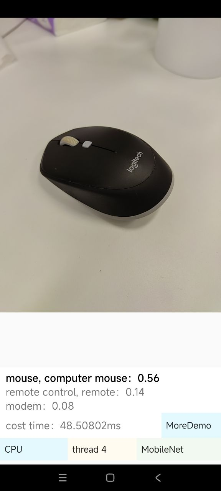
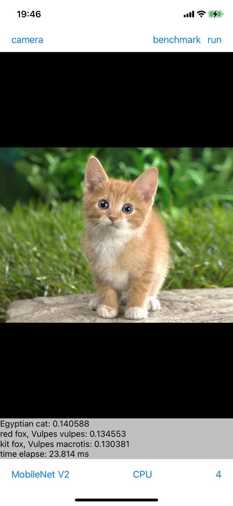

# 示例工程

## C++ Demo
[从源码编译](../compile/tools.html#id7)
### 姿态检测
代码位置：`demo/exec/multiPose.cpp`

1. 下载原始的Tensorflow模型 [pose model](https://github.com/czy2014hust/posenet-python/raw/master/models/model-mobilenet_v1_075.pb)
2. 使用 [模型转换工具](../tools/convert.md) 转换为 MNN 模型，转换时加上参数 --keepInputFormat=0 【把输入由NHWC转换为NC4HW4布局】
3. 执行姿态检测
    ```bash
    ./multiPose.out model.mnn input.png pose.png
    ```
效果示例：


### 图像实例分割
代码位置：`demo/exec/segment.cpp`

下载 deeplabv3 分割模型并转换到 mnn 模型
[https://storage.googleapis.com/download.tensorflow.org/models/tflite/gpu/deeplabv3_257_mv_gpu.tflite](https://storage.googleapis.com/download.tensorflow.org/models/tflite/gpu/deeplabv3_257_mv_gpu.tflite)

```bash
./segment.out model.mnn input.png result.png
```

效果示例：


### 图像识别
代码位置：`demo/exec/pictureRecognition.cpp`

下载 mobilenet 模型并转换为 MNN 格式
第一个参数为 MNN 模型地址
第二个参数为图像地址
追加参数则为下一张图像地址

示例：
```bash
./pictureRecognition.out moiblenet.mnn Test.jpg
```

效果示例：


输出：
```bash
Can't Find type=4 backend, use 0 instead
For Image: TestMe.jpg
386, 0.419250
101, 0.345093
385, 0.214722
347, 0.012001
346, 0.002010
348, 0.001876
294, 0.001247
349, 0.000761
354, 0.000443
345, 0.000441
```
第一行表示识别出可能性最大的类别编号，在相应的 synset_words.txt 去查找对应的类别，如：`demo/model/MobileNet/synset_words.txt`

## Python Demo
### Session图片分类
代码位置：`pymnn/examples/MNNEngineDemo/`

测试代码包含：
- `mobilenet_demo.py` 使用Session进行图片分类示例
- `mobilenet_demo_2.py` 使用Runtime创建Session进行图片分类示例
- `gpu_session_demo.py` 使用Session的GPU后端进行图片分类示例

资源文件如下：
- [mobilenet_demo.zip](https://www.yuque.com/attachments/yuque/0/2020/zip/405909/1589442188553-74d67103-6770-4522-8766-3bb1b2ac4dd0.zip?_lake_card=%7B%22src%22%3A%22https%3A%2F%2Fwww.yuque.com%2Fattachments%2Fyuque%2F0%2F2020%2Fzip%2F405909%2F1589442188553-74d67103-6770-4522-8766-3bb1b2ac4dd0.zip%22%2C%22name%22%3A%22mobilenet_demo.zip%22%2C%22size%22%3A15781277%2C%22type%22%3A%22application%2Fzip%22%2C%22ext%22%3A%22zip%22%2C%22status%22%3A%22done%22%2C%22uid%22%3A%221588768106314-0%22%2C%22progress%22%3A%7B%22percent%22%3A99%7D%2C%22percent%22%3A0%2C%22refSrc%22%3A%22https%3A%2F%2Fwww.yuque.com%2Fattachments%2Fyuque%2F0%2F2020%2Fzip%2F405909%2F1589442188553-74d67103-6770-4522-8766-3bb1b2ac4dd0.zip%22%2C%22id%22%3A%22ZGVmm%22%2C%22card%22%3A%22file%22%7D)

示例：
```bash
$ unzip mobilenet_demo.zip
$ python mobilenet_demo.py mobilenet_demo/mobilenet_v1.mnn mobilenet_demo/ILSVRC2012_val_00049999.JPEG
Load Cache file error.
expect 983
output belong to class: 983
$ python mobilenet_demo_2.py mobilenet_demo/mobilenet_v1.mnn mobilenet_demo/ILSVRC2012_val_00049999.JPEG
Load Cache file error.
MNN use low precision
<capsule object NULL at 0x7fdd0185a270> (True,)
MNN use low precision
memory_info: 22.382057MB
flops_info: 568.792175M
backend_info: 13
expect 983
output belong to class: 983
$ python gpu_session_demo.py mobilenet_demo/mobilenet_v1.mnn mobilenet_demo/ILSVRC2012_val_00049999.JPEG 
Testing gpu model calling method

Load Cache file error.
MNN use high precision
Can't Find type=3 backend, use 0 instead
Can't Find type=3 backend, use 0 instead
Run on backendtype: 13 

expect 983
output belong to class: 983
```

### 表达式图片分类
代码位置：`pymnn/examples/MNNExpr`
```bash
$ python mobilenet_demo.py mobilenet_demo/mobilenet_v1.mnn mobilenet_demo/ILSVRC2012_val_00049999.JPEG
expect 983
output belong to class: 983
```
### 模型量化
代码位置：`pymnn/examples/MNNQuant`

离线量化工具，[用法参考](https://github.com/alibaba/MNN/tree/master/tools/MNNPythonOfflineQuant)，
资源文件下载
示例：
```bash
$ python test_mnn_offline_quant.py  --mnn_model quant_demo/mobilenet_v2_tfpb_train_withBN.mnn \
            --quant_imgs quant_demo/quant_imgs \
            --quant_model ./quant_model.mnn
output names:	 MobilenetV2/Predictions/Reshape_1
100%|██████████████████████████████████████████████████████████████████████████████████████████████████| 2/2 [00:46<00:00, 23.29s/it]
Epoch cost: 46.618 s.
quantized model save to ./quant_model.mnn
```

### 模型训练
代码位置：`pymnn/examples/MNNTrain`

测试代码包含：
- `mnist`
- `mobilenet_finetune`
- `module_save`
- `quantization_aware_training`
#### mnist
使用mnist数据训练模型，并测试准确率，无需下载资源，用法如下：
```bash
$ pip install mnist 
$ python train_mnist.py
train loss:  2.3346531
train loss:  0.28027835
train loss:  0.26191226
train loss:  0.09180952
train loss:  0.14287554
train loss:  0.14296289
train loss:  0.060721636
train loss:  0.037558462
train loss:  0.11289845
train loss:  0.04905951
Epoch cost: 47.505 s.
Save to 0.mnist.mnn
test acc:  96.25 %
```
#### mobilenet_finetune
这个示例展示了如何使用MobilenetV2在你的数据集上finetune一个图像分类器。
示例资源文件：
- [train_dataset.zip](https://www.yuque.com/attachments/yuque/0/2020/zip/405909/1589442189675-b6595179-10c2-4cf2-b4a2-739758e57792.zip?_lake_card=%7B%22src%22%3A%22https%3A%2F%2Fwww.yuque.com%2Fattachments%2Fyuque%2F0%2F2020%2Fzip%2F405909%2F1589442189675-b6595179-10c2-4cf2-b4a2-739758e57792.zip%22%2C%22name%22%3A%22train_dataset.zip%22%2C%22size%22%3A95202011%2C%22type%22%3A%22application%2Fzip%22%2C%22ext%22%3A%22zip%22%2C%22status%22%3A%22done%22%2C%22uid%22%3A%221588831792222-1%22%2C%22progress%22%3A%7B%22percent%22%3A99%7D%2C%22percent%22%3A0%2C%22id%22%3A%226kWMz%22%2C%22card%22%3A%22file%22%7D)
- [test_dataset.zip](https://www.yuque.com/attachments/yuque/0/2020/zip/405909/1589442189983-0b5aaa8c-ba5d-4143-9bbf-be32a44ea064.zip?_lake_card=%7B%22src%22%3A%22https%3A%2F%2Fwww.yuque.com%2Fattachments%2Fyuque%2F0%2F2020%2Fzip%2F405909%2F1589442189983-0b5aaa8c-ba5d-4143-9bbf-be32a44ea064.zip%22%2C%22name%22%3A%22test_dataset.zip%22%2C%22size%22%3A54743675%2C%22type%22%3A%22application%2Fzip%22%2C%22ext%22%3A%22zip%22%2C%22status%22%3A%22done%22%2C%22uid%22%3A%221588831792222-0%22%2C%22progress%22%3A%7B%22percent%22%3A99%7D%2C%22percent%22%3A0%2C%22refSrc%22%3A%22https%3A%2F%2Fwww.yuque.com%2Fattachments%2Fyuque%2F0%2F2020%2Fzip%2F405909%2F1589442189983-0b5aaa8c-ba5d-4143-9bbf-be32a44ea064.zip%22%2C%22id%22%3A%22DZmfq%22%2C%22card%22%3A%22file%22%7D)
- [model.zip](https://www.yuque.com/attachments/yuque/0/2020/zip/405909/1589442190124-6c567afd-8bf0-4411-bfac-0376c94b7dc9.zip?_lake_card=%7B%22src%22%3A%22https%3A%2F%2Fwww.yuque.com%2Fattachments%2Fyuque%2F0%2F2020%2Fzip%2F405909%2F1589442190124-6c567afd-8bf0-4411-bfac-0376c94b7dc9.zip%22%2C%22name%22%3A%22model.zip%22%2C%22size%22%3A13059416%2C%22type%22%3A%22application%2Fzip%22%2C%22ext%22%3A%22zip%22%2C%22status%22%3A%22done%22%2C%22uid%22%3A%221588831927601-0%22%2C%22progress%22%3A%7B%22percent%22%3A99%7D%2C%22percent%22%3A0%2C%22id%22%3A%22ThVjR%22%2C%22card%22%3A%22file%22%7D)

用法如下：
```bash
$ unzip model.zip train_dataset.zip test_dataset.zip
$ python mobilenet_transfer.py --model_file mobilenet_v2_tfpb_train_public.mnn --train_image_folder train_images --train_txt train.txt --test_image_folder test_images --test_txt test.txt --num_classes 1000
# TODO: 当前版本不支持FixModule无法执行该示例
AttributeError: module 'MNN.nn' has no attribute 'FixModule'
```

#### module_save
演示了模型权值的存储和加载
```bash
$ python test_save.py 
0.0004
10
```

#### quantization_aware_training
训练量化，用法如下：
```bash
$  python quant_aware_training.py --model_file quant_demo/mobilenet_v2_tfpb_train_withBN.mnn --val_image_path quant_demo/quant_imgs --val_txt quant_demo/val.txt
```
## Android Demo
代码位置：`project/android/demo`

按照`project/android/demo/READNE.md`的步骤，首先安装开发所需工具；然后下载并转换模型；之后就可以编译成Android APP执行测试。

效果示例：



## iOS Demo
### 模型下载与转换：
首先编译(如果已编译可以跳过)`MNNConvert`，操作如下：
```
cd MNN
mkdir build && cd build
cmake -DMNN_BUILD_CONVERTER=ON ..
make -j8
```

然后下载并转换模型：
切到编译了 MNNConvert 的目录，如上为 build 目录，执行
```
sh ../tools/script/get_model.sh
```

### 工程编译
代码位置：`project/ios`

使用`xcode`打开`project/ios/MNN.xcodeproj`, `target`选择`demo`,既可编译运行。

效果示例：




## Github Demo

**欢迎开发者提供示例，可以在issue中提交自己的示例项目，审核通过后可以再此处展示**

### 以下示例为Github开发者贡献，具体用法需参考相关代码；
- [mobilenet-mnn](https://github.com/wangzhaode/mobilenet-mnn)
- [yolov8-mnn](https://github.com/wangzhaode/yolov8-mnn)
- [stable-diffusion-mnn](https://github.com/wangzhaode/stable-diffusion-mnn)
- [ChatGLM-MNN](https://github.com/wangzhaode/ChatGLM-MNN)
- [图像算法工具箱](https://github.com/DefTruth/lite.ai.toolkit)
- [嵌入式设备部署示例](https://github.com/xindongzhang/MNN-APPLICATIONS)
- [车道线检测](https://github.com/MaybeShewill-CV/MNN-LaneNet)
- [轻量级人脸检测](https://github.com/Linzaer/Ultra-Light-Fast-Generic-Face-Detector-1MB/tree/master/MNN)
- [LFFD人脸检测](https://github.com/SyGoing/LFFD-MNN)
- [Android人脸识别](https://github.com/jackweiwang/Android-FaceDetection-UltraNet-MNN)
- [人脸追踪](https://github.com/qaz734913414/MNN_FaceTrack)
- [视频抠图](https://github.com/DefTruth/RobustVideoMatting.lite.ai.toolkit)
- [SuperGlue关键点匹配](https://github.com/Hanson0910/MNNSuperGlue)
- [OCR](https://github.com/DayBreak-u/chineseocr_lite/tree/onnx/android_projects/OcrLiteAndroidMNN)
