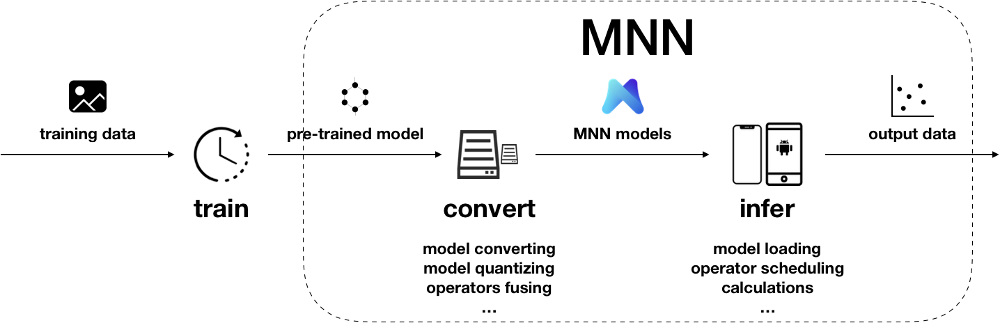

# 快速开始

## 使用MNN整体流程
在端侧应用MNN，大致可以分为三个阶段：

### 训练
在训练框架上，根据训练数据训练出模型的阶段。虽然当前MNN也提供了[训练模型的能力](../train/expr.md)，但主要用于端侧训练或模型调优。在数据量较大时，依然建议使用成熟的训练框架，如TensorFlow、PyTorch等。除了自行训练外，也可以直接利用开源的预训练模型。
### 转换
将其他训练框架模型转换为MNN模型的阶段。MNN当前支持Tensorflow(Lite)、Caffe、ONNX和TorchScript的模型转换。模型转换工具可以参考[编译文档](../compile/tools.html#id2)和[使用说明](../tools/convert.md)。支持转换的算子，可以参考[算子列表文档](../tools/convert.html#id7)；在遇到不支持的算子时，可以尝试[自定义算子](../contribute/op.md)，或在Github上给我们[提交issue](https://github.com/alibaba/MNN/issues/74)。此外，[模型打印工具](../tools/convert.html#id8)可以用于输出模型结构，辅助调试。除模型转换外，MNN也提供了[模型量化工具](../tools/quant.md)，可以对浮点模型进行量化压缩。
### 推理
在端侧加载MNN模型进行推理的阶段。端侧运行库的编译请参考各平台的编译文档：[iOS](../compile/engine.html#ios)、[Android](../compile/engine.html#android)、[Linux/macOS/Ubuntu](../compile/engine.html#linux-macos)、[Windows](../compile/engine.html#windows)。我们提供了[API接口文档](https://github.com/alibaba/MNN/tree/master/doc/API)，也详细说明了[会话创建](../inference/session.html#id1)、[数据输入](../inference/session.html#id8)、[执行推理](../inference/session.html#id17)、[数据输出](../inference/session.html#id21)相关的接口和参数。`demo/exec`下提供了使用示例，如图像识别 `demo/exec/pictureRecognition.cpp` ，图像实例分割（人像分割）`demo/exec/segment.cpp`，[更多demo](demo.md)。此外，[测试工具](../tools/test.md)和[benchmark工具](../tools/benchmark.md)也可以用于问题定位。