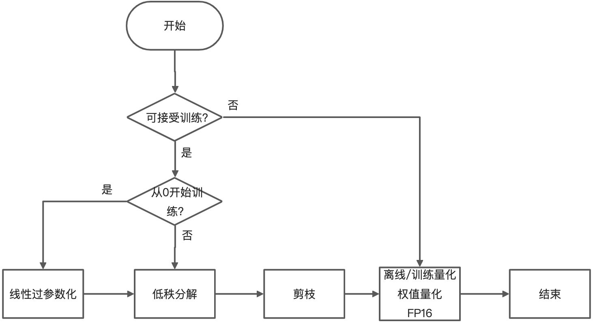

# 模型压缩工具箱

## 介绍
### 是什么？
MNN模型压缩工具箱提供了包括低秩分解、剪枝、量化等模型压缩算法的实现，并且MNN进一步实现了其中一些需要软件特殊实现的算法（如稀疏计算和量化）的底层计算过程，因此，此工具箱需要配合MNN推理框架来使用。
具体来说，MNN压缩工具箱包含两个组成部分：
1. **MNN框架自身提供的压缩工具**（输入MNN模型，输出MNN模型）
2. **mnncompress**（基于主流训练框架TF/Pytorch的模型压缩工具）。
### 有什么？
目前提供的能力如下表所示：

| 原始模型格式 | 提供的工具 | 支持的压缩算法类别 |
| --- | --- | --- |
| MNN | 量化工具（python，c++）<br>模型转换工具（python，c++） | 离线量化<br>训练量化（不成熟）<br>权值量化（转换时直接完成）<br>FP16（转换时直接完成） |
| TensorFlow 1.X | python压缩算法插件（mnncompress） | 低秩分解<br>线性过参数化<br>模型剪枝<br>离线量化<br>训练量化<br>训练权值量化 |
| Pytorch | python压缩算法插件（mnncompress） | 低秩分解<br>模型剪枝<br>离线量化<br>训练量化<br>训练权值量化 |

各类压缩算法的特点：

| 压缩算法类别 | 特点 | 支持的算法 |
| --- | --- | --- |
| 低秩分解 | 将原始模型进行分解，降低模型计算量、存储量，分解之后的模型仍是一个规整的模型，不需要特殊的软件底层实现；需要进行finetune训练 | Tucker分解，SVD分解 |
| 线性过参数化 | 用于模型从0开始训练的过程中，设计一个小模型，然后使用此算法对模型进行过参数化扩展为一个大模型，提高模型的表达能力，然后基于此大模型进行训练，训练完成之后可以将大模型中的层合并得到原始小模型一样的结构，而且精度和大模型一致 | 改进的 linear over parameterization |
| 模型剪枝 | 将模型的权值矩阵进行稀疏，并进行finetune训练，利用稀疏编码（通道剪枝不需要）压缩模型大小，底层稀疏计算实现加速 | 1x1随机剪枝，1x4block剪枝，通道剪枝 |
| 离线量化 | 将float卷积转换为int8卷积计算，仅需少量校准图片，降低存储量到原始模型的四分之一，降低内存，加速计算（某些模型可能会比float模型慢，因为float的优化方法和int8不同） | EMA，KL，ADMM |
| 训练量化 | 将float卷积转换为int8卷积计算，需要进行训练，可提高量化模型精度，降低存储量到原始模型的四分之一，降低内存，加速计算（某些模型可能会比float模型慢，因为float的优化方法和int8不同） | LSQ，OAQ，WAQ |
| 直接权值量化 | 仅将模型中的权值进行量化，计算时还原为float进行计算，因此仅减少模型存储量，计算速度和float相同，可以在模型转换时一键完成，8bit量化情况下，精度基本不变，模型大小减小到原来的1/4 | 对称量化，非对称量化 |
| 训练权值量化 | 特点同直接权值量化，但通过mnncompress压缩算法插件实现，因而可以提供更低比特的权值量化，以减少更多的存储量，并提高权值量化之后模型的精度，例如4bit量化情况下，模型大小减小到原来的1/8 | 对称量化 |
| FP16 | 将FP32计算转换为FP16计算，可在模型转换时一键完成，模型大小减小为原来的1/2，精度基本无损，并提高计算速度（需要硬件支持FP16计算） | - |

### 怎么用？
1. 如果只想使用离线压缩方法，可以将模型转换为MNN模型之后使用对应的工具进行压缩。这类压缩算法不需要进行训练finetune，所以通常运行得很快。
2. 如果离线压缩方法的精度不满足要求，且能够进行训练finetune的话，可以使用**mnncompress**中提供的压缩算法插件将原始模型进行压缩，得到压缩之后的模型和压缩信息描述文件，然后将这两个文件输入到MNN模型转换工具得到最终的MNN压缩模型。需要训练的压缩算法可以提供更好的精度，但需要一定的时间进行finetune训练，此finetune训练需要的时间一般比模型从0开始训练要少很多。
3. 这些算法中有些是可以叠加使用的，以取得更好的压缩效果。推荐使用pipeline（**其中方框中的算法均为可选，叠加压缩算法若精度不好，可选择使用**）：


## MNN框架自身提供的压缩工具
### 使用方法
MNN框架压缩工具是基于离线量化工具和MNN转换工具来实现压缩功能的，这两个工具均提供c++版本和python版本，安装方式如下：
- c++工具安装

    需要源码编译MNN转换工具 `MNNConvert` 和量化工具 `quantized.out`
    ```bash
    cd build
    cmake ..  -DMNN_BUILD_CONVERTER=ON -DMNN_BUILD_QUANTOOLS=ON
    make -j 8
    ```
- python工具安装
    ```bash
    # 外部版本MNN，外网安装方式
    pip install MNN
    # 外部版本MNN，集团内安装方式
    pip install --index-url https://pypi.antfin-inc.com/simple/ -U MNN
    # 内部版本MNN
    pip install --index-url https://pypi.antfin-inc.com/simple/ -U MNN-Internal
    # 安装之后，命令行中将有如下工具：
    mnn：显示MNN命令行工具
    mnnconvert：转换器 MNNConvert 的预编译工具，功能同 MNNConvert
    mnnquant：量化工具 quantized.out 的预编译工具，功能同 quantized.out
    ```
### MNN离线量化工具
#### 原理
将float卷积转换为int8卷积进行计算（仅量化卷积，建议将FC转为1*1卷积实现），同时会通过MNN几何计算机制将量化信息在网络中进行传播，以支持尽可能多的算子的量化计算。模型大小减少为原始模型的1/4，并减少内存，提高推理速度（某些模型可能量化之后变慢，因为float的计算可以使用winograd、strassen等优化算法，而离线量化的int8计算并没有这些优化，如果要使用int8量化的特殊优化，如OAQ、WAQ等，需要使用mnncompress）。
#### 单输入、图片输入模型的量化
这类模型可以使用 `quantized.out`（或`mnnquant`）进行量化，使用文档在：[quantized.out](quant.md)，[mnnquant.md](python.html#mnnquant)
#### 通用模型的量化
通用模型量化工具可以支持任意输入和任意输入类型的模型的量化，基于MNN python包，使用文档在：[MNNPythonOfflineQuant](https://github.com/alibaba/MNN/tree/master/tools/MNNPythonOfflineQuant)

**注意：**`calibration_dataset.py`中`__getitem__`返回为一个输入sample，其形状不应该包含batch维度，在量化时我们会根据工具命令行中传入的batch参数，stack出一个batch的数据，但我们默认batch维度在第一维，所以，如果你的某个输入的batch维不在第一维，你需要在你对应的输入之前加一个transpose。
### MNN权值量化工具
#### 原理
仅将模型中卷积的float权值量化为int8存储，推理时反量化还原为float权值进行计算。因此，其推理速度和float模型一致，但是模型大小可以减小到原来的1/4，可以通过模型转换工具一键完成，比较方便。推荐float模型性能够用，仅需要减少模型大小的场景使用。
#### 使用方法
使用`MNNConvert`（c++）或者`mnnconvert`（python包中自带）进行转换，转换命令行中加上下述选项即可：
```bash
--weightQuantBits 8 [--weightQuantAsymmetric](可选)
```
`--weightQuantAsymmetric` 选项是指使用非对称量化方法，精度要比默认的对称量化精度好一些。
### MNN FP16压缩工具
#### 原理
将模型中FP32权值转换为FP16存储，并在支持的设备上开启FP16推理，可以获得推理加速，并且速度减少到原来的1/2。可以在模型转换时一键完成，使用方便。
#### 使用方法
使用`MNNConvert`（c++）或者`mnnconvert`（python包中自带）进行转换，转换命令行中加上下述选项即可：
```bash
--fp16
```
## mnncompress
### 使用方法
#### 安装
使用pip安装：pip install mnncompress
#### 支持的算法

| 算法类别 | 算法名称 | TensorFlow1.X | Pytorch |
| --- | --- | --- | --- |
| 线性过参数化 | linear over parameterization 改进 | ❎ | ✅ |
| 低秩分解 | Tucker分解，SVD分解 | ✅ | ✅ |
| 剪枝 | TaylorFOChannelPruner 结构化通道剪枝 | ✅ | ✅ |
|  | SIMDOCPruner 1*4半结构化剪枝 | ✅ | ✅ |
|  | SNIPLevelPruner 1*1随机非结构化剪枝 | ✅ | ✅ |
| 训练量化（也可改做离线量化） | LSQ（学习量化参数） | ✅ | ✅ |
|  | OAQ（overflow aware quantization） | ✅ | ❎ |
|  | WAQ（winograd aware quantization） | ❎ | ✅ |
| 权值量化（也可不训练，查看直接权值量化精度） | 对称量化，非对称量化 | ✅ | ✅ |

#### mnncompress技术路线
mnncompress的技术路线如下图所示：

通过mnncompress中的模型压缩插件对原始模型进行压缩，然后得到一个原始的float模型，以及该压缩算法所需要的额外的压缩参数（例如对于量化算法来说，需要各个卷积层的scale和zeropoint等信息）。最后将这个float模型和模型压缩参数文件输入到MNN转换器中，得到最终的MNN压缩模型。
#### 关于模型压缩参数文件
在mnncompress的文档中通常命名为“`compress_params.bin`”，是一个protobuf序列化之后的二进制文件。每执行一个压缩算法都需要保存一个对应的模型压缩参数文件，如果有算法上的叠加（例如剪枝+量化的叠加），那么需要将算法对应的API接口中的`append`参数设置为`True`（例如剪枝+量化的叠加，则需要在量化算法保存压缩参数文件时，将对应的接口`append`参数设置为`True`，将量化算法所需要的参数append到剪枝算法的模型压缩文件上去），这样MNN模型转换器才会知道你的模型经过了哪些优化，才能进行正确的转换。

### Benchmark
#### 离线量化
以下模型均来自torchvision预训练模型，采用mnncompress中LSQ的offline模式进行量化，batch size为64，用10个batch，640张训练图片进行量化，表中标*的模型表示量化时跳过了第一层或者前两层不量化，以提升精度。测速均采用**华为P20 Pro 单线程**。

| 模型 | 原始模型指标 | 压缩模型指标 | ARMV7 (ms) | ARMV8 (ms) |
| --- | --- | --- | --- | --- |
| ResNet-18 | 69.758%，45M | 69.740%，12M | 196.6 --> 208.8 | 187.6 --> 167.0 |
| ResNet-50 | 76.130%，98M | 76.030%，25M | 606.0 --> 470.5 | 550.8 --> 379.6 |
| SqueezeNet 1.0 | 58.092%，4.8M | 57.800%，1.3M | 122.1 --> 104.1 | 120.8 --> 88.3 |
| ShuffleNet V2 x1.0 | 69.362%，8.7M | 68.616%，2.3M |  33.3 --> 33.8 | 29.0 --> 26.0 |
| MobileNet V2 | 71.878%，14M | 71.150%，3.5M | 69.1 --> 50.2 | 62.2 --> 42.1 |
| *MobileNet V3 Large | 74.042%，21M | 73.030%，5.4M | 68.6 --> 63.1 | 64.9 -->  50.1 |
| MNASNet 1.0 | 73.456%，17M | 72.692%，4.3M | 70.6 --> 51.2 | 63.0 --> 42.9 |
| *EfficientNet-B0 | 77.692%，21M | 70.486%，5.3M | 134.3 --> 113.0 | 128.7 --> 100.4 |
| EfficientNet-B1 | 78.642%，30M | 73.546%，7.8M | 199.5 --> 166.9 | 185.2 --> 145.9 |
| regnet_x_400mf | 72.834%，21.3M | 72.660%，8.0M | 83.2 --> 67.6 | 75.1 --> 58.0 |

#### 训练量化
训练量化用来提升量化的精度，其速度和离线量化版本模型一致。建议优先使用离线量化方法，精度不够的情况下再使用训练量化方法。以下数据中的标准模型来自torchvision预训练模型，有些模型如efficientnet的训练成本较大，故未给出训练量化版本。用户自己训练的模型知道训练参数，结果一般可以更好。

| 模型 | 原始模型指标 | 压缩模型指标 | 备注 |
| --- | --- | --- | --- |
| ResNet-18 | 69.758%，45M | 69.840%，12M | 训练一个epoch即可 |
| MobileNet V2 | 71.878%，14M | 71.762%，3.5M | github: pytorch/vision reference/classification，复现命令：torchrun --nproc_per_node=8 train.py --model mobilenet_v2 --data-path /mnt/data/ --epochs 100 --lr 0.01 --wd 0.00004 --lr-step-size 30 --lr-gamma 0.1 --pretrained --quant --sync-bn -b 128 |
| *MobileNet V3 Large | 74.042%，21M | 73.924%，5.4M | 跳过第一层，github: pytorch/vision reference/classification，复现命令：torchrun --nproc_per_node=8 train.py --opt rmsprop --auto-augment imagenet --random-erase 0.2 --model mobilenet_v3_large --data-path /mnt/data/ --epochs 100 --batch-size 128 --lr 0.01 --wd 0.00001 --lr-step-size 30 --lr-gamma 0.1 --pretrained --quant --sync-bn |

#### 剪枝

| 模型 | 原始模型指标 | 压缩模型指标 | ARMV7 (ms) | ARMV8 (ms) |
| --- | --- | --- | --- | --- |
| MobileNet V2 | 71.878%，14M | 71.272%，2.8M，50% SIMDOC稀疏 | 69.1 --> 64.9 | 62.2 --> 58.8 |
| *MobileNet V3 Large | 74.042%，21M | 73.568%，4.2M 50% SIMDOC稀疏 | 68.6 --> 66.5 | 64.9 --> 62.3 |

#### 低秩分解

| 模型 | 原始模型指标 | 压缩模型指标 | ARMV7 (ms) | ARMV8 (ms) |
| --- | --- | --- | --- | --- |
| MobileNet V2 | 71.878%，14M | 69.874%，11M | 69.1 --> 60.6 | 62.2 --> 54.6 |
| MobileNet V3 Large | 74.042%，21M | 72.748%，18M | 68.6 --> 59.7 | 64.9 --> 55.7 |

#### 用户案例

| 模型 | 压缩方案 | 原始模型指标 | 压缩模型指标 |
| --- | --- | --- | --- |
| 神经渲染relight模型 | 低秩分解 | 30.1，138M，238ms | 29.98，58M，169ms  /  29.68，17M，116ms |
| 语音识别AOA V3 | EMA训练量化 | cer 18.3，50.6M  | cer 18.26，18.7M |

### Pytorch模型压缩工具
#### 线性超参数化工具
- 环境要求
  1. python3
  2. PyTorch >= 1.2.0
- 总体使用流程
  1. 通过本工具得到训练好的float onnx模型，以及MNN模型压缩参数文件
  2. 通过MNN转换工具，输入这两个文件，得到最终的MNN稀疏模型
- 支持的op，使用建议
  1. 目前支持普通卷积nn.Conv2d（group=1，非1*1）的过参数化
  2. 该算法应在模型从零开始训练时使用，因为其中的参数会重新进行初始化
  3. 该算法的特点是：设计小模型 --> 训练线性过参数化大模型 --> 保存时合并为原始小模型结构。因此你可以设计一个小模型，然后用此算法训练提高小模型精度，最后推理部署仍使用小模型结构
  4. 得到的小模型后续仍可叠加剪枝和量化等压缩算法
  5. 参考论文：ExpandNets: Linear Over-parameterization to Train Compact Convolutional Networks
- 使用方法：（**注意**：model，expand_model，merged_model均为深拷贝，有不同的内存空间，它们之间不互相影响）
    ```python
    from mnncompress.pytorch import LOP
    # 定义你的模型结构，并初始化
    model = Net()
    # 对模型进行线性过参数化
    lop = LOP(model)
    # 扩大8倍，指定模型压缩参数文件，更多参数查看api文档
    expand_model = lop.linear_expand_layers(8, "compress_params.bin")
    # 使用线性过参数化之后的模型进行训练
    train_and_evaluate(expand_model, data)
    # 保存模型之前，将过参数化的模型合并，然后保存合并之后的模型 merged_model
    merged_model = lop.linear_merge_layers()
    ```
- 相关API
  - LOP
    ```python
    LOP(model) # model为原始模型nn.Module实例
    ```
    方法`linear_expand_layers`：
    ```python
    linear_expand_layers(expand_rate, compress_params_file, add_batchnorm=True, add_bypass=True, append=False)
    '''
    将原始模型进行线性过参数化
    参数：
        expand_rate: int，线性过参数化的倍数，一般取2，4，8，16等
        compress_params_file: str，模型压缩参数文件名
        add_batchnorm: bool，是否在线性过参数化时使用BN
        add_bypass: bool，是否在线性过参数化时添加bypass（残差连接）
        append: bool，是否将线性过参数化算法的参数追加到compress_params_file中去，为False，则将覆盖compress_params_file
    返回值：
        线性过参数化之后的模型，深拷贝，和原始model不共享内存
    '''
    ```
    方法`linear_merge_layers`
    ```python
    linear_merge_layers()
    '''
    将过参数化之后的模型合并为原始模型结构
    参数：
        无参数   
    返回值：
        合并之后的模型，深拷贝，和过参数化模型不共享内存
    '''
    ```
#### 低秩分解工具
- 环境要求
  1. python3
  2. PyTorch >= 1.2.0
- 总体使用流程
  1. 通过本工具得到分解之后的float onnx模型，以及MNN模型压缩参数文件
  2. 通过MNN转换工具，输入这两个文件，得到最终的MNN压缩模型
- 支持的op，使用建议
  1. 目前支持nn.Conv2d（group>1不支持）和nn.Linear的分解
  2. 建议从已经训练好的float模型开始finetune
  3. 分解之后的模型调整好学习率，准确率一般会迅速恢复
- 使用方法
    ```python
    from mnncompress.pytorch import low_rank_decompose

    # 加载已经训练好的float模型
    model = Net()
    model.load_state_dict(torch.load("ori_float_model.pt"))

    # 将原始模型分解，然后用分解之后的模型进行finetune训练即可
    model = low_rank_decompose(model, "compress_params.bin")
    ```
- 相关API
  - low_rank_decompose
    ```python
    low_rank_decompose(model, compress_params_file, skip_layers=[""], align_channels=8, 
                    in_place=False, tucker_minimal_ratio=0.25, 
                    reserved_singular_value_ratio=0.5, append=False)
    '''
    参数：
        model: nn.Module实例，训练好的float模型
        compress_params_file: str, MNN模型压缩参数文件名
        skip_layers: List[str], 跳过不分解层的名字，需要是nn.Conv2d或者nn.Linear类型，如["features.conv1",]
        align_channels: int, 分解之后进行通道对齐的倍数
        in_place: 分解时是否使用原模型内存空间，若为False，则分解之前会对原模型进行深拷贝
        tucker_minimal_ratio: float 0~1, 卷积层tucker分解保留的最低通道数比例
        reserved_singular_value_ratio: svd分解保留的特征值之和占总特征值之和的比例
        append: bool, 是否将低秩分解算法的参数追加到compress_params_file中去，为False，则将覆盖compress_params_file

    返回值：
        分解之后的模型，nn.Module实例        
    '''
    ```
#### 自动剪枝工具
- 环境要求
  1. python3
  2. PyTorch >= 1.8.0
- 总体使用流程
  1. 通过本工具得到训练好的float onnx模型，以及MNN模型压缩参数文件
  2. 通过MNN转换工具，输入这两个文件，得到最终的MNN稀疏模型**（如果直接部署稀疏的float模型，而不叠加量化，那么转换时需要使用MNNConvert的 --weightQuantBits 8 参数进行转换，才会进行稀疏编码，否则模型大小将不变）**
- 支持的op，使用建议
  1. 目前支持torch.nn.Conv2d，torch.nn.Linear
  2. 优化器超参使用模型收敛阶段的超参，学习率可以在收敛阶段学习率的基础上再调小
- 支持的剪枝算法
  1. SNIPLevelPruner：最细粒度的随机剪枝算法，稀疏单位为单个权值。一般需要剪枝比例达到80%以上才有加速，此方法主要进行压缩。
  2. SIMDOCPruner：稀疏单位为1*4的剪枝算法，一般需要30%以上剪枝比例才能加速，精度比通道剪枝好。
  3. TaylorFOChannelPruner：通道剪枝算法，此算法是将conv2d的一整个filter剪掉，因此此filter对应的输出通道会失效，剪枝完模型是一个规整的模型，不需要后端进行特殊加速，但为了将剪掉的filter从模型中真正去掉，需要使用MNNConverter进行转换，转换过程中会分析剪枝通道之间的依赖关系，并完成最终的转换。
- 使用方法
  1. 建议从训练好的float模型进行finetune
  2. 创建Pruner对象，对原始模型进行转换，然后用转换之后的模型进行训练
  3. 在train过程中，调用pruner的do_pruning方法进行剪枝
  4. 导出MNN模型压缩参数文件，示例代码如下（关注其中pruner的用法）：
    ```python
    from mnncompress.pytorch.SNIP_level_pruner import SNIPLevelPruner
    from mnncompress.pytorch.SIMD_OC_pruner import SIMDOCPruner
    Pruner = SIMDOCPruner
    # 你的模型代码
    class Net(nn.Module):
        pass
    model = Net()
    # 加载已经训练好的模型
    model.load_state_dict(torch.load("ori_model.pt"))
    model.to(device)
    # 将模型进行转换，并使用转换后的模型进行训练，测试
    # 更多配置请看API部分
    pruner = SIMDOCPruner(model, total_pruning_iterations=1, sparsity=0.6, debug_info=False)
    def train(model, data, optimizer, pruner)
        model.train()
        for d, t in data:
            optimizer.zero_grad()
            output = model(d)
            loss = F.nll_loss(output, t)
            loss.backward()
            optimizer.step() 
            # step之后调用pruner的剪枝方法
            pruner.do_pruning()
        # 获取当前剪枝比例
        print(pruner.current_prune_ratios())
    for epoch in range(1, epochs + 1):
        train(model, data, optimizer, pruner)
        test(model, data)
    # 保存模型
    model.eval()
    torch.save(model.state_dict(), "pruned_model.pt")
    x = torch.randn(input_shape).to(device)
    torch.onnx.export(model, x, "pruned_model.onnx")
    # 保存MNN模型压缩参数文件，应在剪枝完毕之后进行，建议在保存模型时调用
    pruner.save_compress_params("compress_params.bin", append=False)
    ```
  5. 模型稀疏之后，可以进一步使用PyTorch训练量化工具进行量化，得到稀疏量化模型。也可以直接使用此float稀疏的模型进行推理，需要在MNN模型转换时指定剪枝得到的MNN模型压缩参数文件，并进行权值量化（才会进行稀疏编码）：
    ```bash
    mnnconvert --modelFile pruned_model.onnx  --MNNModel pruned_model.mnn --framework ONNX --bizCode MNNTest --compressionParamsFile compress_params.bin --weightQuantBits 8
    ```
- 相关API
  - SNIPLevelPruner / SIMDOCPruner / TaylorFOChannelPruner
    ```python
    Pruner(model, sparsity=0.5, total_pruning_iterations=1, config_file=None, debug_info= False, 
        prune_finetune_iterations=0, max_prune_ratio=0.99, 
        align_channels=4  # only for 'TaylorFOChannelPruner'
        ):
    '''
    参数:
    model：Module，pytorch模型
    sparsity：float，0~1，模型总体剪枝比例
    total_pruning_iterations：int，指定多少个iteration将指定比例的连接剪掉
    config_file：str，可先运行一次Pruner的do_pruning方法，得到搜索出来的剪枝比例yml文件之后，
                    然后微调此yml文件中的各层剪枝比例，将修改后的文件名通过此参数传入，可控制各层剪枝比例
    debug_info：是否输出debug信息
    prune_finetune_iterations: int, 指定剪枝进行一步，finetune多少步，如指定为99，则剪枝一次，
                                                                    finetune99次，在finetune的99次过程中剪枝mask不变
    max_prune_ratio: float, 指定各层最大剪枝比例
    align_channels: int, 仅通道剪枝算法TaylorFOChannelPruner有此参数，用于指定剪枝之后对齐的通道数

    方法和属性:
    do_pruning(result_file = "found_prune_ratios.yml")：进行一次剪枝，在训练optimizer.step之后调用，搜索到的各层剪枝比例将保存到此文件中
    current_prune_ratios()：返回当前各层剪枝比例
    save_compress_params(filename, append=False): 保存MNN模型压缩参数到filename文件
                                                append 表示是否将剪枝参数信息append到传入的文件中，如果为false，则将新建或覆盖该文件，
                                                append=True 表示剪枝之前还做了其他模型压缩操作，filename文件中已存在相关压缩信息
    '''
    ```
#### 权值量化工具
- 环境要求
  1. python3
  2. PyTorch >= 1.8.0
- 总体使用流程
  1. 通过本工具得到训练好的float onnx模型，以及MNN模型压缩参数文件
  2. 通过MNN转换工具，输入这两个文件，得到最终的MNN量化模型
- 支持的op，使用建议
  1. 目前支持torch.nn.Conv2d，torch.nn.Linear的量化
  2. **仅对权值进行量化，一般8bit权值量化并不需要finetune，直接用MNN的转换工具的“--weightQuantBits”进行转换即可**，但也可使用本工具进行测试精度，或者finetune到更低的bit数，如4bit，2bit，推理速度和float一致
  3. 可与剪枝工具叠加使用
- 使用方法
  1. 建议从训练好的float模型进行finetune
  2. 创建WeightQuantizer对象，对原始模型进行转换，然后用转换之后的模型进行训练
  3. 保存onnx模型之前，去掉插入的节点
  4. 保存onnx模型之后，导出MNN模型压缩参数文件，示例代码如下（关注其中quantizer的用法）：
    ```python
    from mnncompress.pytorch import WeightQuantizer
    # 你的模型代码
    class Net(nn.Module):
        pass
    model = Net()
    # 加载已经训练好的模型，可以是剪枝之后的
    model.load_state_dict(torch.load("pruned_model.pt"))
    # 将模型进行转换，并使用转换后的模型进行训练，测试
    # 更多配置请看API部分
    quantizer = WeightQuantizer(model, bits=8)
    quant_model = quantizer.convert()
    quant_model.to(device)
    for epoch in range(1, epochs + 1):
        # 每次训练之前加上这一句，准备好量化训练图
        quantizer.resume_wq_graph()
        train(quant_model, data, optimizer)
        test(quant_model, data)
        if 触发模型保存条件：
            # 保存模型之前去掉插入的节点，恢复原模型结构
            quantizer.strip_wq_ops()
            # 保存模型，注意index，即模型和保存MNN模型压缩参数文件是一一对应的
            quant_model.eval()
            torch.save(quant_model.state_dict(), "quant_model_index.pt")
            x = torch.randn(input_shape).to(device)
            torch.onnx.export(quant_model, x, "quant_model_index.onnx")
            # 保存MNN模型压缩参数文件，如果进行量化的模型有剪枝，
            # 请将剪枝时生成的MNN模型压缩参数文件 "compress_params.bin" 文件在下方传入，并将 append 设置为True
            quantizer.save_compress_params("compress_params_index.bin", append=False)
    ```
  5. 训练完之后，使用MNN转换器进行模型转换，提供上面得到的MNN压缩参数文件，并使用`--weightQuantBits`指定量化比特数：
    ```bash
    mnnconvert --modelFile quant_model_index.onnx  --MNNModel weight_quant_model.mnn --framework ONNX --bizCode MNNTest --compressionParamsFile compress_params_index.bin --weightQuantBits 8
    ```
- 相关API
  - WeightQuantizer
    ```python
    WeightQuantizer(model, bits = 8, debug_info = False, mode = 'symmetric')
    '''
    参数:
    model：Module，pytorch模型
    bits：int，指定权值量化比特数
    debug_info：bool，是否输出debug信息
    mode："symmetric"或"asymmetric"，采用对称或者非对称量化，目前仅支持对称量化

    方法和属性:
    convert()：返回用于训练量化的模型
    strip_wq_ops()：去掉插入的权值量化op，恢复原始模型结构
    resume_wq_graph()：strip_wq_ops保存模型之后，如果还要继续量化训练需加上这一句，以恢复量化训练图，由此支持边训练边保存
    save_compress_params(filename, append=False)：
            用于保存MNN转换时需要用的模型压缩信息
            filename：str，MNN模型压缩参数将保存到这个文件名指定的文件中
            append：bool，是否将量化参数追加到filename文件中。如果进行量化的模型有剪枝，请将剪枝时通过save_compress_params生成的剪枝信息文件通过此参数传入，并将 append 设置为True
    '''
    ```
#### 训练量化工具
- 环境要求
  1. python3
  2. PyTorch >= 1.8.0
- 总体使用流程
  1. 通过本工具得到训练好的float onnx模型，以及MNN模型压缩参数文件
  2. 通过MNN转换工具，输入这两个文件，得到最终的MNN量化模型
- 支持的op，使用建议
  1. 建议优先试验此工具的离线量化功能，精度如果可以则不需要训练量化，速度快，节省时间
  2. 目前支持torch.nn.Conv2d，torch.nn.Linear的量化
  3. 优化器超参使用模型收敛阶段的超参，学习率可以在收敛阶段学习率的基础上再调小
  4. 模型的第一层或者前面几层对精度影响较大，可以尝试跳过不进行量化
  5. relu6建议使用nn.ReLU6，F.relu6使用opset 9导出到onnx会有问题
- 支持的训练量化算法
  1. LSQQuantizer: 改进naive QAT算法，scale会在网络训练中学习更新
- 使用方法
  1. 建议从训练好的float模型进行finetune
  2. 创建Quantizer对象，对原始模型进行转换，然后用转换之后的模型进行训练
  3. 保存onnx模型之前，去掉插入的节点
  4. 保存onnx模型之后，导出MNN模型压缩参数文件，示例代码如下（关注其中quantizer的用法）：
    ```python
    from mnncompress.pytorch import LSQQuantizer
    Quantizer = LSQQuantizer
    # 你的模型代码
    class Net(nn.Module):
        pass
    model = Net()
    # 加载已经训练好的模型，可以是剪枝之后的
    model.load_state_dict(torch.load("pruned_model.pt"))
    # 将模型进行转换，并使用转换后的模型进行训练，测试
    # retain_sparsity=True表示待量化的float模型是稀疏模型，希望叠加量化训练
    # 更多配置请看API部分
    # 注意在model还在cpu上，任何分布式还未生效前调用
    quantizer = Quantizer(model, retain_sparsity=False)
    quant_model = quantizer.convert()
    # 单机或分布式，根据你已有的代码来
    quant_model.to(device)
    for epoch in range(1, epochs + 1):
        # 每次训练之前加上这一句，准备好量化训练图
        quantizer.resume_qat_graph()
        train(quant_model, data, optimizer)
        test(quant_model, data)
        if 触发模型保存条件：
            # 保存模型之前去掉插入的节点，恢复原模型结构
            quantizer.strip_qat_ops()
            # 保存模型，注意index，即模型和保存MNN模型压缩参数文件是一一对应的
            quant_model.eval()
            torch.save(quant_model.state_dict(), "quant_model_index.pt")
            x = torch.randn(input_shape).to(device)
            torch.onnx.export(quant_model, x, "quant_model_index.onnx")
            # 保存MNN模型压缩参数文件，如果进行量化的模型有剪枝，
            # 请将剪枝时生成的MNN模型压缩参数文件 "compress_params.bin" 文件在下方传入，并将 append 设置为True
            quantizer.save_compress_params("quant_model_index.onnx", "compress_params_index.bin", append=False)
    ```
  5. 将onnx模型和生成的 "compress_params.bin" 文件输入到MNN转换工具中进行转换，得到最终的MNN量化模型：
    ```bash
    mnnconvert --modelFile quant_model.onnx  --MNNModel quant_model.mnn --framework ONNX --bizCode MNNTest --compressionParamsFile compress_params.bin
    ```
- 作为离线量化工具使用
  - 去掉训练过程中的参数更新部分，并将`LSQQuantizer`的`mode`设置为`offline`（查看下方API），其他步骤和上述一致，此时该工具即成为离线量化工具，直接灌入训练数据即可完成离线量化：
    ```python
    # 注释掉训练部分中的这一句即可
    # optimizer.step()
    ```
    可以先尝试这个，如果精度可接受，可以节省训练时间。
- 相关API
  - LSQQuantizer
    ```python
    LSQQuantizer(model, skip_quant_layers = [], bits = 8, debug_info = False, mode = 'online', retain_sparsity=False)
    '''
    参数:
    model：Module，pytorch模型
    skip_quant_layers：[str,]，不进行量化的module的名字，可通过dict(model.named_modules()).keys()获得，如['model.conv1', 'model.conv2']，需要是nn.Conv2d或者nn.Linear
    bits：int，指定量化比特数
    debug_info：bool，是否输出debug信息
    mode："online"或"offline"，训练量化时选online，离线量化时选offline
    retain_sparsity: bool，为True表示待量化的float模型是稀疏模型，希望叠加量化训练

    方法和属性:
    convert()：返回用于训练量化的模型
    strip_qat_ops()：去掉插入的训练量化op，恢复原始模型结构
    resume_qat_graph()：strip_qat_ops保存模型之后，如果还要继续量化训练需加上这一句，以恢复量化训练图，由此支持边训练边保存
    save_compress_params(onnx_inference_model_file, filename, append=False)：
            用于保存MNN转换时需要用的模型压缩信息
            onnx_inference_model_file：str，去掉插入的训练量化节点之后保存的onnx推理模型名字
            filename：str，MNN模型压缩参数将保存到这个文件名指定的文件中
            append：bool，是否将量化参数追加到filename文件中。如果进行量化的模型有剪枝，请将剪枝时通过save_compress_params生成的剪枝信息文件通过此参数传入，并将 append 设置为True
    '''
    ```
### Tensorflow 1.x模型压缩工具
#### 低秩分解工具
- 环境要求
  1. 支持TensorFlow1.X，在TensorFlow1.X最后一个版本1.15.3上测试通过；TensorFlow2.0暂未测试
- 总体使用流程
  1. 通过本工具得到分解训练之后的float pb模型，以及MNN模型压缩参数文件
  2. 通过MNN转换工具，输入这两个文件，得到最终的压缩模型
- 支持的op，使用建议
  1. 支持 **Conv2D, MatMul**两种op
  2. 建议从已经训练好的float模型开始finetune
  3. 优化器超参使用模型收敛阶段的超参
- 使用方法
    ```python
    from mnncompress.tensorflow import get_op_weight_values, low_rank_decompose
    # first, 构建前向网络模型
    build_model()
    # 新建一个临时session，此session会在分解之后关闭掉
    temp_sess = tf.Session()
    # 给原模型中的变量用checkpoint赋值
    saver = tf.train.Saver()
    saver.restore(sess, 'save/model.ckpt')
    # 获得图中的权值numpy数值
    get_op_weight_values(temp_sess, "model_weights.npy")
    temp_sess.close()
    # 将模型图进行分解
    low_rank_decompose(tf.get_default_graph(), "model_weights.npy", "compress_params.bin")
    # 此时图已经分解，构建optimizer，正常训练即可
    optimizer = ...
    # 恢复模型中未分解层的参数
    saver = tf.train.Saver()
    saver.restore(sess, 'save/model.ckpt')
    # 初始化分解之后的层的参数
    initializers = tf.global_variables_initializer()
    ```
- 相关API
  - get_op_weight_values
    ```python
    get_op_weight_values(sess, npy_file_name)
    '''
    参数：
        sess: 临时tf.Session，获取到权值numpy数值之后会被关掉
        npy_file_name: str, 模型中权值的数值会被保存到此npy文件中，用于low_rank_decompose分解

    返回值：
        无
    '''
    ```
  - low_rank_decompose
    ```python
    low_rank_decompose(graph, weight_npy_file, compress_params_file, skip_layers=[""], align_channels=8, 
                    tucker_minimal_ratio=0.25, 
                    reserved_singular_value_ratio=0.5, append=False)

    '''
    参数：
        graph: 模型前向图
        weight_npy_file: str, get_op_weight_values函数得到的模型权值npy文件名
        compress_params_file: str, MNN模型压缩参数文件名
        skip_layers: List[str], 跳过不分解层的名字，需要是nn.Conv2d或者nn.Linear类型，如["features.conv1",]
        align_channels: int, 分解之后进行通道对齐的通道数
        tucker_minimal_ratio: float 0~1, 卷积层tucker分解保留的最低通道数比例
        reserved_singular_value_ratio: svd分解保留的特征值之和占总特征值之和的比例
        append: bool, 是否将低秩分解算法的参数追加到compress_params_file中去，为False，则将覆盖compress_params_file

    返回值：
        无返回值，此时当前graph已经被分解
    '''
    ```
#### 自动剪枝工具
- 环境要求
  1. 支持TensorFlow1.X，在TensorFlow1.X最后一个版本1.15.3上测试通过；TensorFlow2.0暂未测试
- 大致算法原理
  - 使用权值mask梯度信息，权值mask梯度的绝对值为权值的重要性表示，全局对所有权值的重要性大小进行排序，将指定比例的重要性较小的权值剪掉，参考论文 [SNIP: Single-shot Network Pruning based on Connection Sensitivity](https://openreview.net/pdf?id=B1VZqjAcYX)
- 支持的op，使用建议
  1. 目前支持**Conv2D，带可学习参数MatMul需要使用reshape+1*1 Conv2D卷积的组合来实现**
- 支持的剪枝算法
  1. SNIPLevelPruner：最细粒度的随机剪枝算法，稀疏单位为单个权值。一般需要剪枝比例达到80%以上才有加速，此方法主要进行压缩。
  2. SIMDOCPruner：稀疏单位为1*4的剪枝算法，一般需要30%以上剪枝比例才能加速，精度比通道剪枝好。
  3. TaylorFOChannelPruner：通道剪枝算法，以卷积filter为单位进行剪枝，剪枝完仍然是整齐的模型，无须框架底层特殊实现，但需要用MNN转换工具进行转换才能获得最终剪枝模型。
- 使用方法
  1. 前提：一个预先训练好的模型checkpoint（也可以从头开始训练稀疏模型）
  2. 首先恢复出已经训练好的checkpoint，示例代码：
    ```python
    import tensorflow as tf
    from mnncompress.tensorflow import SNIPLevelPruner, SIMDOCPruner, TaylorFOChannelPruner
    from mnncompress.tensorflow import SensitivityAnalyzer
    # 构图
    ...
    # 恢复checkpoint
    sess = tf.Session()
    sess.run(tf.global_variables_initializer())
    saver = tf.train.Saver()
    saver.restore(sess, 'original_model/model.ckpt')
    ```
  3. 获取网络中的（gradient，variable）pair
    ```python
    # 模型中用到的优化器，例如，optimizer = tf.train.AdamOptimizer(1e-4)
    optimizer = ...
    # 获取（gradient，variable）pair
    gradients_vars = optimizer.compute_gradients(loss)
    # 模型更新op
    train_step = optimizer.apply_gradients(gradients_vars, global_step=tf.train.get_or_create_global_step())
    ```
  4. 计算模型中各网络连接的敏感度，并保存为npy文件。主要计算过程是喂几个batch数据进网络，计算得到各参数的梯度：
    ```python
    from mnncompress.tensorflow import SensitivityAnalyzer
    analyzer = SensitivityAnalyzer(gradients_vars)
    for i in range(10):
        batch_x, batch_y = mnist.train.next_batch(50)
        batch_x = np.reshape(batch_x,(-1, 28, 28,1))
        feed_dict={x_PH: batch_x, labels: batch_y}
        # 计算各参数的梯度
        gv_numpy = sess.run(gradients_vars, feed_dict=feed_dict)
        analyzer.analyze(gv_numpy)
    analyzer.save_sensitivity_npy("model_sens.npy")
    ```
  5. 构建Pruner，示例代码：
    ```python
    target_sparsity = 0.6
    total_prune_iterations = 1
    # 可选SNIPLevelPruner, SIMDOCPruner, TaylorFOChannelPruner等算法，更多配置参数参见下方api文档
    pruner = SNIPLevelPruner("model_sens.npy", sess.graph, target_sparsity, total_prune_iterations, debug_info=True)
    ```
  6. 正常训练，注意，训练时每次反向更新之后，执行一下剪枝步骤即可**（第6行）（测试时不需要）**，这样保存下来的模型就已经是稀疏的了，示例代码：
    ```python
    for data in training_dataset:
        feed_dict = {x: batch_x, labels: batch_y}
        sess.run([train_step], feed_dict=feed_dict)
        # 反向更新之后，执行剪枝，测试时不需要
        pruner.do_pruning(sess)
    ```
  7. 测试过程中保存一下剪枝相关的参数文件：
    ```python
    pruner.save_compress_params("compress_params.bin", sess)
    ```
  8. 训练完成保存frozen pb即可得到最终稀疏pb模型，示例代码：
    ```python
    output_graph_def = tf.graph_util.convert_variables_to_constants(sess, sess.graph_def, output_node_names=output_names)
    f = open("frozen.pb", 'wb')
    f.write(output_graph_def.SerializeToString())
    ```
  9. 模型稀疏之后，可以进一步使用TF训练量化工具进行量化，得到稀疏量化模型。也可以直接使用此float稀疏的模型进行推理，需要在MNN模型转换时指定第6步中的bin文件，并进行权值量化（才会进行稀疏编码）：
    ```bash
    mnnconvert --modelFile frozen.pb  --MNNModel quant_model.mnn --framework TF --bizCode AliNNTest --compressionParams compress_params.bin --weightQuantBits 8
    ```
- 相关API
  - SNIPLevelPruner/SIMDOCPruner/TaylorFOChannelPruner
    ```python
    Pruner(sensitivity_npy_file, graph=None, sparsity=0.5, total_pruning_iterations=1, config_file=None, debug_info= False, 
        prune_finetune_iterations=0, max_prune_ratio=0.99, 
        prune_ratio_result_file="算法名_found_prune_ratios.yml", 
        align_channels=4 # TaylorFOChannelPruner特有参数
        )
    '''
    参数:
    sensitivity_npy_file: 敏感度分析得到的npy文件
    graph: tensorflow计算图，如为None，则默认使用tf.get_default_graph()来获取计算图
    sparsity: float，0~1， 模型的总体剪枝比例
    total_pruning_iterations: int， 多少个iteration内将指定比例的参数稀疏掉
    config_file: str，可先运行一次Pruner的do_pruning方法，得到搜索出来的剪枝比例yml文件，
                    然后微调此yml文件中的各层剪枝比例，将修改后的文件名通过此参数传入，可控制各层剪枝比例
    debug_info: bool，是否输出debug信息
    prune_finetune_iterations: int，剪枝一次，finetune此参数指定步数，然后再剪枝一次。
                                    如果total_pruning_iterations设为10，prune_finetune_iterations设为99，则1000个iteration之后才执行完毕剪枝过程
    max_prune_ratio: 0~1，控制各层最大的剪枝比例
    prune_ratio_result_file: str，指定搜索得到的剪枝比例保存的文件名
    align_channels: int，指定通道剪枝之后对齐的通道数

    方法和属性:
    do_pruning(sess): 训练时每更新一次模型参数之后，执行剪枝步骤，测试时不需要
    save_compress_params(filename, sess, append=False): 保存剪枝参数信息到filename文件，sess为维护训练量化图的session, 
                                                        append 表示是否将剪枝参数信息append到传入的proto文件中，如果为false，则将新建或覆盖该文件，
                                                        append=True 表示剪枝之前还做了其他模型压缩操作，filename文件中已存在相关压缩信息
    '''
    ```
#### 权值量化工具
- 环境要求
  1. 支持TensorFlow1.X，在TensorFlow1.X最后一个版本1.15.3上测试通过；TensorFlow2.0暂未测试
- 大致算法原理
  - **仅对权值进行int8量化，一般权值量化并不需要finetune，直接用MNN的转换工具的“--weightQuantBits”进行转换即可**，但也可使用本工具进行测试精度，或者finetune到更低的bit数；可与剪枝工具叠加使用；
- 支持的op，使用建议
  1. 权值量化8bit情况下一般不会损失精度，不需要训练，而模型参数压缩4倍左右，推理速度和float一致
  2. 目前支持**Conv2D, DepthwiseConv2dNative，带参数MatMul**
  3. 可以结合剪枝一起使用，以获得更大的压缩倍数
- 使用方法
  1. 读取已经训练好的float模型的checkpoint，然后插入权值量化节点，**注意添加第22行代码**，示例代码：
    ```python
    from mnncompress.tensorflow.weight_quantizer import WeightQuantizer, strip_wq_ops
    # 构建 前向 网络模型
    build_model_architecture()
    # 在定义反向计算之前构建weight quantizer，向图中插入相关节点
    graph = tf.get_default_graph()
    weight_quantizer = WeightQuantizer(graph, bits=4, debug_info=True)
    # 定义optimizer
    opt = ...
    # 恢复原模型中的变量
    saver = tf.train.Saver()
    sess = tf.Session()
    # 给原模型中的变量用checkpoint赋值
    saver.restore(sess, 'save/model.ckpt')
    # 训练之前初始化相关变量，放在restore之后
    weight_quantizer.init(sess)
    ```
  2. 正常训练，**注意添加第5行代码**，示例代码：
    ```python
    for data in training_dataset:
        feed_dict = {x: batch_x, labels: batch_y}
        sess.run([train_step], feed_dict=feed_dict)
        
        weight_quantizer.update(sess)
    ```
  3. 训练完成，去掉插入的权值量化算子**（第2行代码）**，保存frozen pb，示例代码：
    ```python
    # 去掉插入的权值量化算子
    strip_wq_ops()
    output_graph_def = tf.graph_util.convert_variables_to_constants(sess, sess.graph_def, output_node_names=output_names)
    f = open("frozen.pb", 'wb')
    f.write(output_graph_def.SerializeToString())
    ```
  4. 使用MNN转换工具的“--weightQuantBits numBits”选项将frozen pb转换成MNN模型，其中numBits为WeightQuantizer中的bit数，得到的MNN模型的精度和frozen.pb一致
    ```bash
    mnnconvert --modelFile frozen.pb  --MNNModel weight_quant_model.mnn --framework TF --bizCode MNNTest --compressionParams compress_params.bin --weightQuantBits 8
    ```
- 相关API
  - WeightQuantizer
    ```python
    WeightQuantizer(graph, bits=8, debug_info=False)
    '''
    参数:
    graph: tensorflow模型图
    bits: 权值量化的bit数
    debug_info: bool，是否输出debug信息

    方法和属性:
    init(sess): 训练之前初始化内部用到的相关变量
    update(sess): 更新内部状态
    save_compress_params(filename, append=False)：
        用于保存MNN转换时需要用的模型压缩信息
        filename：str，MNN模型压缩参数将保存到这个文件名指定的文件中
        append：bool，是否将量化参数追加到filename文件中。如果进行量化的模型有剪枝，请将剪枝时通过save_compress_params生成的剪枝信息文件通过此参数传入，并将 append 设置为True
    '''
    ```
  - strip_wq_ops()
    ```python
    '''
    去掉权值量化相关算子
    '''
    ```
#### 训练量化工具
- 环境要求
  1. 支持TensorFlow1.X，在TensorFlow1.X最后一个版本1.15.3上测试通过；TensorFlow2.0暂未测试
- 总体使用流程
  1. 通过本工具得到训练好的float pb模型，以及量化参数文件
  2. 通过MNN转换工具，输入这两个文件，得到最终的量化模型
- 支持的op，使用建议
  1. 建议从训练好的float模型进行finetune
  2. 目前支持 **Conv2D, DepthwiseConv2dNative**，带参数**MatMul（EMA，LSQ量化算法支持）**
  3. 使用OAQ量化算法需要量化矩阵乘 **MatMul** ，请将其利用 **reshape** 和 **Conv2D（1 * 1 卷积） **组合实现
  4. 优化器超参使用模型收敛阶段的超参，学习率可以适当调节一下
  5. 模型的第一层或者前面几层对精度影响较大，可以尝试跳过不进行量化
- 支持的训练量化算法
  1. EMAQuantizer: naive QAT算法，scale采用滑动平均更新
  2. LSQQuantizer: 改进QAT算法，scale会在网络训练中学习更新
  3. OAQQuantizer: 改进LSQ算法，int8计算中累加到int16而不是通常的累加到int32，在低端手机上可以获得比普通量化30%~50%的加速，低端设备上加速更明显
- 使用方法
  1. 搭建好网络之后，在session运行之前，构造 **Quantizer** 对象，指定相关配置项，构造此对象的同时会向前面搭建好的网络中插入fake quant节点，用于实现训练量化功能，示例代码：
    ```python
    from mnncompress.tensorflow import EMAQuantizer, strip_MNN_QAT_ops, get_qat_state_placeholder, MNN_QAT_variables
    from mnncompress.tensorflow import LSQQuantizer, strip_MNN_QAT_ops, get_qat_state_placeholder, MNN_QAT_variables
    from mnncompress.tensorflow import OAQQuantizer, strip_MNN_QAT_ops, get_qat_state_placeholder, MNN_QAT_variables
    QATQuantizer = EMAQuantizer # 也可以改为使用LSQQuantizer或者OAQQuantizer
    # first, 构建前向网络模型
    build_model()
    # second, 插入fake quant节点，注意此句位置应在构建optimizer之前
    # 更多配置详见API部分
    quantizer = QATQuantizer(tf.get_default_graph())
    # 构建optimizer，反向网络
    opt = ...
    # 只恢复原模型中的变量
    saver = tf.train.Saver(var_list=[v for v in tf.all_variables() if v not in MNN_QAT_variables()])
    sess = tf.Session()
    # 初始化所有变量，包括MNN训练量化中用到的变量
    sess.run(tf.global_variables_initializer())
    # 给原模型中的变量用checkpoint赋值
    saver.restore(sess, 'save/model.ckpt')
    # 注意：该saver只维护了原来的模型的变量，要保存插入fake quant的模型，需要新建一个saver
    new_saver = tf.train.Saver()
    ```
  2. 正常训练，注意，训练和测试过程中需要给quantizer内部的 **MNN_QAT_is_training** 这个 **placeholder** 赋值，训练时赋值True，测试时赋值False；**注意添加第1行、第7行代码：**
    ```python
    quantizer.init(sess)
    quant_state = quantizer.is_training # 或者 quant_state = get_qat_state_placeholder()
    for data in dataset:
        feed_dict = {x: batch_x, labels: batch_y, quant_state: True}
        sess.run(train_step, feed_dict=feed_dict)
        quantizer.update(sess)
    ```
  3. 测试过程中保存训练得到的量化参数文件，示例代码：
    ```python
    # 如果先进行了剪枝训练，那么需要将剪枝中得到的 "compress_params.bin" 文件在下方传入，并设置 append=True
    quantizer.save_compress_params("compress_params.bin", sess, append=False)
    ```
  4. 训练完之后，我们得到了一些checkpoint文件和对应的量化参数文件，现在我们要来得到最终推理用的frozen pb了，示例代码：
    ```python
    from mnncompress.tensorflow import EMAQuantizer, strip_MNN_QAT_ops
    # 保存frozen pb之前去掉（绕过）插入的量化节点，传入 strip_MNN_QAT_ops 的graph参数
    # 也可以是从checkpoint读取出来的graph
    strip_MNN_QAT_ops(sess.graph)
    output_graph_def = tf.graph_util.convert_variables_to_constants(sess, sess.graph_def, output_node_names=output_names)
    f = open("frozen.pb", 'wb')
    f.write(output_graph_def.SerializeToString())
    ```
  5. 使用MNN模型转换工具，输入frozen pb和量化参数文件，得到最终的量化模型，示例：
    ```shell
    mnnconvert --modelFile frozen.pb  --MNNModel quant_model.mnn --framework TF --bizCode AliNNTest --compressionParamsFile compress_params.bin
    ```
- 测试训练量化结果需注意的地方
  1. **如果你是训练和测试分开两个文件**，**测试时用python代码重新构图**，在构图时给bn的is_training又直接赋值为**python bool False**，然后加载训练的checkpoint进行测试，那你重新构建的图里面是没有训练量化节点的，此时需要在你构图之后，创建session之前，恢复变量之前，你再新建一个和训练时候一样的Quantizer对象（复制粘贴），向测试图中插入训练量化节点即可，然后根据训练时候保存的checkpoint恢复训练得到的变量，就可以了，当然测试的时候也需要给 quant_state 赋值为False，即可。
  2. **另外注意，有的使用者在训练和测试的时候给模型加了不同的scope，这时训练的到的compress_params.bin就不能用了，因为tensor名字对不上，此时，只需要在测试之后转pb之前加入下面两句就可以了：**
    ```python
    quantizer.save_compress_params("compress_params.bin", sess)
    strip_MNN_QAT_ops(sess.graph)
    output_graph_def = tf.graph_util.convert_variables_to_constants(sess, sess.graph_def, output_node_names=output_names)
    f = open("frozen.pb", 'wb')
    f.write(output_graph_def.SerializeToString())
    ```
- 相关API
  - EMAQuantizer/OAQQuantizer/LSQQuantizer
    ```python
    Quantizer(graph=None, is_training = None, skip_quant_layers = [], skip_quant_flag = [], bits = 8, 
            min_clamp_value = 0, # 此参数仅OAQQuantizer有
            debug_info = False, retain_sparsity=False)
    '''
    参数:
    graph: 需要进行训练量化的模型图
    is_training: None or Python bool，为None时，Quantizer的is_training属性是一个placeholder，用于控制量化状态，需要在feed_dict中额外传值；为True或False时，则和用户代码中的训练或测试flag一样，is_training是一个constant，不需要在feed_dict中额外赋值
    skip_quant_layers: [str], 指定图中跳过量化的op的名字
    skip_quant_flag: [str]，跳过op名字中含有指定字符串的op的量化，例如想要跳过模型中整个decoder1的量化，这些op的名字中都含有"decoder1"，那么在此参数中指定["decoder1"]即可
    bits: int, 指定量化比特数，目前仅支持8bit量化
    min_clamp_value: int, OAQQuantizer特有参数，用于指定最小的量化范围，例如最低量化为6bit，则此数值设置为2^(6-1) - 1 = 31
    debug_info: bool，是否输出debug信息
    retain_sparsity: bool, 是否保持量化原始float模型的稀疏结构不变，剪枝之后叠加量化时，需要将此参数设为True
    '''
    # 为获得相关层的名字，我们提供了一个帮助函数：
    import mnncompress.tensorflow.helpers as helper
    helper.get_op_name_of_type(graph, ['Conv2D', 'DepthwiseConv2dNative', 'MatMul'])
    '''
    方法和属性:
    is_training: property，返回Quantizer内部的 MNN_QAT_is_training 这个 placeholder
    strip_qat_ops(): 保存froze pb前去掉（绕过）插入的训练量化节点
    save_compress_params(filename, sess, append=False): 保存量化参数信息到filename文件，sess为维护训练量化图的session, 
                                                        append 表示是否将量化参数信息append到传入的proto文件中，如果为false，则将新建或覆盖该文件，
                                                        append=True 表示量化之前还做了其他模型压缩操作，如剪枝，filename文件中已存在相关压缩信息
    init(sess): 初始化Quantizer内部信息
    update(sess): 更新内部需要的信息
    '''
    ```
  - strip_MNN_QAT_ops
    ```python
    strip_MNN_QAT_ops(graph)
    '''
    此函数用于保存froze pb前去掉（绕过）插入的训练量化节点
    如果训练和测试分开来做，意味着测试时是读取训练得到的checkpoint然后进行测试的
    此时图中已经有了训练量化的fake quant节点，但无法使用Quantizer维护的原图信息进行
    保存froze pb前去掉（绕过）插入的训练量化节点 的功能
    此时可以使用该函数来达到去掉（绕过）fake quant节点的目的
    '''
    ```
  - get_qat_state_placeholder
    ```python
    get_qat_state_placeholder(graph=None)
    # 用于在无quantizer对象的情况下获取MNN训练量化工具内部标志训练或者测试的placeholder
    ```
  - MNN_QAT_variables
    ```python
    MNN_QAT_variables()
    # 用于获取MNN训练量化特有的量化variable集合
    ```
#### Hooks
TensorFlow推荐使用[tf.train.MonitoredSession](https://www.tensorflow.org/versions/r1.15/api_docs/python/tf/train/MonitoredSession)，[tf.train.MonitoredTrainingSession](https://www.tensorflow.org/versions/r1.15/api_docs/python/tf/train/MonitoredTrainingSession)进行训练，并使用[tf.train.SessionRunHook](https://www.tensorflow.org/versions/r1.15/api_docs/python/tf/train/SessionRunHook)进行训练流程控制。为方便此类用户使用，我们提供了相关压缩工具的hook，初始化hook之后，即可使用。
这些hook的构造方法和使用的压缩算法文档中一致，在此不再详述。
注意，有些hook需要在构造反向图之前创建，例如量化的hook。目前提供的hook有：
1. SNIPLevelPrunerHook
2. SIMDOCPrunerHook
3. TaylorFOChannelPrunerHook
4. LowRankDecompositionHook
5. EMAQuantizerHook
6. OAQQuantizerHook
7. LSQQuantizerHook
