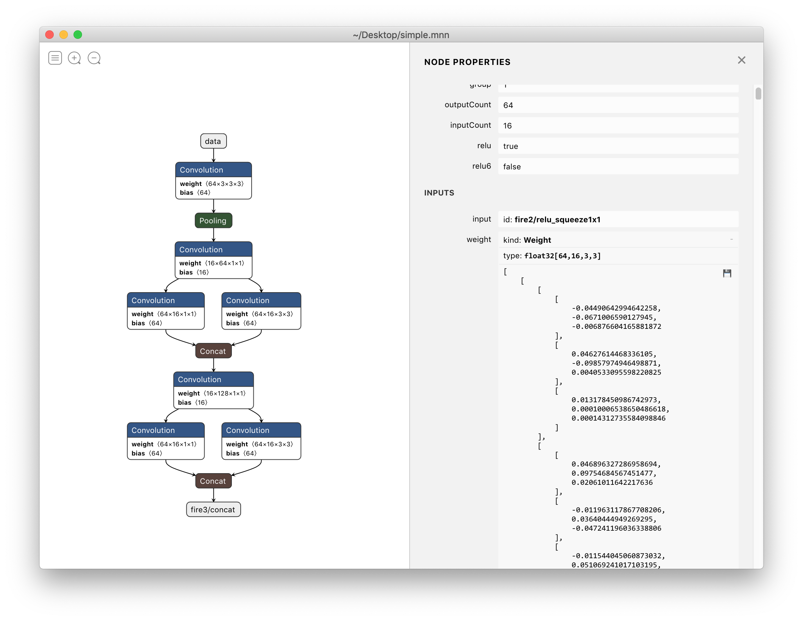

# 可视化工具
可视化的效果：


在详细调研了市面上比较主流的可视化工具后，`Netron`是一款受众面较多、兼容多款模型的可视化模型，同时它还具有跨平台支持、`Python`模块支持的能力。因此，在研究了一番它的设计和架构并考虑后续`MNN`自身的演进，我们决定**官方维护`MNN`模型的可视化能力并将其作为`Pull Request`合并，大家可以放心使用啦。**

## 功能列表
    - 支持加载`.mnn`模型 。
    - 支持将可视化的图导出成图片保存。
    - 支持拓扑结构的展示、`Operator`/`Input`/`Output`的内容展示。
    - 支持结构化的`weight`，`scale`，`bias`等数据的展示，**并支持将此类数据持久化保存**。
## 使用方式（Release版本）
  - [下载地址](https://github.com/lutzroeder/netron/releases)
  - `macOS`: 下载 `.dmg`文件 或者 `brew cask install netron`
  - `Linux`: 下载 `.AppImage`或者`.deb`文件.
  - `Windows`: 下载`.exe`文件.
  - `Python`：`pip install netron`
## 使用开发版本
  - 对仓库地址：`https://github.com/lutzroeder/netron`，进行`clone`。始终使用`master`分支。
  - `cd [your_clone_path]/netron`
  - 安装`npm`，确保`npm`版本大于`6.0.0`
  - `npm install`
## 使用JavaScript调试
`npx electron ./`（如果这步失败，单独`npm install -g npx`）
## 使用`Python`调试
```bash
python3 setup.py build
export PYTHONPATH=build/lib:${PYTHONPATH}
python3 -c "import netron; netron.start(None)"
```
## 遗留问题
加载超大模型可能渲染失败（几千个节点）