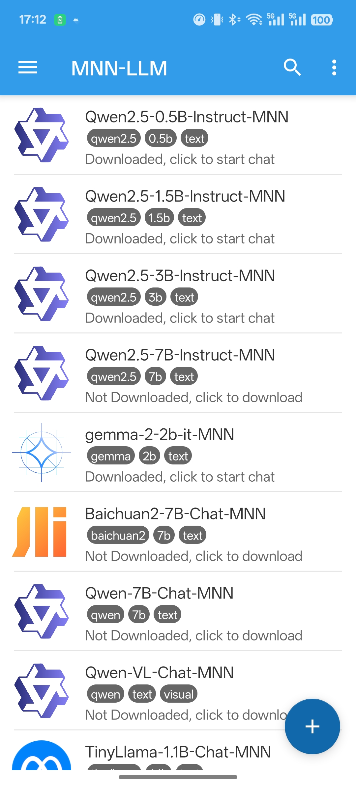
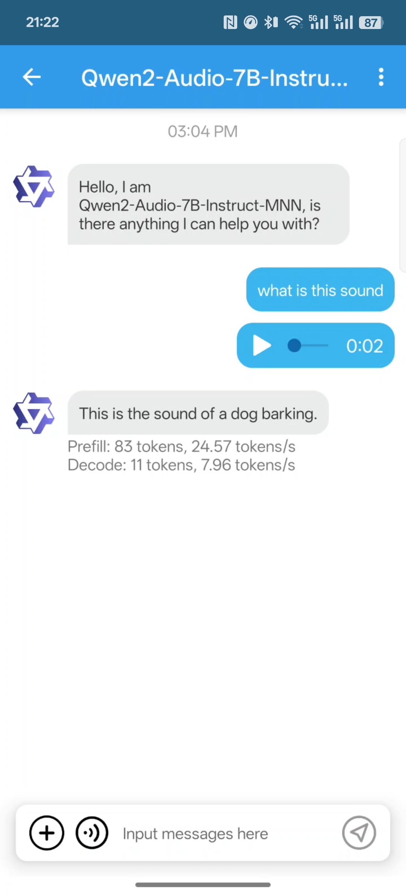

# MNN 大模型 Android App

## 简介
这是我们的全功能多模态语言模型（LLM）安卓应用。

<p align="center">
  
  
  
  
</p>


### 功能亮点

+ **多模态支持：** 提供多种任务功能，包括文本生成文本、图像生成文本、音频转文本及文本生成图像（基于扩散模型）。

+ **CPU推理优化：** 在安卓平台上，MNN-LLM展现了卓越的CPU性能，预填充速度相较于llama.cpp提高了8.6倍，相较于fastllm提升了20.5倍，解码速度分别快了2.3倍和8.9倍。下图为 llama.cpp 与 MNN-LLM 与 llama.cpp 的比较。
<p align="center">
  
</p>


+ **广泛的模型兼容性：** 支持多种领先的模型提供商，包括Qwen、Gemma、Llama（涵盖TinyLlama与MobileLLM）、Baichuan、Yi、DeepSeek、InternLM、Phi、ReaderLM和Smolm。

+ **本地运行：** 完全在设备本地运行，确保数据隐私，无需将信息上传至外部服务器。


# 使用说明
您可以通过 [Releases](#releases) 下载应用，或者 自行构建(#开发)。
+ 安装应用后，您可以浏览所有支持的模型，下载所需模型，并直接在应用内与模型交互。
+ 此外，您可以通过侧边栏访问聊天历史，轻松查看和管理之前的对话记录。

 !!!warning!!!  此版本目前仅在 OnePlus 13 和 小米 14 Ultra 上进行了测试。由于大型语言模型（LLM）对设备性能要求较高，许多低配置设备可能会遇到以下问题：推理速度缓慢、应用不稳定甚至无法运行。对于其他设备的稳定性无法保证。如果您在使用过程中遇到问题，请随时提交问题以获取帮助。


# 开发 
+ 克隆代码库：
  ```shell
    git clone https://github.com/alibaba/MNN.git
  ```
+ 构建库：
  ```shell
  cd project/android
  mkdir build_64
  ../build_64.sh "-DMNN_LOW_MEMORY=true -DMNN_CPU_WEIGHT_DEQUANT_GEMM=true -DMNN_BUILD_LLM=true -DMNN_SUPPORT_TRANSFORMER_FUSE=true -DMNN_ARM82=true -DMNN_USE_LOGCAT=true -DMNN_OPENCL=true -DLLM_SUPPORT_VISION=true -DMNN_BUILD_OPENCV=true -DMNN_IMGCODECS=true -DLLM_SUPPORT_AUDIO=true -DMNN_BUILD_AUDIO=true -DMNN_BUILD_DIFFUSION=ON -DMNN_SEP_BUILD=ON"
  ```
+ 复制到 LLM Android 应用项目：
  ```shell
  find . -name "*.so" -exec cp {} ../apps/MnnLlmApp/app/src/main/jniLibs/arm64-v8a/  \;
  ```
+ 构建 Android 应用项目并安装：
  ```shell
  cd ../apps/MnnLlmApp/
  ./gradlew installDebug
  ```

# Releases
## Version 0.1
+ 点击这里[下载](https://meta.alicdn.com/data/mnn/mnn_llm_app_debug_0_1.apk)
+ 这是我们的首个公开发布版本，您可以：
  + 搜索我们支持的所有模型，在应用中下载并与其聊天；
  + 生成扩散模型：
    + stable-diffusion-v1-5
  + 音频模型：
    + qwen2-audio-7b
  + 视觉模型：
    + qwen-vl-chat
    + qwen2-vl-2b
    + qwen2-vl-7b


# 关于 MNN-LLM
MNN-LLM 是一个多功能的推理框架，旨在优化和加速大语言模型在移动设备和本地 PC 上的部署。通过模型量化、混合存储和硬件特定优化等创新措施，解决高内存消耗和计算成本等挑战。在 CPU 基准测试中，MNN-LLM 表现优异，其预填充速度比 llama.cpp 快 8.6 倍，比 fastllm 快 20.5 倍，同时解码速度分别快 2.3 倍和 8.9 倍。在基于 GPU 的评估中，由于 MLC-LLM 的对称量化技术优势，MNN-LLM 的性能在使用 Qwen2-7B 进行较短提示时略有下降。MNN-LLM 的预填充速度比 llama.cpp 快 25.3 倍，解码速度快 7.1 倍，相较于 MLC-LLM 也分别提高 2.8 倍和 1.7 倍。如需更详细的信息，请参考论文：[MNN-LLM: A Generic Inference Engine for Fast Large LanguageModel Deployment on Mobile Devices](https://dl.acm.org/doi/pdf/10.1145/3700410.3702126) 


# 致谢
该项目基于以下开源项目：
+ [progress-dialog](https://github.com/techinessoverloaded/progress-dialog)
+ [okhttp](https://github.com/square/okhttp)
+ [retrofit](https://github.com/square/retrofit)
+ [Android-SpinKit](https://github.com/ybq/Android-SpinKit)
+ [expandable-fab](https://github.com/nambicompany/expandable-fab)
+ [Android-Wave-Recorder](https://github.com/squti/Android-Wave-Recorder)