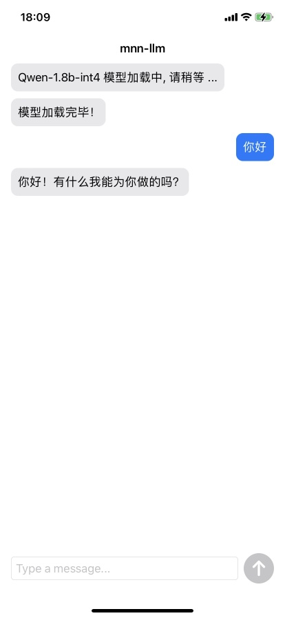

# mnn-llm ios demo

🚀 本示例代码全部由`ChatGPT-4`生成。

## 速度

[旧版测试prompt](../resource/prompt.txt)
- Qwen-1.8b-chat 4bit
  - iPhone 11    : pefill  52.00 tok/s, decode 16.23 tok/s
  - iPhone 14 Pro: pefill 102.63 tok/s, decode 33.53 tok/s
- Qwen-1.8b-chat 8bit
  - iPhone 11    : pefill  61.90 tok/s, decode 14.75 tok/s
  - iPhone 14 Pro: pefill 105.41 tok/s, decode 25.45 tok/s

---

[新版测试prompt](../resource/bench.txt)
- Qwen1.5-0.5b-chat 4bit
  - iPhone 15 Pro: pefill 282.73 tok/s, decode 51.68 tok/s
- Qwen2-0.5b-instruct 4bit
  - iPhone 15 Pro: pefill 234.51 tok/s, decode 51.36 tok/s
- Qwen2-1.5b-instruct 4bit
  - iPhone 15 Pro: pefill 107.64 tok/s, decode 25.57 tok/s

## 编译
1. 编译 MNN iOS Framework: 在 MNN 根目录下执行
```
sh package_scripts/ios/buildiOS.sh "-DMNN_ARM82=true -DMNN_LOW_MEMORY=true -DMNN_SUPPORT_TRANSFORMER_FUSE=true -DMNN_BUILD_LLM=true -DMNN_CPU_WEIGHT_DEQUANT_GEMM=true"
mv MNN-iOS-CPU-GPU/Static/MNN.framework transformers/llm/engine/ios/MNN.framework
```
2. 下载模型文件: [Qwen1.5-0.5B-Chat-MNN](https://modelscope.cn/models/zhaode/Qwen1.5-0.5B-Chat-MNN/files) ，或者使用 export 下面的脚本导出模型
3. 将模型文件拷贝到`${MNN根目录}/transformers/llm/engine/model/`目录下
4. 在xcode项目属性中`Signing & Capabilities` > `Team`输入自己的账号；`Bundle Identifier`可以重新命名；
5. 连接iPhone并编译执行，需要在手机端打开开发者模式，并在安装完成后在：`设置` > `通用` > `VPN与设备管理`中选择信任该账号；

备注：如测试其他模型，可以将`ios/mnn-llm/model/`替换为其他模型的文件夹；同时修改`LLMInferenceEngineWrapper.m +38`的模型路径；

## 性能
等待模型加载完成后，发送：`benchmark`，即可进行benchmark测试；

## 测试
等待模型加载完成后即可发送信息，如下图所示：


